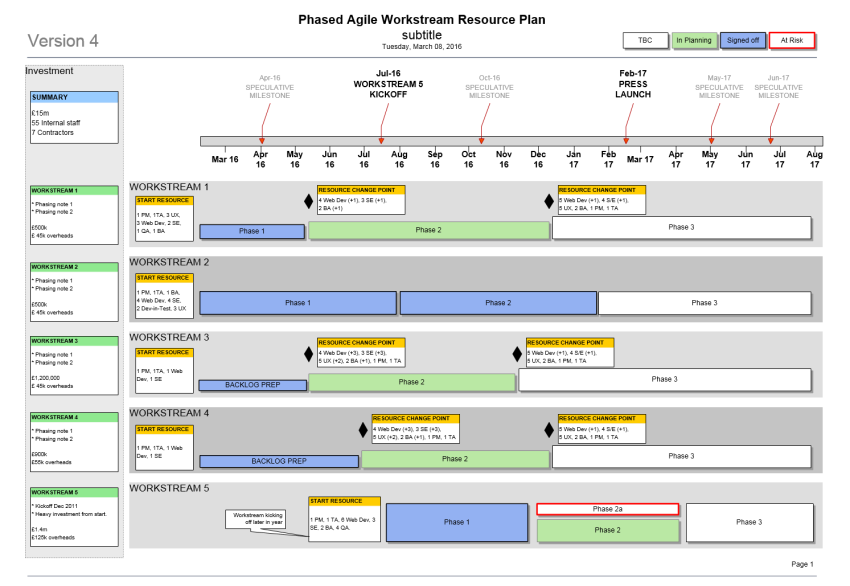
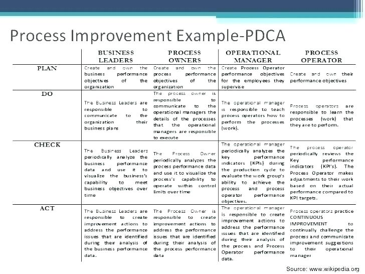
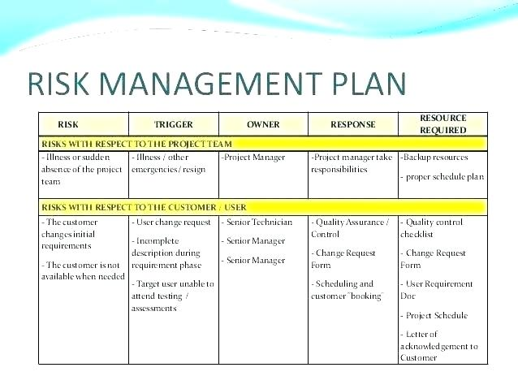
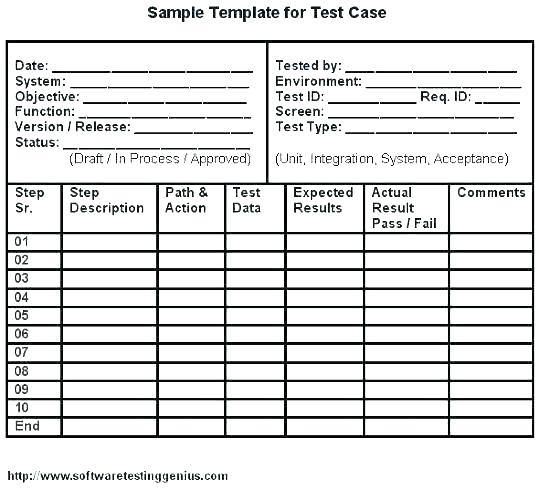
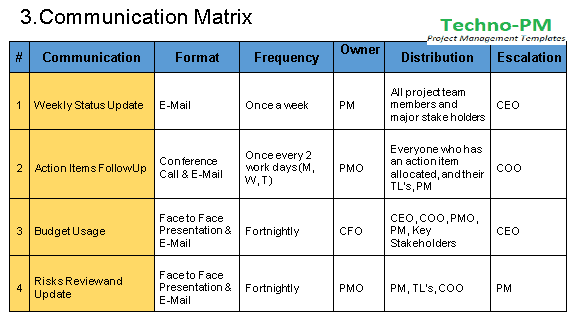

Planning is something that is necessary for every software development process. 

Everything must be part of a plan with specific times, requirements, responsible, etc.

This huge plan that you make at the beginning of the project in general but necessary, every member team would make other software specific plan with his or her activities. This general plan even can change during the development, but always will be present from the beginning until the end ( when the full version of the software will have launched.) 

<title-2>First, we have to know what is the concept of Software Project Planning</title-2>

No one does what they don't know, so it is important to define the meaning and the content of the Software Project Plan. 

A big part of this process consists of making a set of plans to help guide your team to know, execute, and close every phase and step during the Software Development Process. 

This planning includes time, risks, costs, quality checks, changes, issues, external suppliers, equipment needed, communications, resources, procurement activities, and the whole information you need to manage the project and be sure of its correct evolution. 

To be more specific, in the software project planning you need to keep in mind:

* Risk Management: Record and manage the information about every possible risk in the development process of your software. But the most important is that you consider what will you do if one of them occur.
* Change management, that is the description of how you and your team will manage and try every change during the software project. 
* Project categorization, which is a segmentation of qualities of the project and its phases.
* Requirement management, that is the information of the necessities you have to reach to achieve the project successfully. 
* Communications that you would use to get in touch with the team members, with suppliers, clients, etc. 
* Project schedule or the planning of tasks and times. 
* The staff of development, or the development team that you will need and have. 
* Security approach to your project and all members that are involved. 

This first step tends to be one of the most challenging in the software development because you need to keep in mind many details, without mentioning that you have to know how to estimate processes and features, and also how to inform the whole team.

<title-2>Activities for Software Project Planning</title-2>

This is a structure, a guide for every element that you need to include in this planning phase. 

Here we explain you a brief of every step, but the most important thing is that we will bring you an example to complete every activity easy and effectively. 

<title-3>1. Create the plan of the project</title-3>

A general point of view, because from here we will develop the project. It is a kind of skeleton.

<title-3>2. Create a Resource Plan</title-3>

A well defined and documented resource plan should have specific quantities of labor, equipment, materials, and resources needed to complete the software project. 

To be more specific, this plan should have:

* Types of labor required for the project
* Roles and key responsibilities for each labor type
* Number of people required to fill each role
* Items of equipment to be used and their purposes
* Types and quantities of equipment needed
* The total amount of materials needed

Source: [Method 123](https://www.method123.com/resource-plan.php)

Source: [Business resource](https://business-docs.co.uk/downloads/agile-resource-plan-template/)

<title-3>3. Think in the Financial Plan</title-3>

At this point in the project, you should have enough finances to develop it, but when it is time to plan what we will do, also you have to think in the distribution of the money in the whole project. 

This is vital for the good development of your software. 

If the investment is not distributed in the right way you would have problems for closing it.

<title-3>4. Structure of the Quality Plan</title-3>

In a Quality Plan, also known as Test Plan you schedule all tasks needed to be sure of your project meets the needs of customers. 

This plan includes quality assurance items with independent reviews, and a quality control list with all internal reviews to meet the qualities of the target. 

In this plan you should:

* Identifying the customer's requirements
* Listing the project deliverables to be produced
* Setting quality criteria for these deliverables
* Defining quality standards for the deliverables
* Gaining your customer's agreement with the targets set

Source: [Method 123](https://www.method123.com/quality-plan.php)

Source: [Sled guide](http://sledguide.info/tmpl/)

<title-3>5. Create a Risks Plan</title-3>

In this plan, you will identify those risks that you think that would have, and the goal it is, to plan actions that reduce them or reduce its incidents. 

Controlling risks you will be able to increase chances and achieve success easily. 

In a risk plan, you should:

* Identify risks within your project
* Categorize and prioritize each risk
* Identify the impact on the project if the risk does occur

Source: [Method 123](https://www.method123.com/risk-management-plan.php)

Source: [James Griffin](http://jamesgriffin.co/server-risk-assessment-template/)

<title-3>6. Create the Acceptance Criteria</title-3>

This plan helps you to gain the customer's acceptance for deliverables you have produced. 

Don’t forget, include acceptance test methods and resources for achieving customer acceptance. 

Source: [Warexone](http://warexone.info/sample-uat-test-plan-template/)

<title-3>7. Make a plan for communications</title-3>

This plan basically exists to communicate the right information at the right time to the right person. 

There you would make a schedule for communication events with specific goals as keep properly informed to everyone is involved in the project. 

Also, you should describe how you can plan to communicate, which strategies you will use, etc. 

In this plan you have to be sure of:

* Listing your communications stakeholders
* Defining each stakeholders communication needs
* Identifying the required communications events
* Determining the method and frequency of each event
* Allocating resource to communications events
* Building a communication event schedule

Source: [Method 123](https://www.method123.com/communication-plan.php)

Source: [Pinterest](https://www.pinterest.com/pin/303218987409875020/)

<title-3>8. Create a Procurement Plan</title-3>

Making this plan you would procure all products and services you need from suppliers.

If you make a proper procurement plan you will be sure of buying the right products as a good prize, and you will receive it in the right way. 

You only have to be sure of taking a method of procurement and the timeframes for delivery. 

Describe very well the relation and tools with suppliers (his requirements, the contract you will do, etc)

These are the actions that you need to include in this plan:

* Define your procurement requirements
* Identify all of the items you need to procure
* Create a sound financial justification for procuring them

Source: [Method 123](https://www.method123.com/procurement-plan.php)

<title-3>9. Make contracts for suppliers</title-3>

This is more of a requirement if you will plan to have products or services from external suppliers. 

You can make a plan or just a model of the contract you would do. If you have a base, then you will be able to adapt it in every situation. 

This contract is an agreement between you and the supplier. 

Every contract has to be comprehensive, it should have critical terms well defined, as the conditions needed, and the identification of every part is involved. 

Prepare well these documents and work to keep a better relationship with all of these ally companies during your software development project. 

<title-3>10. Plans the execution of review phases</title-3>

Every phase or action that will be executed on your project must review it. 

In that way, you will sure that everything is going well. The financial plan, resources needed, the equipment, responsible, and every previous phase. 

Make reviews even of all contracts you make. This is the proper way to manage a software project and be sure of the good cohesion between the team, the resources, and everything necessary to achieve the final software. 

From now on you will be able to structure your **Software Project Plan**. Make it and share your experience. We are exciting for you, and we desire you good luck. If you have a question, contact us, it will be a pleasure to develop together with your software.
