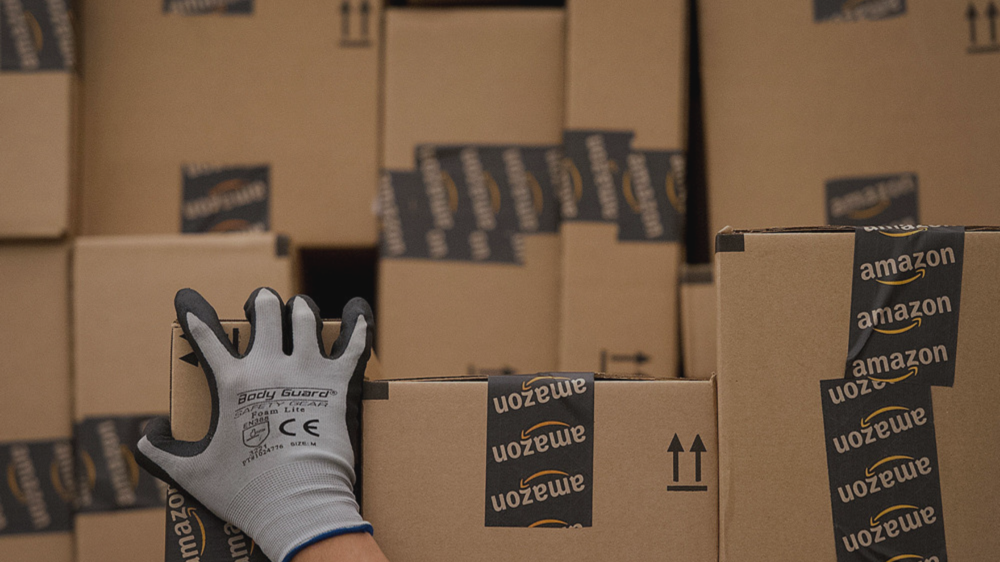

Previously in this blog, we had exposed some of the <a target="_blank" href="https://cobuildlab.com/blog/logistics-industry-trends-for-2021/"> trends in logistics </a> that are being driven this 2021, but for this post, we saved the most interesting one right after the use of the Internet of Things and Artificial Intelligence, and it's Predictive Logistics. And as trite as it may seem, there are still many companies that are still blindfolded to the reality that is Digital Transformation, and all the tendencies and innovations it brings with it.    

Just as some dream of anticipating the winning numbers in the lottery, others more ambitious and visionary are already preparing to anticipate what the demand for their product or service will be in the future. Many more companies are conducting predictive analytics that allows them to integrate reverse logistics solutions into the supply chain, guiding the entire enterprise to a state of greater profitability as they are betting on the circular economy. Of course, since the beginning of industries, there has been an attempt to predict peak demand for certain products and services but now technology has helped us to make this a reality, allowing us to give the most appropriate destination to the asset or product, thus extending its life cycle.    

<title-6 align="centered"> 👉 Check out the <a target="_blank" href="https://cobuildlab.com/blog/logistics-industry-trends-for-2021-part-2/"> logistics industry trends for 2021 </a> </title-6>     

<title-3 align="centered"> Predictive Analytics </title-3>    

To exemplify the dynamics of predictive analytics, we must move to a small hotel on the outskirts of Lyon, France. Once there, we find that its owner has inherited that small business from his father, who in turn has inherited it from his father; where in addition to the hotel owner's last name there is another thing that has not changed much either: in summer there are more guests. This type of business specialized in customer service (no matter if it is a mom n' pops or a big chain) knows its public well and knows that in some seasons the work will increase considerably which allows them to act in advance by contacting their suppliers, reserving the products they need and in this way keeping the stock supplied to be able to offer the best service to their customers.      

The owner of this small hostel in Lyon has probably worked since he was very young in this business so he knows his clientele very well, and from past experiences, he knows that in high seasons like summer, which is the vacation time, many more people book in his establishment; on the other hand, he can accurately interpret the pattern of behavior and predicts that this increase in demand will be repeated next summer.  This is what is known as predictive logistics.    

However, since the ‘80s, banks and insurance companies began to use data mining techniques to apply predictive analytics as well. And currently, there are technologies such as the Internet of Things, Big Data, and Machine Learning that allow not only to collect immeasurable amounts of information but are increasingly more and more accurate, identifying customer buying patterns allowing to run a much more efficient predictive logistics.     

Now that we have understood the concept of predictive analytics, we can delve into the existing types of data analysis    

▪️ **Descriptive analytics:** Like the example of the hostel in Lyon, this type of analytics will make a timeline of how a business has performed over the years, reflect and quantify what has happened, taking that historical data to perform a complete analysis.    

▪️ **Predictive analytics:** As its name suggests, it seeks to predict what is going to happen.     

▪️ **Prescriptive analytics:** Uses simulation and optimization techniques to draw a line of actions that best suits the business.     

Logistics is an industry that depends on many contingencies. Predictive analytics offers the opportunity to measure more and more data, study what has happened and provide future scenarios of what is likely to happen, facilitating or predicting the actual occurrence of these scenarios and providing guidance on what actions to take to make our predictions come true or if negative, how to avoid them.    

<title-3 align="centered"> The Amazon Effect: a patent </title-3>
    

When it comes to logistics, it is necessary to follow in the giant's footsteps. Since it went live in 1995, Amazon has had a huge impact on the behavior of the buyers not only on their site but also when they visit physical stores. The customer has grown accustomed to the seamless buying experience offered by Amazon and expects a timely and effective service and a greater variety from where to choose when visiting the store. Searching the halls for an item, pick it, and then standing in line to pay for it is no longer necessary when you can shop online.    

In 2013, the giant filed a patent for "Anticipatory Package Shipping" to significantly reduce delivery times for its products. Amazon uses a powerful data mining system by closely studying user behavior, looking at search history, purchases made, wish list, products in and out of the shopping cart, even the time the mouse pointer stays on certain offers with one goal in mind: to predict demand. In this way, merchandise is distributed to delivery warehouses that customers in those regions have not yet ordered, but are very likely to do so; it is then possible to get those products to the customer quickly at the time of order, saving time and money as well as improving customer service immeasurably.    

<title-3 align="centered"> Benefits of predictive analytics in logistics </title-3>    

▪️ As we have mentioned in this article, data collection is essential to analyze the relevant aspects to **predict demand** and take the most advantageous preventive measures.    

▪️ Predictive analytics **improves inventory management**, what we have in stock, what needs to be replenished, reduce losses, and more.    

▪️ It also allows us to make **better use of the resources** we have available, both human and infrastructure.    

▪️ Predictive analytics also allows us to **plan product replenishment** by predicting demand, thus ensuring availability in warehouses and points of sale.    

▪️ And of course, one of the most important benefits is that it allows us to greatly **reduce operating costs**.     
 

These are just some of the benefits, which vary according to how much profit is made from the results of predictive analytics. This practice is especially applicable in e-commerce companies, following in the footsteps of Amazon, many companies are already looking to make a better analysis of the behavior of their buyers on the web to prevent the demand for specific products and thanks to this prediction, fill up with the merchandise in demand to avoid running out of stock and reduce shipping times greatly improving the customer shopping experience.     

The use of technologies such as Artificial Intelligence and the Internet of Things will help expand the application of logistics whose growth is directly proportional to the degree of digitization of the industry.      

<title-5 align="left"> About Cobuild Lab </title-5>

We partner with Industry Experts to solve Logistical and Productivity problems with Custom Software Solutions, Artificial Intelligence, and IoT.  Since 2012 we've focused on developing and combining cutting-edge techniques, tools, and technologies to increase development speed to deliver faster results    

<youtube-video id="5fbYxQNgJ7s&"></youtube-video>     

Got an idea for a web or mobile app? Let’s build it! Check out our <a target="_blank" href="https://cobuildlab.com/price-calculator/">  price calculator</a> to have an estimate of the cost of your project or email us at contact@cobuildlab.com and get a FREE online consultation. 

