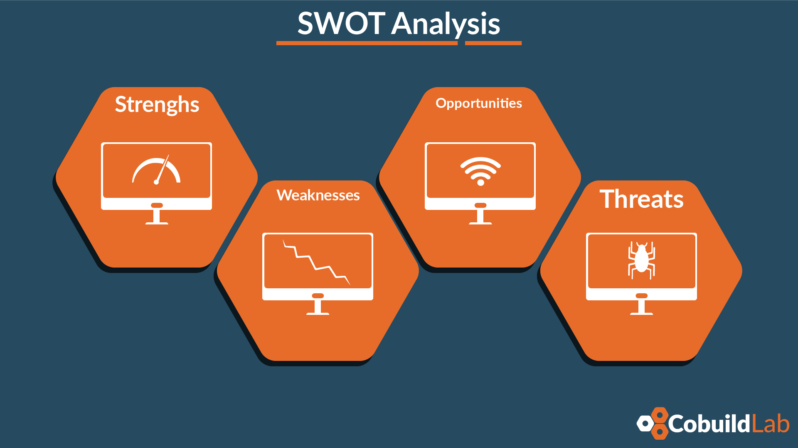

**Product Development** is a process used to bring products to market and perfect business models. It is used for many types of businesses, but in this post, we will go deeper into this process applied to software development. Stay a little longer and find out everything. 

<title-2>Product Development as a process</title-2>

*“It is a group of steps that together fulfill the goal of conceptualizing, developing, and launching a new or rebranded product on the market based on the customers' demand. “*

Source:[Nibusinessinfo](https://www.nibusinessinfo.co.uk/content/product-development-process)

It is kind of similar to the [Cobuild Process](https://cobuildlab.com/blog/cobuild-megatrend-in-the-startup-world/) we use to accelerate ideas, turn them into minimum viable products and profitable businesses. 

<title-2>The Product Development Process is composed for the next phases (Overview)</title-2>

Before starting this section, we must tell you that there are different frameworks for this development methodology and each framework has specific steps. But in general, this process has four phases that have to be accomplished no matter which framework you have chosen. And these are: 1) Concept phase, 2) Engineering phase, 3) Manufacturing Phase, 4) Marketing and commercialization Phase.

<title-3>Phase 1: Concept</title-3>

This generic phase is divided into three subpoints because the treatment given to the idea from the beginning is quite complicated. Start from the generation of all the senses, the review made, and the final conceptualization that will be the foundation of the business model and the product that will be presented as a solution. 

* **Idea Generation** 

In this first phase what you're going to feed on is as many ideas as possible. Business ideas, products, and everything you would like to incorporate into your project. There is no limit, or they do not have to be coherent with each other. It's just a list of ideas that you're going to place in no order specific order. 

You can base yourself on what some competitors do, on magazines, on what potential customers talk about or want, on a need you have or have detected in a market, or simply on your creativity. Anything goes at this stage. Even choose some technique for generating ideas such as brainstorming, group activities, surveys, etc.. 

This phase is fundamental because it is from this phase that the project will be built and the software or product will be developed. 

* **Review of ideas**

At this point, it is necessary to organize all the ideas from the previous phase, and then make a selection of the most viable, those that you consider most valuable and important to include in your development process. 

If you see that many of the things you thought disappear at this point, because after analyzing them you saw that they are unfeasible for many reasons (economic, legal, or any) don’t worry, it’s normal. Sometimes less is more, and effectiveness and efficiency start from being as concrete and simple as possible.  

Focus a lot on the market, on people's needs, on the solution you offer, and on how much it will cost you, how much you will have to invest. Keep only the essentials. 

* **Conceptualization** 

It is at this stage that ideas are really shaped. The necessary aspects are analyzed in greater depth, and all actions are aimed at bringing them to life in a plan. 

In this phase, it is common to perform practices such as [SWOT analysis](https://cobuildlab.com/blog/5-marveling-tips-that-lead-to-successful-entrepreneurship/) that translates the strengths, weaknesses, opportunities, and threats of your ideas. 

In this image, you can clearly see this practice which is almost like a religious practice that is done to a business model that is just being formulated. 

It is also common at this stage to clearly define the investment you must make, how much it will cost you to start and develop the project, how much profit you can achieve, you can think about the segmentation of your target audience and what strategy you will use to reach them, and even visualize marketing strategies.

Quantitative market research is an activity that usually is part of this phase on the Product Development Process. Actually, it is necessary making it for this step and during the whole process if it is possible, even when the product is finished and launched. 

This is the analysis phase of concept, of conceiving the action plan. 

<title-3>Phase 2: Engineering</title-3>

In this phase, the goal of designing and starting to develop the first versions of the product is fulfilled. This is why we speak of Minimum Viable Product or Prototypes. All this, before the massification, in case of physical products or full versions of software products. It is a kind of soft launch.

* **Software Development**

In the [Software Development](https://cobuildlab.com/blog/best-software-development-process/), should be contemplated steps as the product design, the selection of the technology you are going to use, the human team, the development of the project as such, be it software or not. If it is in your plans, making a Prototype or a [Minimum Viable Product](https://cobuildlab.com/blog/minimum-viable-product/), it can be included market tests, product testing, and other complex steps like these. 

And as we said before, it is also propitious to carry out quantitative and qualitative market and product research because this way you can evaluate how good or bad are the strategies, the actions, the processes that you are carrying out. 

At this point, it is where what you previously conceptualized is executed, where the magic happens. 

<title-3>Phase 3: Manufacturing</title-3>

At this stage, all tests and validations are done. What remains is to massify the product if it is a mass consumer product. 

In case your product is software, this phase is for making the acceleration of the product and the company, and complete a launch. 

Here you make quality controls, you develop a logistic of sell and commercialization, and in general line, you accelerate your business.

<title-3>Phase 4: Marketing and Commercialization</title-3>

This point sometimes goes unnoticed. At least at the beginning of the project, and when the project is on track people notice the huge importance of this aspect for the product or service that is being developed. 

But this won't be your case, for sure. Especially if you are following the Product Development Process, because in this type of projects the tasks of marketing and commercialization begin to be considered from the earliest stages, even from the conception of ideas.

In this phase are always involved actions such as market research and analysis, [ad campaigns](https://cobuildlab.com/blog/tips-to-optimize-ads-campaigns/), planning and implementation of [social media strategies](https://cobuildlab.com/blog/social-media-trends-for-2019/), [video marketing](https://cobuildlab.com/blog/video-marketing/), the process you're going to use to market it, and so on. 

The goal of this stage is **to cultivate, maintain and increase a brand's market.**

And if, when we refer to maintaining or increasing the market for the software product. Also to those that want applying to rebrand or change them in some way.
 
This is the overview of the whole process, but as we said, each one of these phases generally has many specifics steps or tasks on detail. 

These phases are an overview. But they are more specific and complex depending on the framework of Product Development used. Below there are several emphasized in Software Product Development.

<title-2>Frameworks of Software Product Development</title-2>

[SEO techniques](https://cobuildlab.com/blog/seo-tips-that-will-increase-your-position-in-search-engines/),

