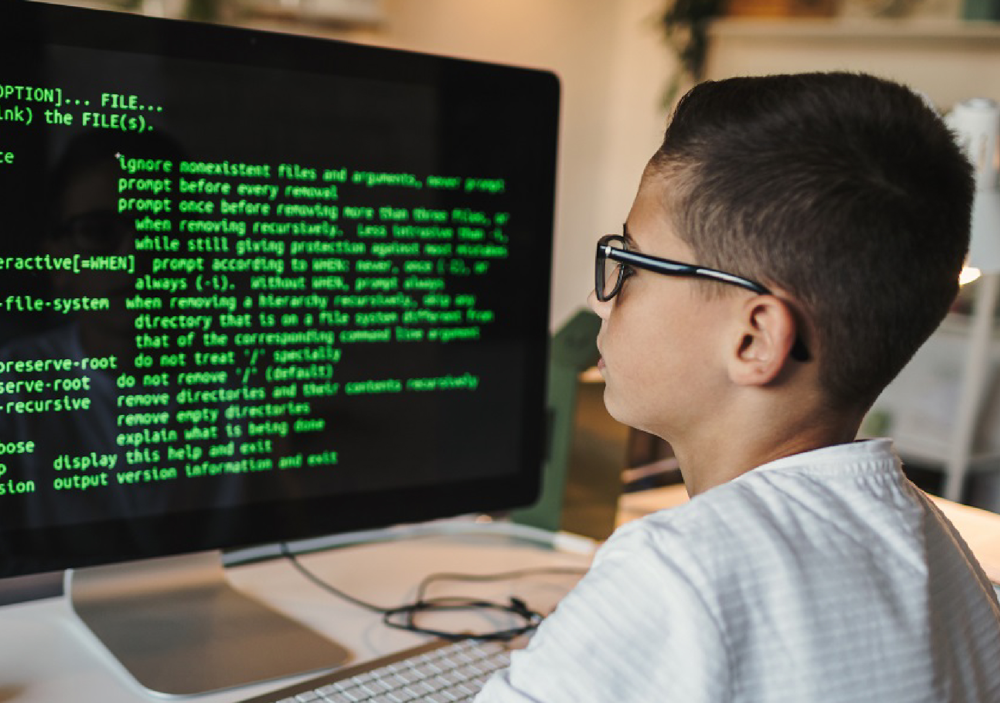

Miami, FL. Oct 05, 2022.

Companies widely use the <b>Python programming</b> language worldwide to build web applications, analyze data, automate operations and create reliable and scalable business applications.

Many technology companies, such as Google, Uber, Netflix, and Facebook, have been using this programming language for years and building their technology infrastructure based on it. So, it’s no secret it’s the darling of most developers and a must for those who decide to embark on the world of <a target="_blank" href="https://www.cobuildlab.com/blog/soft-skills-every-developer-must-have/">   programming</a>. 

<b><title-4>What makes <a target="_blank" href="https://www.python.org/">   Python</a> so interesting?</title-4><b>   

- It is free. It is an open-source language, so there is no license fee to use it.   

- A vast community backs it.   

- Its accessible nature means that new libraries and applications are continually being developed.   

- It is a multi-paradigm language. This means that it combines properties of different programming paradigms, which makes it very flexible and easy to learn.   

- Its multi-paradigm nature allows it to be used in such seemingly disparate fields as web application design or artificial intelligence, among many others.   

- Python is suitable for all platforms. We can run it on different operating systems, such as Windows or Linux, by simply using the corresponding interpreter.   

Although it may be a bit slower than Java or C/C++, the language's design principles are guided by a series of aphorisms collected in Python's Zen. These principles show that code readability and simplicity are essential for language design.   

- Explicit is better than implicit
  
- Simple is better than complex
  
- Complex is better than complicated
  
- If the implementation is hard to explain, it's a bad idea
  
- If the implementation is easy to explain, it might be a good idea   

These premises are at the heart of this <a target="_blank" href="https://cobuildlab.com/blog/get-to-know-an-application-programming-interface/">   programming language</a>, whose main objective is to make life easier for developers, improve execution times and create more robust, durable, and scalable code.   
  

   
  
<b><title-4>What exactly can we use Python for?</title-4></b>

First, it applies to practically any area that is or can be linked to technology. Among others, these are some technical applications of this programming language:

<b>1. Server-side web development</b>

Server-side web development includes the complex backend functions that websites perform to display information to the user. <a target="_blank" href="https://www.cobuildlab.com/blog/steps-to-becoming-a-full-stack-developer/">   Python helps write server-side</a> code because it offers many libraries that consist of pre-written code for creating complex backend functions.   

<b>2. Automation with Python scripts</b>

A scripting language is a programming language that automates tasks commonly performed by people.   

- Renaming a large number of files at once
  
- Convert a file to another file type
  
- Remove duplicate words from a text file
  
- Perform basic mathematical operations
  
- Send messages by email
  
- Download content
  
- Perform fundamental log analysis
  
- Find errors in multiple files   

<b>3. Software Development</b>

<a target="_blank" href="https://www.cobuildlab.com/blog/from-desk-to-dawn-how-the-remote-work-lifestyle-affect-productivity/">   Software developers</a> often use Python to perform various software development tasks and applications:   

- Track bugs in software code
  
- Create the software automatically
  
- Manage software projects
  
- Develop software prototypes
  
- Develop desktop applications using graphical user interface (GUI) libraries
  
- Develop simple text-based games into more complex video games   

<b>4. Perform data science and machine learning tasks</b>

Data science is about extracting valuable information from data, while machine learning (ML) teaches computers to learn from data and make accurate predictions automatically.

And the list goes on. Python is a problem solver for developers and is backed by big brands that base their work on it. 

To make everything easier, Python is handled through a series of libraries, translating into a collection of frequently used code that developers can include in their Python programs to avoid writing code from scratch.   

<b><title-4>Some of the most popular libraries are:</title-4></b>

- Matplotlib
  
- Pandas
  
- NumPy
  
- Requests
  
- OpenCV-Python
  
- Keras

Each one with its particular purposes and code collections.   

   
  
There are many applications of <b>Python</b> in every area you can imagine to get an idea of the wide range of real-life applications of this programming language in industries currently shaping our world. The Python programming language has many real-life applications in sectors presently shaping our world.

Learning Python will open many doors and opportunities for you no matter what area or field you are in or want to be in the future. Python is here to stay. It has transformed and improved our world and will continue to do so for many years.

If you are already a Python expert and have a way to check it out, visit <a target="_blank" href="https://cobuildlab.com/">   our web</a>, and get in touch with us, we can <a target="_blank" href="https://www.cobuildlab.com/blog/top-pros-of-remote-software-developer-service/">   create amazing things</a> together. 

<b><title-3>Cobuild Lab Team</title-3></b>
