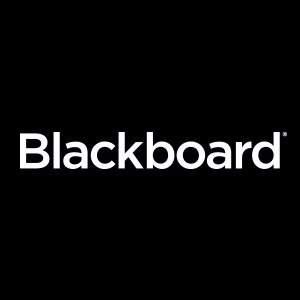

In recent years, there has been excitement around the transformative potential of technology in education. [Just in the United States alone, spending on education technology has now exceeded $13 billion.](https://anadea.info/blog/technology-trends-in-education)

Programs to promote the use of education technology may expand access to quality education, support students’ learning, and help families navigate complex school systems. 

With the EdTech industry, learning becomes more dynamic, it saves money and improves the current setup of schools and colleges.

<title-2>What is EdTech all about?</title-2>

The Association for Educational Communications and Technology (AECT) defined educational technology as "the study and ethical practice of facilitating learning and improving performance by creating, using, and managing appropriate technological processes and resources."

Educational technology refers to the use of tools, processes, and technology strategies to improve learning experiences in a variety of settings, such as formal learning, informal learning, lifelong learning, learning on demand, workplace learning, etc. 

Educational technology began by improving very basic teaching tools, but have now rapidly expanded in recent years to all areas, including devices such as mobile technologies, virtual and augmented realities, simulations and immersive environments, collaborative learning, social networking, cloud computing, flipped classrooms, and more.

<title-2>Importance of EdTech for society</title-2>

The EdTech is essential today for several reasons such as student demands. They love to use technology outside of the classroom. 

Even children like to be interactive. Learning through technology has become part of their lifestyle. If we introduce technology in school, we are using something they want. Youngs will quickly get engaged in the learning process. And in conclusion, technology is making learning more fun and accessible to today's students.

We can't forget the teachers. They are being taught to use EdTech in their classrooms. 

If they know how to use technology in many useful ways, its job will be more comfortable. It helps to assess their students' knowledge as objectively as possible. It also helps them keep the whole class busy.

Teachers can devise creative ways to teach their students and keep them busy. 

Technology in education can improve relations between teachers and students when is integrated technology into subject areas.

It helps to teach and learning more meaningful and fun. Students are also able to collaborate with their classmates through technological applications. 

<title-2>Educational technology news that supports the industry grow</title-2>

Of many emerging technologies today, stands out as keys for the classroom of the future, 5G technology, Augmented Reality, Virtual Reality, and voice mobile technologies, because they are creating more interactive learning experiences. And Artificial Intelligence-powered educational platforms can help improve students' engagement with world culture and history too. 

<title-3>* 5G</title-3>

[In the fall of 2018, NYC Media Lab launched the Verizon 5G EdTech Challenge in partnership with the Verizon Foundation and Verizon 5G Labs.](https://nycmedialab.org/recent-projects/2018/10/17/verizon-5g-edtech-challenge)

University researchers and nonprofit innovators were called to present a concept for building solutions for a mission: 

Leverage emerging technologies, such as 5G, to improve the quality of student education 

More specifically, how can emerging technologies take advantage of 5G to improve student readiness and engagement, STEM teacher training, and support them with special or diverse learning needs? 

5G is the fifth generation of wireless technology and promises high speed, low latency wireless technology. 

It could enable quicker downloads, more powerful networks, increased efficiency for businesses, and a near-immediate transfer of information. 

Autonomous cars, smart communities, the Internet of Things and Immersive Education are a few of the many high-potential industries highlighted by Verizon that 5G will transform. 

These are some suggestions about what will mean 5G for Edtech: a holographic teacher who can lead debates on specialized topics; virtual reality experiences that can help students with diverse learning needs; or connected devices that can help close gaps in the education of international students.

<youtube-video id="Xvfupr2n4f0"></youtube-video>

<title-3>* VR/AR</title-3>

In September 2018, NYC Media Lab and RLab - an RV/RA center - launched the XR Startup Bootcamp. An intensive 12-week acceleration program with ten teams in its initial phase. They focused on customer discovery and market validation for concepts that leverage virtual, augmented and mixed reality, voice technology, robotics, and other future interfaces. 

One of the promising teams to emerge from the program was SPARk, an Augmented Reality and voice platform for STEAM educators and learners that formed at Columbia University. 

Zhi Hao (Joe) Chung, the team founder, worked as a STEAM educator for over five years, and he noticed a challenge to technical and scientific areas. "Lesson plans are complicated, content is sometimes unengaging, and students can tire in the learning process." 

SPARK built a platform that allows educators to search for and upload lesson plans, which can a student have interactive and multi-sensory learning experiences. 

As the students learn, the platform uses voice technology to listen to the student progress, and provide him comprehensive feedback from teachers, which can improve future lessons. 

As an example, a slide presentation on the process of photosynthesis could, with SPARK, transform into an AR game. A student interacts with a tangible block, and when activated the AR, that block becomes the sun. The student can use the block to trigger the process of photosynthesis while visualizing the results in a headset or on a mobile device.

<youtube-video id="uf7ix03cgsQ"></youtube-video>

<title-2>How is the Edtech industry expected to grow?</title-2>

Some predictions of how the EdTech will evolve in the following years:

* According to Top Hat product manager (Eran Ben-Ari), the success of teacher and students must be better as this trend grows. Students will achieve better learning outcomes, and administrators will find ways to identify where a student may be falling behind or needing additional resources and intervene as needed. 

Eran said that the increase of students per class is a growing need for technology solutions that allow engaging students wherever they are. Student success will increasingly depend upon these choices.

And all of these necessities are an opportunity for you to develop the software solution based on this industry. 

* Mike Huseby, CEO of Barnes & Noble Education thinks we will see the use of Artificial Intelligence increasingly as higher education institutions continue their digital transformation journeys and seek to catch students' attention using adaptive and engaging learning experiences. 

In addition to improving both in-class and out-of-class learning, for all kind of students, these tools also increase student efficiency, as they are available when and where students need them. 

We can add that these initiatives increase the demand for educational software, and best of all, it increases and improves educational experiences. That is to say, if you develop a project of this type, you would not only be benefiting but also contributing to society and the development of other people in the world. 

We bet for a world with more software and education.

<title-2>Examples of Edtech startups that can inspire you</title-2>

Some companies that are in the Edtech industry we have:

<title-3>[BYJU’S](https://byjus.com/)</title-3>

The first we want to show you is [BYJU’S](https://play.google.com/store/apps/details?id=com.byjus.thelearningapp&hl=en). Their main product is a mobile app launched in August 2015. 

It provides educational content mainly to school students from primary to higher secondary level education. 

The company trains students for examinations in India such as IIT-JEE, NEET, CAT, IAS as well as for international tests such as GRE and GMAT. The focus is on mathematics and science, where concepts are explained using 12-20 minute digital animation videos. [BYJU'S reports to have 33 million users overall, 2.2 million annual paid subscribers and an annual retention rate of about 85%.](https://en.wikipedia.org/wiki/BYJU%27S)

There is an example of the market you can get. 

<title-3>BLACKBOARD</title-3>

Blackboard: Dr. William Ballhaus is the founder of Blackboard. An app which seeks to close the gap between the evolving work environment, educators, and students. 

Blackboard's goal is to provide teachers with various online options that can enhance their experience as instructors beyond the classroom. 

The platform offers insightful analysis that can help students and teachers connect on a more personalized level and work on the individual strengths and weaknesses of students.

<title-3>MIAMI EDTECH</title-3>

Here in Miami, you have the success example of [Miami EdTech](https://miamiedtech.com/). A company dedicated to providing innovative technologies to the educational institutes of the city. 

They convert teacher's ideas on personalized software that improve education. Also, they are creating a community of innovation and technology in the education area. 

All that effort recently had its rewards because [Microsoft donated $125.000 to develop its Computer science training program for Miami-Dade teachers.](https://www.prnewswire.com/news-releases/microsoft-awards-125-000-to-miami-edtechs-computer-science-training-program-for-miami-dade-teachers-in-partnership-with-fiu-300845400.html)

Under the slogan of "train the trainer," this startup continues to develop and showing the right numbers of the EdTech Industry in Miami and the whole country. 

What could we observe in this post? EdTech industry moves money; there are many startups, and they are not enough, it is a market that is increasingly in demand, and that is why needs more offers, and we do not mention it has immense value because it contributes to education and the growth of societies. It would be good to invest in it, don't you? If you want to do it, contact us. 
