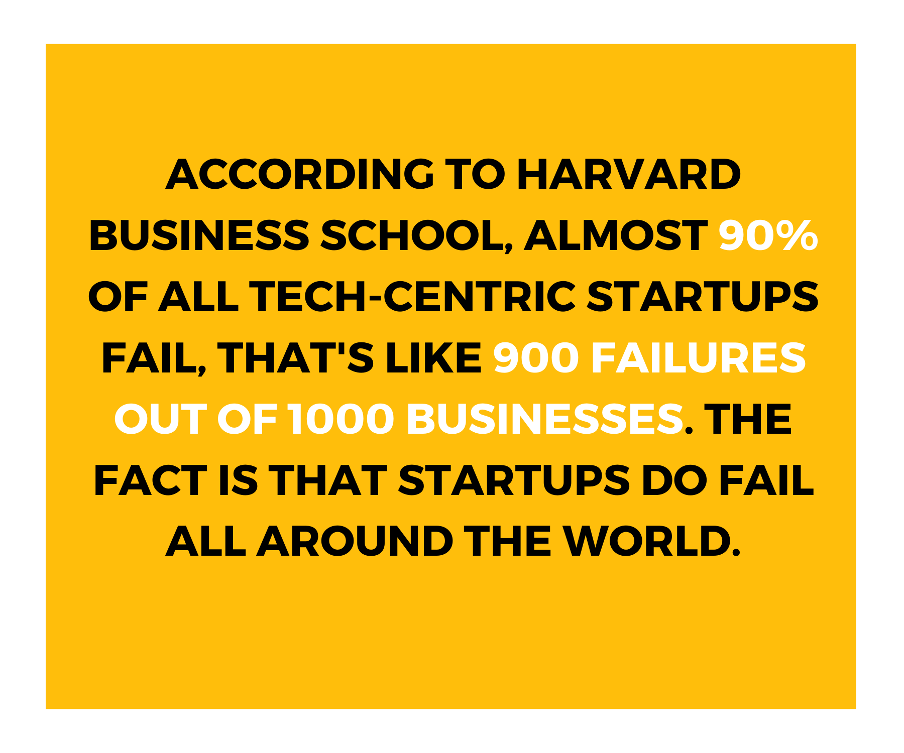
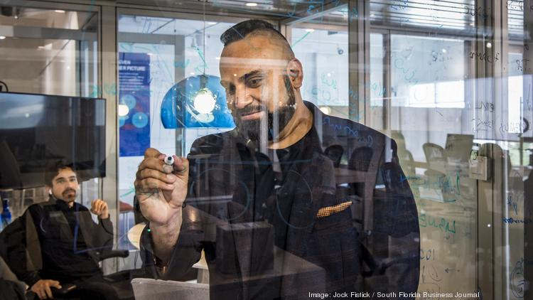
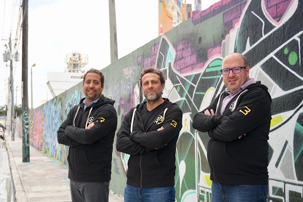
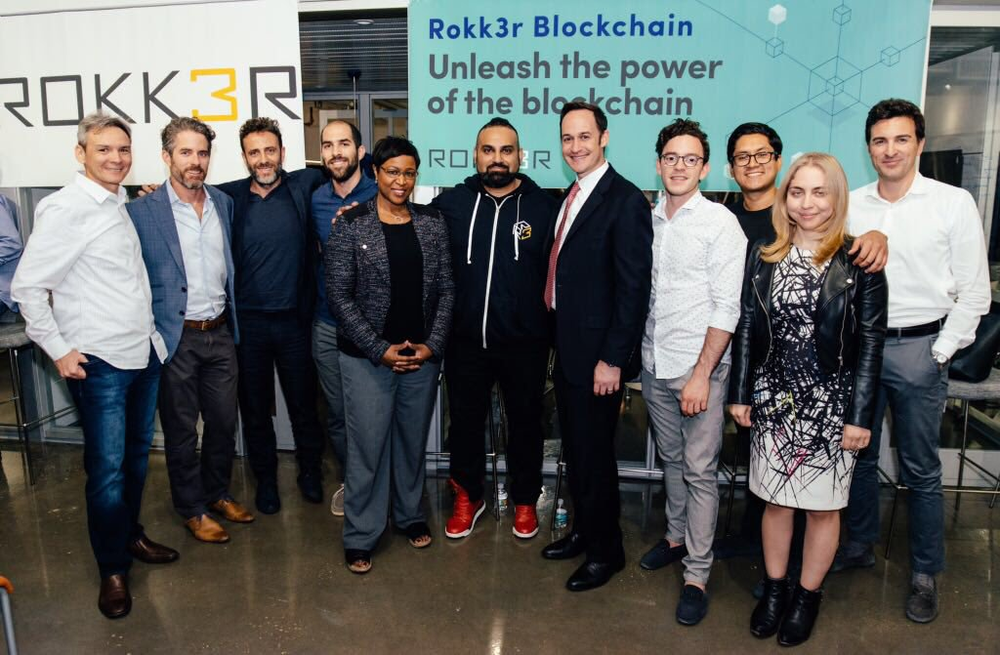
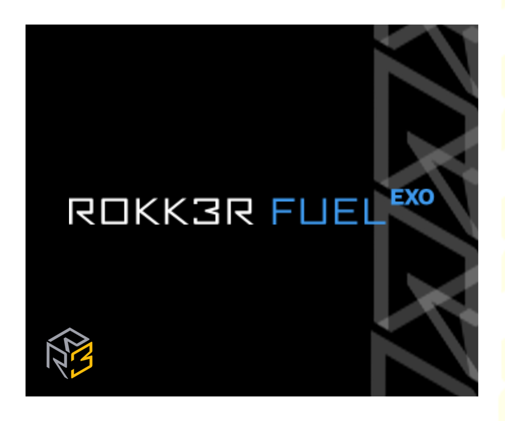
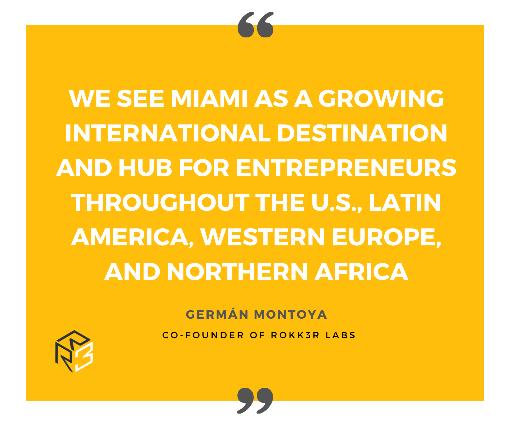

We all can picture how we want our <a target="_blank" href="https://cobuildlab.com/blog/startups-a-new-technological-business-model/"> Startup </a> to be like, it's a thriving business at a big open-concept office, we want to have a rest area full of PlayStation 4 with 4k TV's, and ping pong tables. We Can't-miss out on an Italian design kitchen with nothing but organic food, a coffee station, and a juice bar, and of course, we would make an office tour video for our YouTube Channel.    

That all sounds good on paper, and once we get funding, the dream comes true. But not every Startup reaches a happy ending with an Initial public offering where the founders celebrate it with their kids and family.    

    

Sometimes it is circumstances that we can't control or just our own mistakes that might lead one's companies to failure. One thing is for sure, we can only learn from experience, and the things you learn yourself from failure stay with you for life.    

<title-3 align="centered"> Why do companies fail? </title-3>    

One of the main reasons companies fail is because they are faced with the problem that there is little or no market for their product, either because their value proposition is not compelling enough or maybe there's no right timing with the market. Perhaps the product doesn't meet the needs of the market.    

On the other hand, entrepreneurs and business creators are too optimistic about how easy it is to get customers. They assume that by building a new website, product, or service, customers will come running to their door. That might happen with the first customers, but soon the task of attracting and gaining customers becomes expensive. In many cases, the cost of acquiring a customer (CAC) is higher than the value of the revenue you earn throughout the relationship with that customer (lifetime value of the customer - LTV). At this point, one as an entrepreneur should realize that our business model has failed big time.    

The second reason why new businesses and startups fail is that they run out of cash, and it's all due to a bad management team. One of the primary responsibilities of the CEO or managing director is to know how much money is left and whether it will be enough for the company to reach a point where sufficient external investment or positive cash flow can be achieved.    

What usually goes wrong and leads to a company running out of cash and unable to get more is that its managers have not managed to meet the requirements to get some money from an investor before running out of it. Of course, it's still possible to get money, but the valuation will be significantly lower.    

<title-3 align="centered"> The Silicon Valley Tramp </title-3>    

It seems that nowadays, everyone fell into a big trap of trying to simulate Silicon Valley, which is still the leading center for innovation and development of high technology, receiving a third of total venture capital investment in the United States. Although there aren't as many silicon chip manufacturers anymore, high-tech businesses have turned the Valley into a highway for venture capital.     

If you are not yet familiar with them, venture capitalists are firms formed by a group of private investors who pool a certain amount of money to make different kinds of investments.    

 Unlike a bank, these funds participate in the ventures as partners in hopes for the company to increase its value, and once the investment has matured, capitalist withdraws making profits.    

Some companies have a decent management team that gets venture capital from investors. Still, then they get a little excited and look for a bigger office with Playstation 4 and 4k TVs, and improving the value proposition takes a back seat. The money keeps coming in, the accelerators join in, and when the final product comes out, it doesn't meet the needs of the market and Houston, we have a problem.    

Rokk3r proposes a system a little bit more focused without that much risk expansion that could help people go from step one to step two, and this model seeks to be an alternative to the Silicon Valley system.    

<title-3 align="centered"> INTRODUCING ROKK3R VENTURE BUILDERS </title-3>    

    

<a target="_blank" href="https://www.rokk3r.com/venture-builders/"> Rokk3r </a> is a platform for entrepreneurs to create startups that perform at least 10x greater than competitors and a strategic partner for investors and organizations to increase value, mitigate risks, and stay at the edge of innovation.    

In today's world, where there are so many technological advances, so many new opportunities, we ask ourselves, how do I create a new company without taking the risk of exploding? What Rokk3r does is try to use new technologies to create new value propositions by mitigating risk at every step of the way. They look for the best way to attack the market, always trying to mitigate the risk, and Rokk3r participates as partners or <a target="_blank" href="https://cobuildlab.com/blog/co-founders/"> co-founders </a> of the new companies.     

    
 
When Rokk3r started in 2012, there was a lot of technological need by the entrepreneurs, and they realized that it was not so much the technology or the capital but validating the idea that would make a real difference on the way to success.    

The <a target="_blank" href="https://cobuildlab.com/blog/practices-for-validating-your-business-idea-for-your-software/"> validation of the idea </a> is a step within any business, whether software or not; It consists of applying methods to learn more about customers, the market, and the real needs, to conceive a product that has a better chance of success. So when you have a business, you have got to validate the idea that it is not only good for you but that the consumer wants and needs it. For this, Rokk3r's team has developed a lot of risk reduction schemes, experimentation if you like, to ensure that the product offered by the company you invest in is finally purchased.    

<title-3 align="centered"> Transforming the current companies </title-3>    

    

Taking into account that Rokk3r's model differs a little from incubators and accelerators, the model they propose consists of first looking for the company's ally, then looking for the business opportunity and finally hiring the team.    

As we mentioned at the beginning of this post, there are many reasons why a company fails, and probably one that is worth mentioning is the fear of change, and in today's world, since it changes every second, whether you adapt or die.     

It is valid for you to feel overwhelmed sometimes, and you might even find yourself wondering if your proposal would survive. Now imagine you come across this business builder who proposes to keep you at the forefront of innovation, sounds good, right?.    

This is why Rokk3r is so unique; they look for traditional companies like yours,  and they will look among your assets for something that can be reused.  Once they found this asset, they incorporate new technologies and bring out a unique value proposition without changing your company's day-to-day routine so you will have this opportunity to undertake something new alongside them if you are willing to take the chance.    

It happens that most companies have developed an immune system for change. Once the opportunity is presented just at the moment of making the final decision, this immune system activates, and the founder or some board member hesitates and wonders why we get into this, although it seems to be a pretty good deal? And when it comes to business, the only thing worse than starting something and failing is not starting anything at all so, if the process is working, let them innovate the edge of your company.    

    

Founded by <a target="_blank" href="https://www.crunchbase.com/person/brian-sanchez"> Brian Sanchez </a>, <a target="_blank" href="https://www.crunchbase.com/person/charles-irizarry"> Charles Irizarry </a>, <a target="_blank" href="https://www.linkedin.com/in/germanmontoya/"> German Montoya </a>, <a target="_blank" href="https://www.crunchbase.com/person/juan-montoya"> Juan Montoya </a>, and <a target="_blank" href="https://www.linkedin.com/in/nabylcharania/"> Nabyl Charania</a>, Rokk3r Labs became the best place in the world to launch game-changer companies. It has co-built over 40 companies worth over $50 million with returns of over 100 times the investment, which speaks volumes about their process of defining startups.    

Based in Miami, this company is looking to investing in Mexico and Latin America to create exponential startups. With a focus on leveraging exponential technologies and implementing new-age methods of raising capital, Rokk3r is harnessing the global collective genius to co-build companies that change the world.    

For more info please visit <a target="_blank" href="https://www.rokk3r.com/"> https://www.rokk3r.com/ </a>    

Rokk3r was honored in <a target="_blank" href="http://thetechtribune.com/2019-best-tech-startups-in-miami/"> 2019 Best Tech Startups in Miami </a> and <a target="_blank" href="http://thetechtribune.com/10-best-tech-startups-in-miami/"> 2020 Best Tech Startups in Miami </a>.    

<title-3 align="centered"> Rokk3r Fuel </title-3>    

    

In March 2017, it was announced the launch of Rokk3r Fuel, a +240 million dollar dedicated investment fund designed to give investors access to Rokk3r Labs' proprietary approach of identifying and co-building innovative new companies. Rokk3r Fuel is led by founding partners Jeff Ransdell and Jonas Tempel in partnership with Rokk3r Labs managing founders Nabyl Charania and Germán Montoya.    

    

The firm uses a tested methodology of risk mitigated early-stage investing by working with Rokk3R Labs and their global network of professional company builders, to help the next generation of innovators access the resources needed to grow.    

To know more about Rokk3r Fuel visit  <a target="_blank" href="https://www.rokk3rfuel.com/"> www.rokk3rfuel.com </a>    
