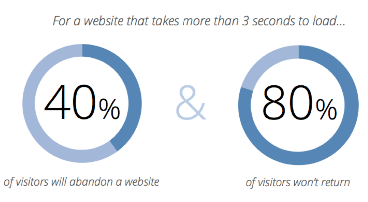
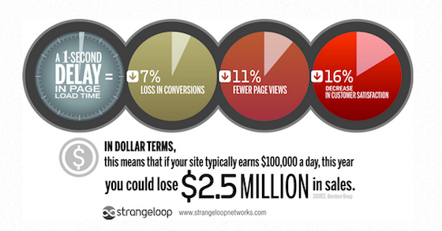
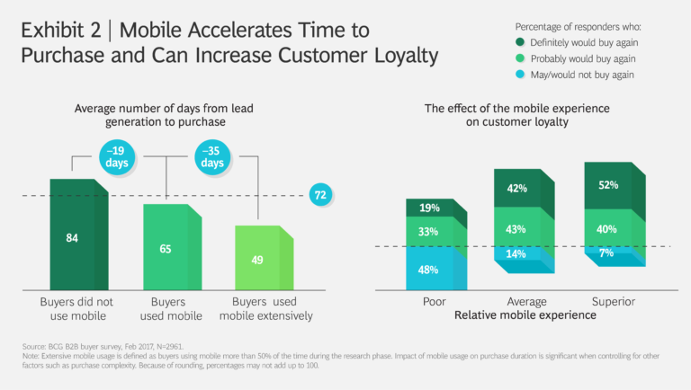
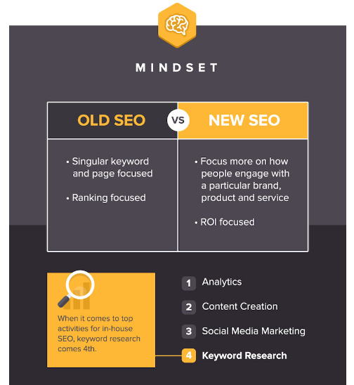

Have you ever imagined that being on the first page of Google would earn you lots of money? It is this way now. And not only in Google, in every search engine of the internet, but Google is the most popular and profitable. That is possible thanks to SEO, and here we will explain you some **SEO tips** that will help you with this goal. 

If you are in higher position on searches people would access easier your website, social media accounts, and every web platform you have. That translates into more people converted, more loyal clients, and of course, more sells and money. 

For that reason, so many brands make everything is possible to be on the first page of Google. 

There are many ways to do It, but one of the more common is SEO techniques.

<title-2>What is SEO?</title-2>

Search Engine Optimization. This is the literal meaning of this acronym. In more understandable words, SEO are some techniques of information engineering that optimize the content you share on the internet, specifically for search engines. 

This is an online marketing discipline that will help you to grow your visibility in organic search engine results. And all of this result without any payment. 

SEO is a mix of technical elements and creative elements that you should practice for structure your website in a way that search engines understand it better. In that way, you would improve your ranking, drive more traffic to your website, and increase awareness in search engines. 

From there, you also would monetize with your website or just selling more because you will be one of the first options that people will access. 

And the best of all, you can get search engine-friendly websites, and at the same time, you will improve the content of your website. People will love it! 

<title-2>SEO tips for success</title-2>

**1. Work on your speed as if it were about saving your life**

<youtube-video id="13jOMJhKISE"></youtube-video>

Three seconds is the longest time your web page should take to load it. You have to eliminate every element that makes it slow. 

It is demonstrated that the loading speed influences on the position you have in search engines. Why? Because visitors leave a slow website and fewer views and visits mean poor content according to the [latest update of the Google algorithm](https://searchengineland.com/faq-all-about-the-new-google-rankbrain-algorithm-234440).

If your website delays in loading you’ll lose visits, your content will lose relevance and it would go to the last places in this search engine. So, the first SEO technique that you can do is to improve the loading speed. 

It can be using a better server, eliminating all elements that you are not using, optimizing images, eliminating cache, and all information that is not necessary. 

Here is the proof

Source: [Neilpatel](https://neilpatel.com/blog/10-most-important-seo-tips-you-need-to-know/)

Source: [Neilpatel](https://neilpatel.com/blog/10-most-important-seo-tips-you-need-to-know/)

But if you want to know exactly what you have to improve on your website for getting faster its loading speed, there are some tools like [lighthouse](https://developers.google.com/web/tools/lighthouse/) and [Pagespeed](https://developers.google.com/speed/) than analyze it and give you reports about what you can do for accomplishing that.

These tools are developed for Google and both are [open source software.](https://cobuildlab.com/blog/software-open-source-vs-proprietary-software/)

**2. Work for as many featured fragments as you can**

It is demonstrated that featured fragments position you higher on Google search results, and a lot. 

In case you didn't know, featured fragments are these charts that you can see above the regular results in the Search Engine Results Pages (SERP), with lists, or a brief about a search you made. 

How you can have one? Well, there isn’t a formula for that yet. [Google recommends](https://support.google.com/webmasters/answer/6229325?hl=en) that you make a good structure of your information mainly, create content that is relevant to people searching for answers and they will do the rest.

These [code snippets](https://developers.google.com/search/docs/data-types/article) for getting rich results you can do it for free following the steps that Google provides for you.

**3. Mobile is first**

In this 2019 if a website doesn’t have a mobile version including a responsive design practically does not exist for Google. 

There are studies like the one who made the [Blue Corona team](https://www.bluecorona.com/blog/mobile-marketing-statistics) that show that customers feel better with the mobile experience. That applies to searches and sells. 

Most searches on Google are made for mobile devices, that’s why Google is supporting and positioning these brands that understand it, and are producing content to consume on mobile. 

**4. Mention and link own content and content from others**

For sure, you have heard about a SEO technique called link building where you put links from another website in the content that you publish or vice versa. In that way, you would get more visits and also the websites you that you refer.

This happens bilaterally. You publish the link from others and the others publish link yours. In that way, is being built a kind of network. 

This has been very popular the last years, but now, Google goes beyond, and it is not necessary to put the link. From now, Google can associate the content without a physical link.  In effect, if there are comments or your brand is mentioned Google will know it, and that will give you relevance in the search engine. 

You only have to be sure of one thing: all websites that will have a relationship with your website must produce high quality and relevant content. They should have a good online reputation. 

5. Write for a human before for the search engines 

This is the last tip but we think that is the most important. Why do we think this? Because this tip will guarantee relevant and good content, and that is the most important thing when you have a website. 

You have followers, a community that you have to attend and satisfy. The easier way to improve your position on Google is giving them good and valuable content. 

That’s why we think that you have to write first for people, for this community who consume your content, and then apply some techniques that push a little more your content. 

But if you write thinking in search engines first, maybe your content is not so nice for people who read it. 

That happened before. People tended to write for Google and search engines, and the content was not friendly. It might even seem that was written by a machine. 

That is the last you want now. Google actually penalize this content that looked forced and it is not friendly or natural. 

Source: [Neilpatel](https://neilpatel.com/blog/10-most-important-seo-tips-you-need-to-know/)

So, forget the keyword stuffing or spam. Leave in the past these repeated words, and begin to make your content more natural and friendly. 

There is something called [*ranking factors*](https://backlinko.com/google-ranking-factors), and Google has more than 200. This is some elements, actions, and techniques that will help you to get a better position in this search engine. 

This also will help you with the SEO on the page. Look for them or communicate with us, for developing and put into practice your own SEO tips. You will get more visits, a better position on Google, and more money. From now, SEO will be your best friend.

