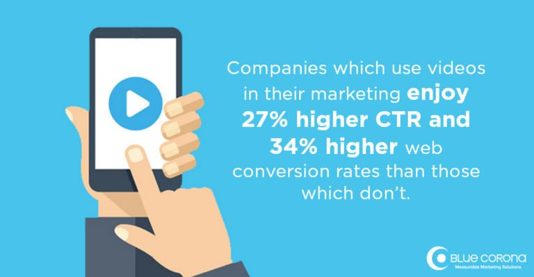
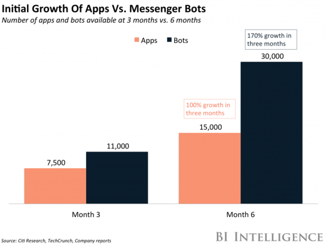
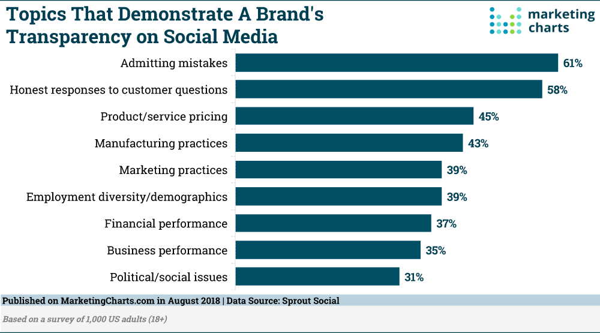
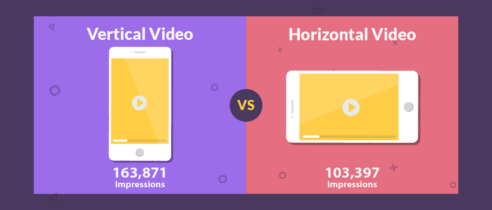
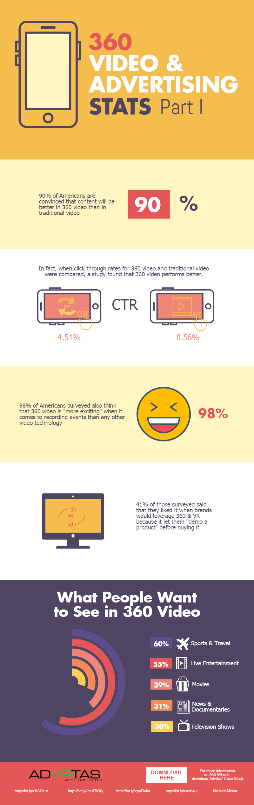
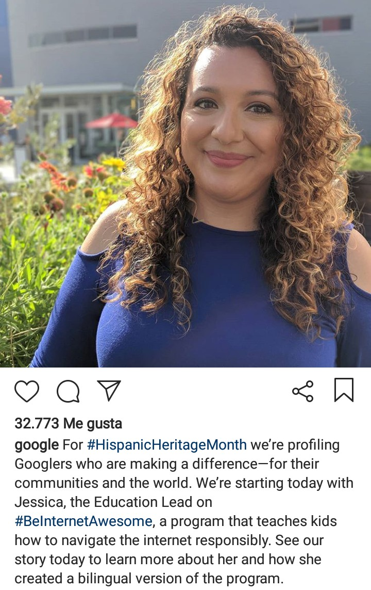
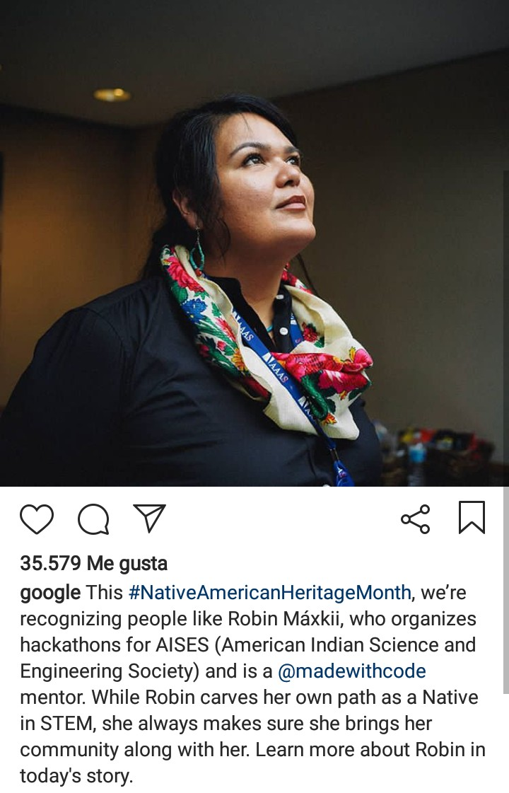
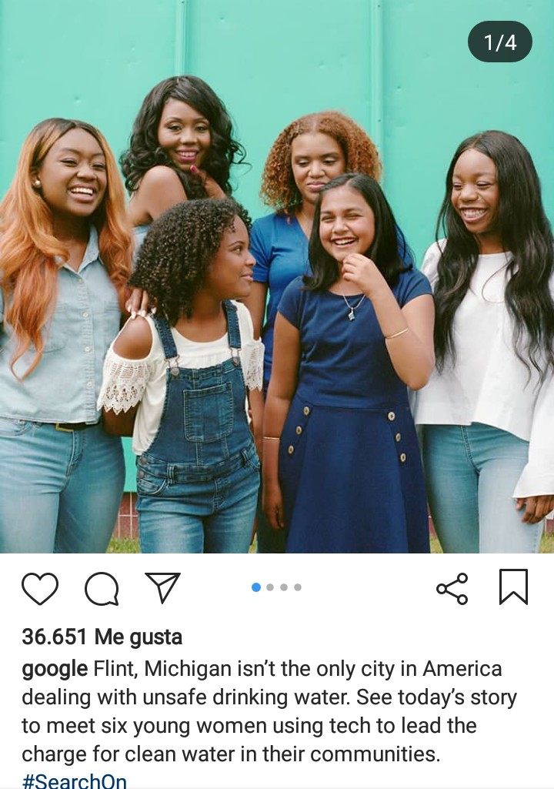
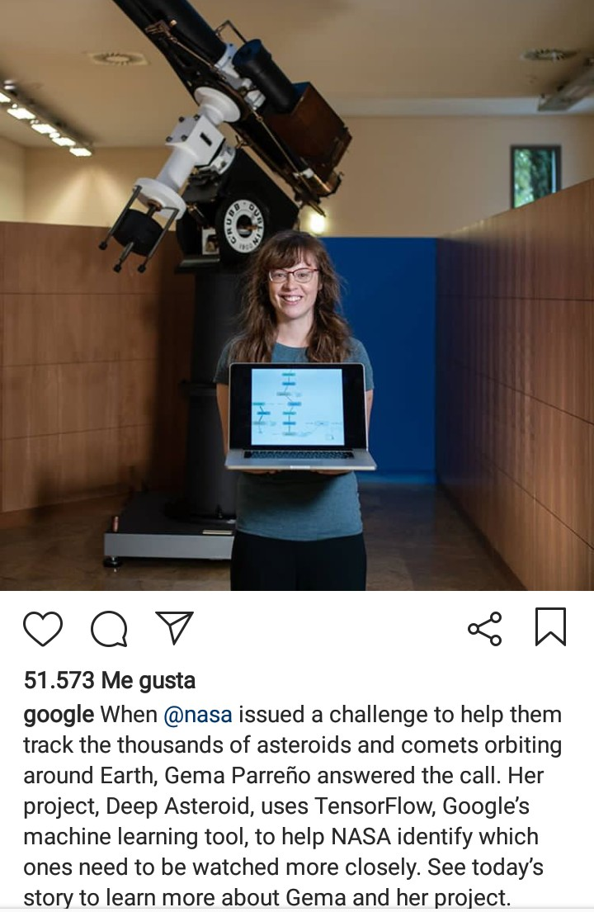
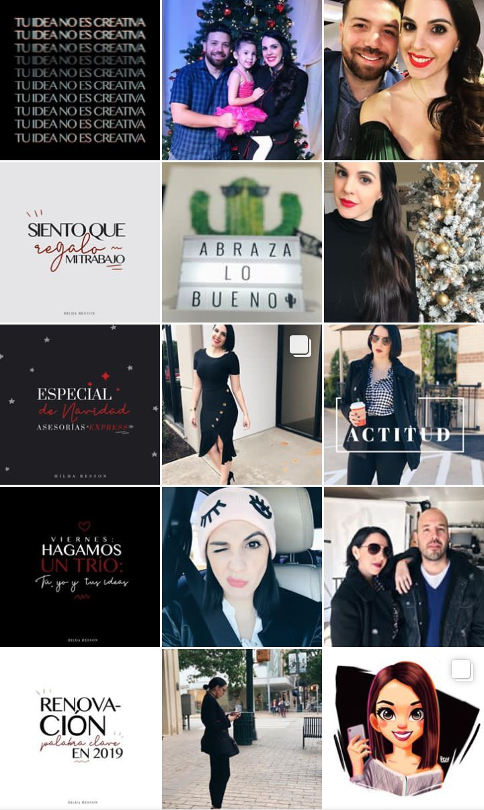

This year almost ends and we love, like everyone, predictions for the next year. Social media doesn’t scape of this, and we want to be part of that. That’s why we prepare some **social media trends for 2019** that we think will go viral to more than one brand. Do you want to be one of them? Let’s read, learn, and DO IT!

<title-2>List of social media trends for 2019</title-2>

<title-3>Video marketing will continue strong</title-3>

Video marketing was strong this year. On the internet, we could see how videos take the first place. 

Predictions for the next year show more power and more video content as the key to success in and out of the internet. 

Statistics say that more than 80% of content on the internet will be videos. Also, brands that use videos catch better the attention of its customers. Google will continue loving them, and social media will be the first platforms to consume them.

Source: [Blue corona](https://www.bluecorona.com/blog/video-marketing-statistics-must-see/)

<title-3>Influencer marketing</title-3>

It is a collaboration between brands. This marketing strategy was called strategic alliance before, but now is more than that, and the next year will continue advancing.

Even though both brands need to win something with the collaboration, on influencer marketing necessarily one brand must be an influencer, It has to have a good and strong presence on the internet, and the other should be less known. And how does work this marketing strategy? This influencer recommends your brand and his or her followers will be interested in your product or service. 

The [Digital Marketing Institute](https://digitalmarketinginstitute.com/blog/20-influencer-marketing-statistics-that-will-surprise-you) made a study where it showed up that 49% of consumers depend on influencer recommendations because they feel confident about influencers. They actually think that influencers know them better than their best friends. 

In the same study, they post statistics of Tomson about the money you can gain spending resources on influencers. They say you can get $6,50 for each dollar spent on influencers.

Source: [Sales Force](https://www.salesforce.com/ca/blog/2017/03/2017-state-of-influencer-marketing)

<title-3>Chatbots as protagonists</title-3>

It is a computer that uses artificial intelligence for talking and make a conversation with customers or people that need information. 

“Such programs are often designed to convincingly simulate how a human would behave as a conversational partner, thereby passing the Turing test. Chatbots are typically used in dialog systems for various practical purposes including customer service or information acquisition”.[Wikipedia](https://en.m.wikipedia.org/wiki/Chatbot)

This technology helps to reinforce and facilitate the direct and instant contact with clients that is so required nowadays. 

That’s why the next year, chatbots will be on demand.

Source: [Medium](https://medium.com/botsupply/chatbot-101-everything-you-ever-wanted-to-know-about-chatbots-478c0b825dd0)

If you want to be sure of this, we share this statistic and this study made for the [Chatbot Magazine's team](https://chatbotsmagazine.com/chatbot-report-2018-global-trends-and-analysis-4d8bbe4d924b) where we can see how people prefer bots for chatting than apps. And that's just the beginning.

Source: [Chatbots Magazine](https://chatbotsmagazine.com/chatbot-report-2018-global-trends-and-analysis-4d8bbe4d924b)

<title-3>Lives, lives, and lives</title-3>

Are you shy to talk on Live? Well, if you want to be on trend this 2019, you must do it. So, leave that fear. 

Instagram and Facebook popularized too much these transmissions, and the next year it seems that they will continue doing it. 

People love “lives” on social media because they bring a personal face on every brand. “Lives” are spontaneous, funny, and loved by all. So, begin to make them, and improve your position in the market. 

If you don’t know what to talk about, we share these topics that people of MarketingCharts suggest for being a brand more transparent and convince everyone with that.

Source: [Marketing Chart](https://www.marketingcharts.com)

This statistic explains better why we say that video lives are the trend and It will continue being.

Source: [livestream](https://livestream.com/blog/live-video-statistics-livestream)

<title-3>More vertical videos</title3>

We know, once again we talk about videos, and we are not joking when we say “they are and will be the protagonist”. 

This trend for 2019 is about videos on a vertical format, as the Instagram TV (IGTV). This year we see even on Youtube and Facebook ads videos with this format. People make lots of videos like this and Instagram, the second social media platform with higher use in the world is winning this battle until now. So, Why not do some vertical videos?

Statistics maybe convince you.

Source: [Blog Animaker](https://blog.animaker.com/vertical-video-facebook-ads-case-study/)

<title-3>360 degrees video and VR</title-3>

This amazing videos today only are compatible with Youtube, and special video players on websites. But we think that they will be compatible on 2019 with all social media platform. People find the way to edit this images on 360 degrees to upload them on Instagram, but they aren’t the essence of this videos. 

For sure this will be a trend the next year. The market calls for it.

<youtube-video id="rG4jSz_2HDY"></youtube-video>

Can you imagine seeing a video like this on Instagram or Facebook?

Well, these are some statistics that show the effect of videos in 360 degrees. Especially in ads.

Source: [Advrtas](https://advrtas.com/360-video-ads-better/)

<title-2>This year on social media…</title-2>

2019 will be amazing, but 2018 also was good for social media. That's the reason we take all of these trends that changed 2018 to show them here:

* **Challenges everywhere**

This year, challenges were on the table. That’s why we could see the #KekeChallenge, the #Xchallenge, the Icebucketchallenge, etc. For sure you participated in one, and millions of people in the world did it. 

For example, in the ice bucket challenge participated 17 million of users in the world. This news was written by [USA today.](https://www.google.com/amp/s/amp.usatoday.com/amp/448006001)

This trend is not only for this year. From 2017 challenges were famous on the social media. But we have to say that this year they stayed on the top.

* **More humanity**

Before, all people show good and beautiful things in its lives through social media. But this year happened the opposite. Breakups, weakness, insecurities, bad moments, and also good too, but social media this year was more human and real. 

Even corporate brands showed its human value and feeling. Maybe with the story behind its employees or allies, etc. This trend we think will continue and it will be reinforced
For the next year. If a social media account is humanized it will sell a lot. 

Big brands as Google confirm it.

* **Feeds super organized**

This trend was on Instagram, and every expert or influencer called it according to their criteria, like CCP: creative content programmed. But the result was basically a feed on Instagram very organized, with a static pattern of publication and look. 

For example, you had to choose three types of content as an image, a phrase with a lettering design, and a video, to publish it in a specific order. Suppose that you selected first the image, then the phrase, and last, the video. People followed this publication format religiously, and as a result, you could see all feeds super organized, and the content categorized by the format used.

Though It is so difficult to know with precision what people will love in the future, if you study, read, and pay attention to what they are doing now on social media, and which promises make the influencers, it is a little bit easier to predict some trends that will be on fire the next year. 

* **Stories in the day and at night**

From Snapchat, stories got so popular than others platform of social media couldn’t resist the temptation of being part.

Facebook, WhatsApp, and Instagram, which are the three more used social media apps in the world, incorporated stories to be on trend.

As Snapchat, this feature was a success. In part thanks to the more human and authenticity on social media, and also because it is so fun, almost addictive to share what’s happening at the moment. Instantly.

Let's see some statistics. 

