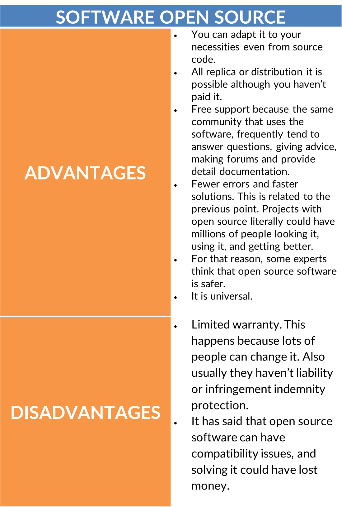
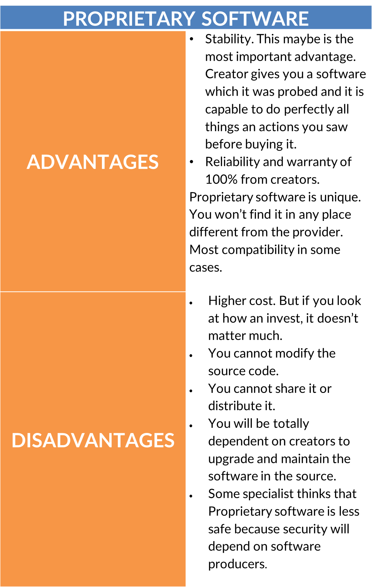

Have you ever listened to every good thing in life has to be paid? Well, that’s not always is certain, especially when we talk about software. This world gives us the opportunity to get open source software that is available for everyone. And that's not all. It doesn’t mean less quality or usability comparing it with those we pay. From now on we will compare **Software Open Source vs. Proprietary Software** to know the advantages and disadvantages, examples, and how can you use them in the best way.

<title-2>What is Open Source Software?</title-2>

In a few words, it is a kind of software that is available for everyone in the world, and it has the peculiarity that its code is open to developers. Surely you will ask, why does this happen? This makes possible that developers can change the code until it works the best for a specific project they are participating.

Engineers, customers, even developers love this kind of software because they can save effort, work, and time using something that it was already developed. And as if this wasn’t enough, they can personalize this main code and adapt it to their necessities. Sounds good, right?   

That’s not all! Software Open Source also can be shared with others. In a few words, once you have access, you can make whatever you want.

<title-3>Is it the same open source and free software?</title-2>

We already know what means Software Open Source, but what happens with free software?

Although it seems to be the same, they aren’t. Software open source, how we saw, it is a software you can modify it and adapt it to your necessities. While free software, as usual, cannot be transformed. You can use it for free but only with qualities with it has created. It is not flexible at all.

<title-4>With free software you can:</title-4>

* Use the software.
* Run it.
* Understand who it works.
* Share and distribute it.
* Create another software always you respect these aspects.

And what you think? Software for commercial use also can be free software. Why? Well, if you respect all these points, you can charge a rate for distribution.

<title-4>With Software Open Source you can do the next:</title-4>

* Getting access to the source code.
* Permission to change the software. 
* Free distribution of original and modified code. 
* Having derived work that can be distributed under the same terms of original software.
* The same license of the original software. You can take a new license, but it is not necessary.
* If you use it, it is not necessary that your program has to be open source too.

The principle here it is promove the collaboration inside a community to generate mutual benefits. 

Not all software open source is necessary free. And a free software can be open source at the same moment, but it wouldn’t be.

<title-2>Proprietary software meaning</title-2>

On the other hand, we have proprietary software, another kind of software that you have to bough if you want to use it.

This software belongs to someone else but what does it mean? The code is closed, it is copyrighted, its use is limited at some point, especially when it is referred to distribution or modification. 

Proprietary software also is called commercial software or closed-source software inattention to one of its most important characteristics. 

This software also is really good and unique and usually, they can be modified within creators limits.  

Some of the most important software that revolutionized the world years ago there are in this category.

<title-4>Characteristic of propietary software</title-2>

We met enough information about free and open source software. Now it is the moment to learn at least some of the most important characteristic of proprietary software:

* It has to be bough 
* Has an only license which is the property of a developer, company or who is the owner.
* Without access to its source code
* Free distribution or copy is prohibited. Actually, it is a crime
* It depends on end-users’ agreement 
* They can take you to jail if you violate any rule or agreement you accepted before.

<title-3>Software open source vs proprietary software: advantages and disadvantages</title-3>

 
  

<title-2>Examples of open source and proprietary software</title-2>

Open Source: 

<carousel folder='blog'>
./media/wordpress.png
./media/linux.jpg
./media/react.png
./media/free-office.png
</carousel>  

Proprietary Software  
<carousel folder='blog'>
./media/adobe-suite.png
./media/mac-OS.jpg
./media/microsoft-window.png
./media/avast.jpg
</carousel>

If we have to select a winner at the **software open source vs proprietary software** we say that there isn’t a winner. All of them give us good and bad things. Each one is useful. Everything will depend on your objectives and necessities. Do you agree with us? 
