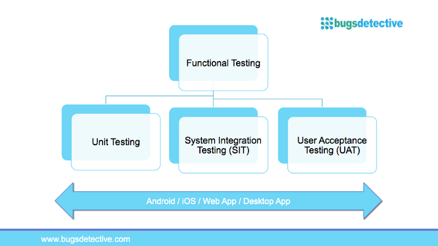

Testing is a phase in the software development process. But how necessary is to guarantee good results? That’s the main reason for this article. And also give you facts, examples, methods, and information about **software testing** for you can use it when it has been necessary. 

<title-2>It´s time to know what is software testing?</title-2>

Software testing is more than a probe. It is taking in consideration every part in a software product to find every imperfection, defect or deficiency it has as fast as possible.

It’s a methodology that helps you to find deficiencies. Testing is inside of [software development process](https://cobuildlab.com/blog/best-software-development-process/) and here you will discover its real importance. 

<title-3>Why does testing is necessary for a software?</title-3>

There are a lot of reasons, but we love to keep it simple and easy to understand. That’s why we make a list of some good reasons to test a software in different moments and areas. Let’s see: 

* To make better a workable software product 

* To improve its quality and performance 

* To develop the product reliability and stability

* To correct every defect

* To reduce costs, because being sure of good functionality gives us the opportunity to save money

* To be efficient, especially when we test in early phases.

This is part of the answer why testing software is so important for you.

<title-3>How do you test a software product?</title-3>

There are many ways, but we can share with you those we do for clients. And we want to explain to you why they are the best for us.

**1. In the source code, we use the unit testing**

In our software development process each developer probe a small part of the code to be sure about its functionality. The segment of the code tested is made for each one. 

This test we consider is necessary to do it before uploading it in the test server. Unit tests are very important because it is the first software validation.

**2. Then, it is the functional testing**

This second testing method consists of a test that confirms that functional requirements were met. It’s like a quality assurance which generally shows what the software makes.

Functional testing probe a part of the functionality of the whole software. Also, it is “a type of **black-box testing** that bases its test cases on the specifications of the software component under test. Functions are tested by feeding them input and examining the output, and internal program structure is rarely considered.” [Wikipedia](https://en.wikipedia.org/wiki/Functional_testing)

Functional testing has three components: 

* Unit testing
* System integration testing 
* User Acceptance Test

Source: [Medium](https://medium.com/@khaidir.kamil/usability-testing-vs-functional-testing-which-one-should-you-invest-more-bfa2a0e66b6)

Functional testing is made generally by testers. But in some cases could be made by developers.  

**3. When the product is ready, we have usability testing**

In this test, we need to probe the ease use of the app. This is part of non-functional testing. 

What do you need to know about this technique? Well, it is used on user-centered interaction design, we mean, users test it, evaluate it and then they give you information about how real users are going to use the software. 

Some experts have developed usability testing methods where users don’t need to be involved. 

The most important thing on usability testing is measuring the production capacity to get the intended propose.  

Also “usability testing measures the usability, or ease of use, of a specific object or set of objects.”[Wikipedia](https://en.wikipedia.org/wiki/Usability_testing)

**4. Stress testing**

When the software it’s gonna be publicly available, it is common to do a stress testing on its components simulating many many users. This test is made to know the software performance with enough demand. 

If it passes, the app is ready to be launched.

These testing methods were chosen for us because we focus on early products, prototypes, MVP, and the first version of products to probe the concept and validating the business model. 

In a few words, it is required to do the minimum to launch the first version of the software for small audiences and probe it. Once it has been tested it, we change and improve what is necessary to test again until is ready.

<title-4>Sosftware tetsing example</title-4>

Suppose that we are working on a project and we need to do the software testing. 

We work with an agile framework, and that’s the reason we make testing from day one, since the first iteration.

Another consequence of agile processes is the impossibility to plan with too much time every test. 

1. So, developers make unit testing while they are creating the code. 
2. Once the functions are on the test server our leaders make the functional test to be sure of accordance between functional requirements and software functionality. 
3. Then, our leaders plan and make the usability testing 
4. When everything is right, we launched a probe for stress testing 
5. By last, we release the software

All of this software testing is made from the first day of work. Some of them are realized at the same moment to keep the agile methodology. Testing software, in this case, is an exploratory process. 

Every test has to be documented once it has been finished and we will do it on the test registry. In that way, we will be sure of good code, good functionality in accordance to criteria described in user stories, the correct usability, and the high resistance of software.

**What is included in software testing?**

During the software testing the team needs to develop test scenarios, they can plan the test, execute the test, found defects or validate the code or functions that are good. Once you have the test result, immediately these results have to put it on a test registry.

In conclusion: **Software testing** is more than necessary. It is the guarantee of quality, good functionality, and accomplishment of the software goals. If you don’t test it you won’t be sure of having good results. And everyone in the world wants to have good results. So, test more and bet less. 

