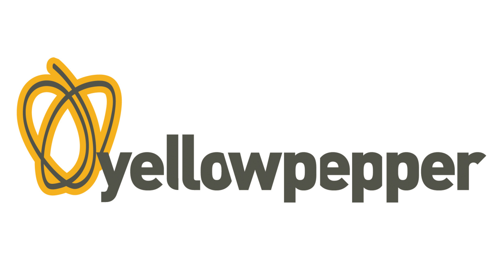
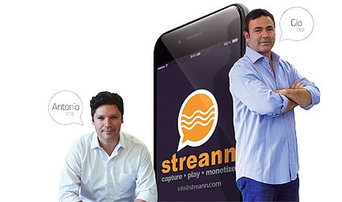

Did you know that Miami is the second city in the country with a higher level of entrepreneurship? And the last year was the first. Now it is a little below of Silicon Valley, but these would change in a very short time, and here, we will explain to you why. 

Startups in Florida multiply every day, and more investors and big companies invest here. In that way, the entrepreneurship culture develops, and at the same time, technologies, software, services, and our lives get better thanks to all of these solutions. 

To prove this fact, we prepare this post where you will find the **startups that were funded recently** either in this 2019 or the last year. 

<title-2>This is the list of startups that were funded:</title-2>

<title-3>1. ParkJockey for Softbank</title-3>

Source: [Parkjockey](https://www.parkjockey.com/)

[Softbank](https://www.softbank.jp/en/) wants to contribute with the entrepreneurship in Florida at the point that they plan to compete with Silicon Valley and they bet for accomplishing this goal in 2019. 

For that reason, they finance a parking tech startup here in Miami called [Parkjockey.](https://www.parkjockey.com/miami)

[This company has a valuation above $1 billion now](https://www.bizjournals.com/southflorida/news/2018/12/10/softbank-invests-hundreds-of-millions-of-dollars.html), and this would make it one of the most valuable startups in Miami. Actually, it is a unicorn and it is a little below of Magic Leap and JetSmarter with $2,44 billion and $1,5 billion. 

ParkJockey was founded in 2013 by Umut Tekin and Ari Ojalvo. 

Its software helps real estates owners to manage to park or to generate parking revenues from their properties. 

And as if this wasn’t enough this startup plan to make another deal with Imperial Parking Corporation (IMPARK). A big company from Canada is one of the largest parking management companies in the country with more than 3600 facilities in around 330 cities between US and Canada. 

They hope to finish this agreement for half of this 2019.

Until now, ParkJockey [doesn’t have made public the specific amount of the investment](https://www.dealstreetasia.com/stories/softbank-parking-unicorn-parkjockey-113136/) from SoftBank, but it is a reality. 

The team of [Miami Herald](https://www.miamiherald.com/news/business/technology/article222882895.html) published that this financing round is valued on hundreds of millions of dollars while Crunchbase says that this investment was for $800 million.

The most important reality is that ParkJockey is more than a promise for local entrepreneurship. 

<title-3>2. Caribu</title-3>

Source: [Caribu](https://caribu.com/)

[Caribu](https://caribu.com/) is a startup based in Miami. This platform that allows parents for reading together with children through a video call [receive $1,3 million in the fund the last year, and AT&T is behind of this investment.](https://www.bizjournals.com/southflorida/news/2018/10/04/caribu-raises-1m.html)

Also, Be Curious venture firm that invests in parenting startups, participate in this round of investment. 

This startup has been developed fastly and now they have a presence in around 140 countries, and they won on 2018 the 1775 Global Challenge Cup Pitch Challenge for raising funds. 

Its CEO Maxeme Tuchman said that they want to change or just getting better the way that families communicate and to be sure of children would read literature and learn too.

Caribu also contributes to the entrepreneurship making of Miami the second city in the whole country with a higher level of initiatives. 

Read more about this Startup in our [blog post](https://cobuildlab.com/blog/caribu-app-for-children-parents-read-together/).

<title-3>3. Yellow Pepper</title-3>

Source: [Yellow Pepper](https://www.businesswire.com/news/home/20180524005278/en/YellowPepper-Announces-12.5M-Additional-Funding-Drive-Latin)

[Yellow Pepper](http://www.yellowpepper.com/our-products/) platform provides to many institutions, especially in Latin America, mobile banking and payment solutions. 

The best of this fintech is that is located here, in our city, and also that it has the support of big monsters in the industry like Visa and Mastercard. 

The first of these big brands [made an investment this 2018 for $15,5 million](https://www.businesswire.com/news/home/20180524005288/en/Visa-Strategic-Investment-YellowPepper-Accelerate-Adoption-Mobile). The goal was to share and offer the best technology and capabilities to a set of partners, and just support the technology of the future when it is related to payments and financial solutions. 

This startup was founded in 2004 and now enables over 6,6 million users a month who execute around 480 million transactions a year. 

And for sure a hit from startups raised on Miami.  

<title-3>4. MD Live</title-3>

Source: [MD Live](https://www.mdlive.com/doctor-phone/)

[MD Live](https://www.mdlive.com/) is a telemedicine provider founded in the South of Florida. 

Randy Parker is responsible for this startup that was created in 2006 with the goal of replacing or at least reducing the ER and medical visits. 

This platform provides care for over 50 medical conditions, and even it includes therapy consulting for solving personal or mental issues. 

The idea is that you can consult your doctor from your home or any place where you are. 

From this app, you also would have treatments, lab results, a medical record, and much valuable medical information. 

In 2018, specifically in August, investors like Signa, Health Care Service Corporation, and Health Velocity Capital made an [investment of $50 million](https://www.mdlive.com/investors-include-health-velocity-capital-and-proven-healthcare-leaders-cigna-and-health-care-service-corporation/) to expand and getting better the platform that helps more than 27 million of Americans. Awesome, right? 

<title-3>5. Streann Media</title-3>

Source: [Produ](https://www.produ.com/noticias/gio-punzo-de-streann-media-lideramos-soluciones-ott-con-mas-del-70--de-los-clientes-en-a)

[Streann Media](https://streann.com/) is also a startup that was funded recently in Miami. They got a [venture investment for $1,54 million](https://www.refreshmiami.com/miami-startup-streann-media-attracts-1-54-million-in-funding/) to achieve the global expansion of its startup that provides innovative distribution, engagement, and monetization tools for content providers. It is a SaaS platform.

This investment come for New World Angels, FAN Fund, Naples Technology Ventures, and Tamiami Angels.

Giovanni Punzo and Antonio Calderon are the co-founders of this company that was founded in 2014. 

Everyone who uses this platform can create next-generation digital networks to engage their end users, also they can monetize in digital, and the best, control their content. 

An interesting fact of this startup is that they were responsible for streaming all 64 games of the FIFA World Cup in three countries for mobile, web and Roku platforms. 

Also, they participated and won the Unbound Miami conference. 
“We created Streann to rescue the broadcast industry and we are just getting started.” Said Punzo. Their goal is to rescue the broadcast industry in their words. 

These **startups recently funded in Miami** are from 2018 to the beginning of 2019. The next startup founded would be yours. So, prepare your [pitch deck](https://cobuildlab.com/blog/make-the-perfect-pitch-deck-and-convince-investors-easily/), [choose a method to raise funds](https://cobuildlab.com/blog/methods-to-raise-funds-for-your-startup/) or maybe [follow these tips](https://cobuildlab.com/blog/methods-to-raise-funds-for-your-startup/) we made to achieve the same goal, and find all the funding you need to make your business idea real. We support you from here and bringing to you pieces of advice.
