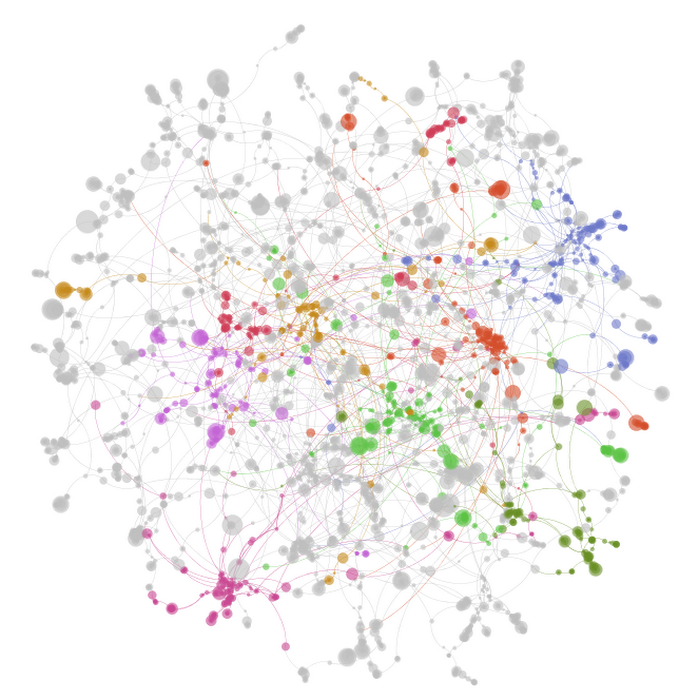
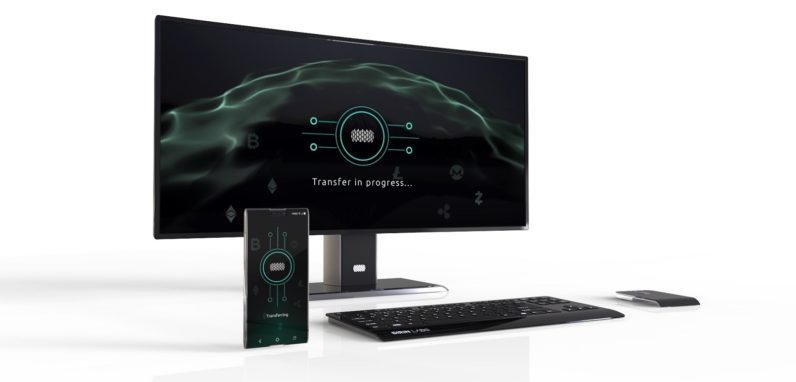
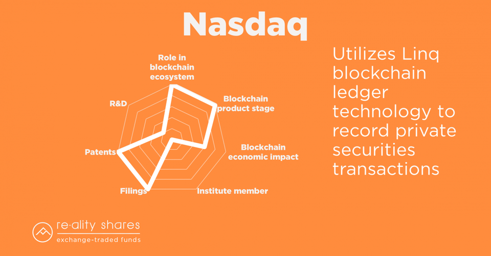

We think that Satoshi Nakamoto never imagined the big businesses he or she will do with [the blockchain](https://en.wikipedia.org/wiki/Blockchain). This technology changed the world and the way we enjoy, use, and get money, processes in companies, the way to transmit information, etc. 

Blockchain not only has been used for **cryptocurrencies**, which is a virtual currency to do safer transactions without a bank, government or institution behind;  It also has been used in some distributed ledger technologies for access, validate, and update records without changing it across a network spread in multiple entities or locations, and lots of people in the world use it to transmit, store, save, and protect data on the web.

Source: [Investopedia](https://www.investopedia.com/terms/d/distributed-ledger-technology-dlt.asp)

<title-2>Blockchain: the source</title-2>

BlockChain, it is a chain made of blocks of information that cannot be changed without affecting the other blocks. Why? This happens because the metadata of one block has information relative to the block before. This chain made of blocks is together on a timeline.

This technology is based on math operations so complex that an expert would take years to try to decode it.

This technology was used by Satoshi to create the Bitcoin Network, and it has been used for many purposes.

It works like magic. And that explains the success it has had. For that reason, big companies like Amazon, Walmart, HTC, Google, and others are investing in technologies in this market. 

**Big brands and Blockchain** are inseparable now, and that’s why we prepare this post. To show you the huge effect of blockchain technologies had has the last years on the world economy.

<title-2>The list of big Brands and Blockchain</title2>

<title-3>* Google</title3>

This technology’s monster from 2012 has been interested in blockchain business. That’s the reason they associated with Digital Asset and BlackApp to work on different technologies in the area. Actually, they are the second company in the world with a higher investment in the market. Say it by [CBI Insights](https://www.cbinsights.com/research/report/blockchain-trends-opportunities/). 

Google’s team build all of its blockchain technologies on the Cloud. Actually, they offer some of them for free and others like [proprietary software](https://cobuildlab.com/blog/software-open-source-vs-proprietary-software/). 

Google nowadays has a Big Data study of Ethereum Blockchain. In this way, people can access this information and using it in favor to develop something, to take advantage of that or just to be informed. 

For example, they show that CryptoKitty is the company with the higher number of ERC-721 contracts on the Ethereum network. 

Source: [Coindesk](https://www.coindesk.com/google-now-provides-a-big-data-view-of-the-ethereum-blockchain)

Also, they offer ledger solutions to people who earn, buy, sell, and use commonly cryptocurrencies. 

Google’s goal is to provide important and valuable information about blockchain to developers’ community in the world across the Google Cloud Service. In that way, they could be able to develop interesting and effective technologies.

<title-3>* Amazon</title3>

Consesys, Tradewind, R3, and Luxoft are some of the allies of Amazon Web Services. 

Between its services on blockchain market we can find distributed ledger solutions and the best, they offer pure blockchain built on its structures, tools, and technologies. 

Source: [Amazon](https://aws.amazon.com/es/partners/blockchain/#)

In this way, they explain its services on the Blockchain’s market. And also, they offer with this solutions framework: flexibility, one-click deployment, and the best, a global reach. 

<title-3>* Walmart</title3>

Walmart was one of the first big brands that use and support Blockchain in the world. 
They think that this technology helps them increase transparency of transactions making it faster too. In that way, the food they need to transport can be followed it during the path. They use the IBM blockchain for this. 

Source: [Clickz](https://www.clickz.com/brands-blockchain/209093/)

The main reason for this Blockchain’s benefit for food companies it is on the speed. 

With Blockchain is possible to follow in two seconds the path of food and money during a transaction while in a traditional way they could take weeks. 

They support Blockchain because this benefit helps them preserve quality and the good state of some products. 

We share this video that also explains it in a good way.

<youtube-video id="SV0KXBxSoio"></youtube-video>

<title-3>* IBM</title3>

IBM is a company that provides Blockchain services and solutions to many and different companies in the world. 

They use this technology applied to many processes into an organization, like transmit information in a safer way, and having a distributed ledger across different locations. These are many reasons that get better your business performance thanks to Blockchain.  

They also work on the cloud as other Blockchain’s services.

<title-3>* Sirin Labs</title3>

Sirin Labs is a company that developed officially one of the first crypto phone which is called Finney. 

This smartphone works like a wallet for cryptocurrencies.

You can save the most common crypto coins there in a safe way. 

All of this is possible thanks to a fork called Sirin OS of Android. This tool makes possible to have the opportunity to have a wallet, encrypted communication, etc.

Source: [Omicono](https://omicrono.elespanol.com/2018/04/primer-telefono-con-blockchain/)

And as if this were not enough, Sirin Labs also is working on a [PC all in one](https://medium.com/@ViktorCrypto/smartphone-and-pc-on-blockchain-sirin-labs-5080ee371d3f) specialized in the same market; cryptocurrencies. 

Some information about that it leaked on the internet the last year, and that’s why people said that Sirin Labs delayed the release. 

This image has been on the internet since 2017. 

Source: [Omicono](https://omicrono.elespanol.com/2018/04/primer-telefono-con-blockchain/)

But the truth is that none of these products are on the market now, we only have promises and the information that the brand’s agent give us or people hung up on the internet.

<title-3>* Nasdaq</title3>

This is an index market which used this technology for protecting its operation, and also they work with cryptocurrencies, the special product made with the blockchain technology. 

Blockchain has been so good for this company that they were able to predict the performance and value of Bitcoin in some years.

Source: [Reality Shares](https://twitter.com/realityshares?lang=en)    

**What will come for the future?** 

Nobody knows. But everything seems in favor of Blockchain in different areas like the crypto market. Some studies said that the next year cryptocurrencies will be over than 11% that now. 

Other specialists think that Blockchain can be used for reducing the corruption in companies, governments, and every kind of association. 

But how we have seen, this market is so dynamic, now could be on the top and tomorrow it could be forgotten.

For now, big technology brands are supporting cryptocurrencies and a way to earn them: the blockchain. So, if you have a nice idea in this area why don’t try? In some months you will probably be a millionaire, your information could be save of criminals, or maybe your processes could be faster thanks to this technology. 

If you don’t have one idea or you are not in this market, began to use any of these products sponsored by your favorites brands in the world. That’s one of the benefits of the beautiful relationship between **brands and blockchain**. What are you waiting for taking advantage?

