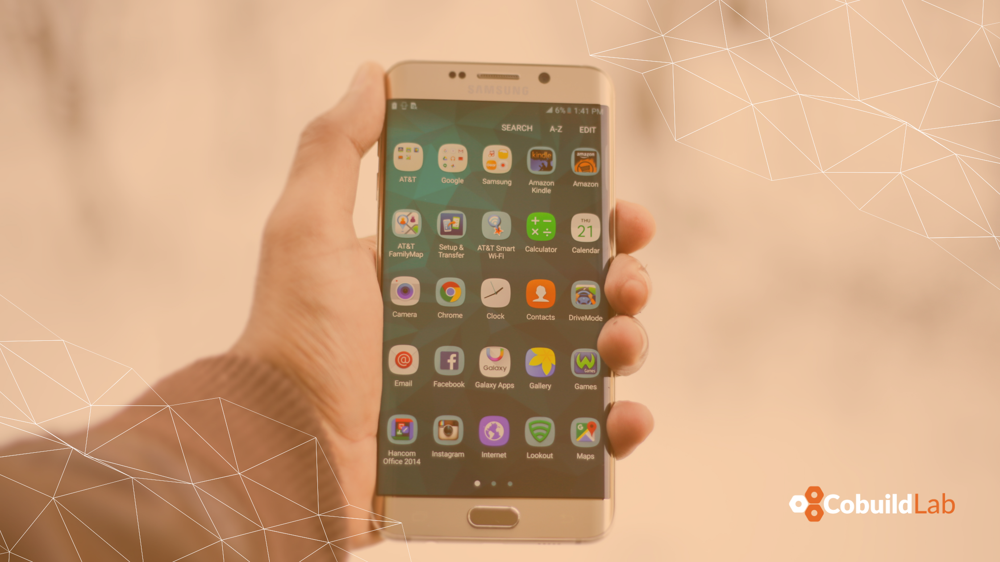
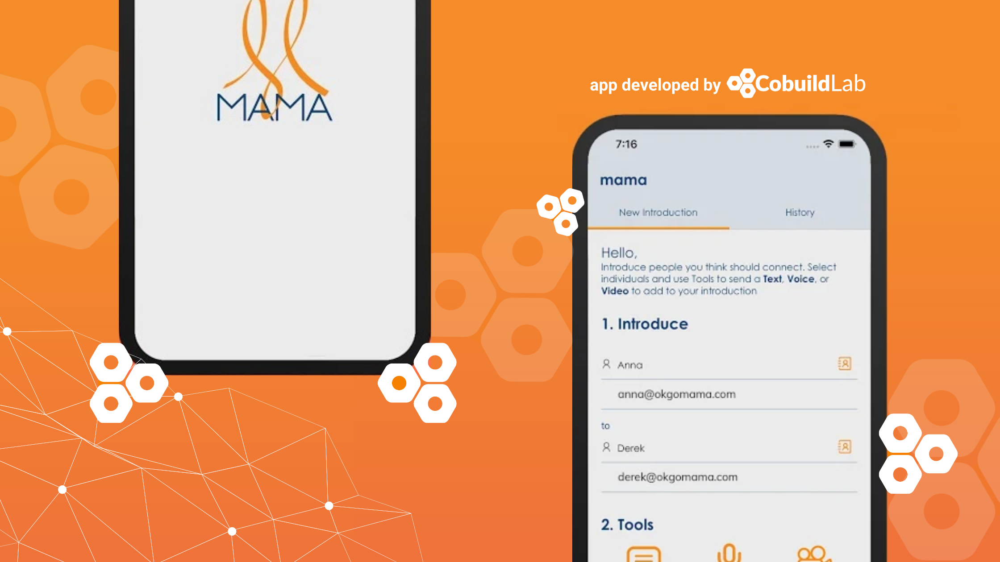

Miami, FL. Oct 30, 2020 - The second phase of development for MAMA's mobile app has been finished and its trial version is already released, confirmed <a target="_blank" href="https://www.linkedin.com/in/alacret/"> Angel Lacret</a>, Chief of Product Development, and Cobuild Lab's CTO.    

Mama is a fun and easy-to-use connectivity tool that makes lightning-fast introductions. In a time where we are often left to our own devices, people can feel isolated and still struggle to make rewarding connections. Mama is here to solve that problem!    

MAMA is a social platform that aims to connect people through the introductions from individuals we know, like, and trust; an acquaintance that acts as a “matchmaker”. Its founders <a target="_blank" href="https://www.linkedin.com/in/anna-keeler-971599156/"> Ana Keeler</a> and <a target="_blank" href="https://www.linkedin.com/in/s2a/"> Derek Stout</a> wanted to connect people to expose endless opportunities for friendship, love, and professional connections. They teamed up with <a target="_blank" href="https://cobuildlab.com/"> Cobuild Lab</a> a couple of months ago to start developing a <a target="_blank" href="https://cobuildlab.com/blog/mobile-apps-web-apps-or-cross-platform-what%E2%80%99s-the-best-for-my-small-business/amp/"> mobile app</a> that will allow you to make professional recommendations, introductions between friends, meet interesting people, and expand your network.    

<title-4 align="centered"> Why a mobile app? </title-4>     

    

A mobile application or app -as it’s most commonly known- is a software product that’s been designed and built to run on a particular piece of hardware, such as a tablet, smartphone, or watch. Although they were originally intended for productivity assistance such as calendars or contact databases, their use quickly expanded. Today there are mobile applications for factory automation, social media, games, libraries, photos, and video editing, there is even an official US military application for iOS that presents the service's technology news, updates, and media in one place.    

So, why build a mobile app for this project? Let’s check out some statistics:     

👉 According to the 2019 <a target="_blank" href="https://www.bondcap.com/report/itr19/"> Mary Meeker</a> report, Mobile internet usage was rising while desktop internet usage continued to fall    
👉 According to <a target="_blank" href="https://www.emarketer.com/content/the-majority-of-americans-mobile-time-spent-takes-place-in-apps"> eMarketer</a>, nearly 90% of mobile internet time is spent on apps    
👉 In the second quarter of 2020, there were 37.8 billion global mobile app downloads according to <a target="_blank" href="https://www.businessofapps.com/marketplace/sensortower/"> Sensor Tower</a>    
👉 Play Store's ‘social’ category had 1.18 billion global downloads in the second quarter of 2020 <a target="_blank" href="https://www.businessofapps.com/marketplace/sensortower/"> (Sensor Tower)</a>    

We transform Small and Medium size businesses by automating manual processes and tasks into optimized and streamlined workflows with Web and Mobile custom software.  So we always look for the best solution for our customers whether it is <a target="_blank" href="https://cobuildlab.com/blog/mobile-apps-web-apps-or-cross-platform-what%E2%80%99s-the-best-for-my-small-business/amp/"> Mobile Apps, Web Apps, or Cross-Platform</a> we assess our clients and we build what works best for their business.    

It was pretty clear for the MAMA project to be successful it had to be a mobile app. We then started <a target="_blank" href="https://cobuildlab.com/blog/planning-a-software-project/"> planning the software project</a> by holding previous meetings with Ana and Derek to <a target="_blank" href="https://cobuildlab.com/blog/cobuild-process-part-1/"> validate the idea</a>, and then we planned the development process, where we divided the project into three stages:    

🔵 In the first stage of the project, we framed the app’s interface, creating a foundation for the functionalities that would be added next.    
🔵 In the second stage, a variety of functions were added such as sending and receiving text messages, you can also record and play voice notes or video messages in the app.    
🔵 In the third stage, we incorporated the introductions to the app through a chat so when you invite people you’d like to introduce, they will have to download the app and connect through the platform.     

    

We are now launching its <a target="_blank" href="https://cobuildlab.com/blog/minimum-viable-product/amp/"> MVP (Minimum Viable Product)</a> to start building a user base and it’s already available on the <a target="_blank" href="https://apps.apple.com/us/app/id1516922160"> Apple Store</a>and <a target="_blank" href="https://play.google.com/store/apps/details?id=com.cobuildlab.mama"> Play Store</a> as well. Stay tuned for more updates on MAMA's Project, thank you so much for reading!    

<title-5 align="left"> CompetitiveAdvantage Cobuild Lab </title-5>

At <a target="_blank" href="https://cobuildlab.com/">  Cobuild Lab</a> we’re firm believers that every single time we’re writing a line of code we’re writing our future. We build software products such as web or mobile apps that run our lives and are changing the world we live in. Since 2012 we've focused on developing and combining agile techniques, tools, and technologies to increase development speed to deliver faster results.    

<youtube-video id="5fbYxQNgJ7s"></youtube-video>     

Got an idea for a web or mobile app? Let’s build it! Check out our <a target="_blank" href="https://cobuildlab.com/price-calculator/">  price calculator</a> to have an estimate of the cost of your project or email us at contact@cobuildlab.com and get a FREE online consultation. 

