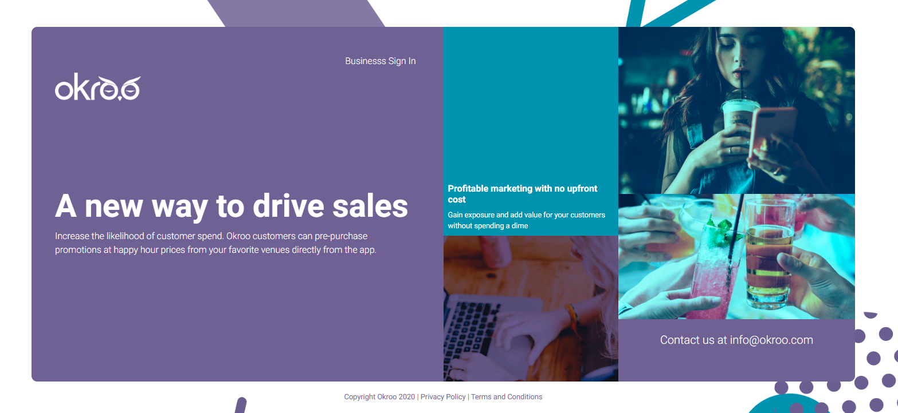
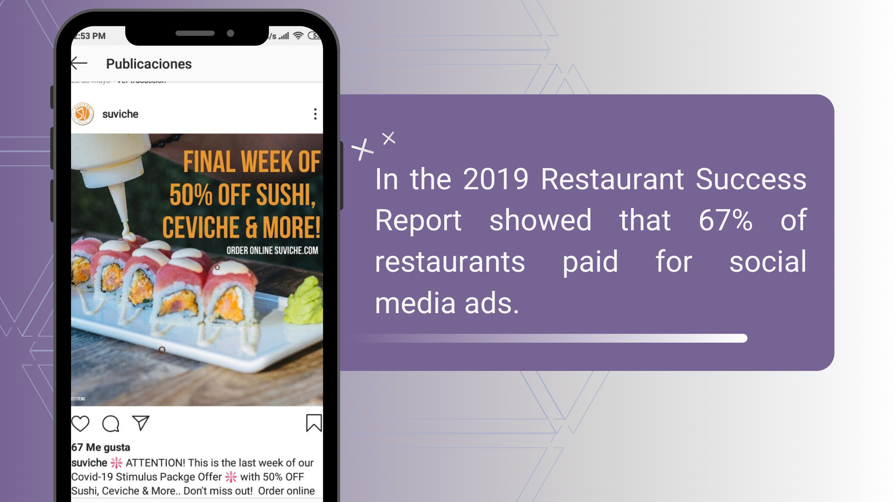

Miami, FL. July 23, 2020 - <a target="_blank" href="https://cobuildlab.com/blog">  Cobuild Lab</a> has partnered up with two entrepreneurs  who love the Miami lifestyle -especially its cuisine- and they’ve come up with a brilliant idea to make it easier to choose your next restaurant  when you're visiting Downtown. We developed <a target="_blank" href="https://okroo.com/">  Okroo</a>, a mobile app that allows you to know the best promotions of the restaurants and bars closest to you.    

Miami's cultural fusion can be appreciated in all its forms: music, arts, traditions... and especially, the cuisine. As the locals joke -because of its diverse population- Miami is the only foreign city Americans can visit without a passport.  With Cuban, Hispanic and African influences mixed with a base of American tradition, you'll get the unique South Florida style of cooking known as <a target="_blank" href="https://en.wikipedia.org/wiki/Floribbean_cuisine"> Floribbean cuisine</a>, which is why visiting a good restaurant to taste the authentic gastronomy of the city is a must.    

Some of Miami's most interesting dishes are found in the heart of Downtown, and its restaurants are a reflection of its melting pot quality. You'll find everything from kosher food to delicious Cuban sandwiches, the most exquisite caviar and the best Spanish restaurant with an excellent paella.    

And here’s a very interesting fact about Miami:  it is the <a target="_blank" href="https://cobuildlab.com/blog/Miami-a-Tech-Hub-for-investors/">  perfect tech hub for investors</a>. According to the <a target="_blank" href="https://indicators.kauffman.org/">  Kauffman Index</a>, it is the second most entrepreneurial city in the U.S. And that's exactly what inspired Craig Miller and <a target="_blank" href="https://www.linkedin.com/in/bkossally/">  Brenton Kosally</a> to take the idea that promises to shake up the culinary route Downtown to the next level. 

    

According to the <a target="_blank" href="https://www.restaurant.org/downloads/pdfs/research/soi/restaurant_industry_fact_sheet_2019.pdf">  2019 Restaurant Industry Factbook</a>, 56% Consumers who say the ability to walk there from their home would make them choose one restaurant over another. This is known first hand by both Craig and Brento who work Downtown, and of course they are a 10 minute walk from an endless number of places to eat. They needed to go to the nearest place to eat and then return to work, plus the after-hours with friends are always better when they get promotions and happy hours, but they couldn't found an app that would allow them to look for food or drink promotions around Downtown Miami.    

Now, assuming that an employee who works 5 days a week must buy lunch daily, it creates a fixed expense for which it would not hurt to know which places have promotions and thus save a little money. That's where the idea comes from to develop an application that could show you the offers from the sites closest to you.    

<title-3 align="centered"> WE INTRODUCE YOU OKROO: A NEW WAY TO DRIVE SALES  </title-3>    

    

Craig Miller y Brenton Kosally got in touch with <a target="_blank" href="https://www.linkedin.com/in/alacret/">  Angel Lacret</a> Chief of Product Development and Cobuild Lab’s CTO to build this amazing idea. “When  <a target="_blank" href="https://cobuildlab.com/blog/planning-a-software-project/">  planning a software project</a> we have some previous meetings with the client explaining how our <a target="_blank" href="https://cobuildlab.com/blog/cobuild-process-part-1/"> Cobuild Process</a> works, which consists of two stages: <a target="_blank" href="https://cobuildlab.com/blog/validating-your-idea-the-first-step-to-create-your-startup/">  validate</a> and cobuild” commented Lacret, “So for Okroo's project we had about 4 or 5 meetings where we used something called a <a target="_blank" href="https://www.upstrategylab.com/blog/create-strong-value-proposition-b2b#:~:text=The%20value%20proposition%20canvas%20consist,customer%20profile%20and%20your%20offering.&text=Your%20offering%20displays%20the%20products,have%20a%20product%2Dmarket%20fit.">  Value Proposition Canvas</a> and other entrepreneurial tools to determine the viability of the product”  he said.    

Okroo is a <a target="_blank" href="https://cobuildlab.com/blog/mobile-apps-web-apps-or-cross-platform-what%E2%80%99s-the-best-for-my-small-business/amp/">  mobile app</a> that allows you to discover surrounding promotions for meals and drinks closest to you.  The app has a **geolocation** function, which records your current location and then searches for the places closest to your position.    

<title-5 align="centered"> Increasing the likelihood of customer spending </title-5>    

The main problem that most businesses are facing is to get traffic to their stores and to be able to communicate their offers, so most of them go to social media, influencers, or invest in being a community event or charity sponsor. Okroo's value proposition is to enable users to discover this promotions, increasing traffic and their likelihood to spend.    

<a target="_blank" href="https://www.readycloud.com/info/instant-digital-savings-mobile-coupon-statistics-for-2018#:~:text=More%20than%2025%20million%20American,2017%20thanks%20to%20mobile%20coupons.">  50% of consumers are more likely to shop with a brick-and-mortar store if they’ve received a coupon from that store</a>    

    

The city's dynamic offers an adventure for young people, an <a target="_blank" href="https://eventbrite-s3.s3.amazonaws.com/marketing/Millennials_Research/Gen_PR_Final.pdf">  Eventbrite's nationwide research of millennials</a> showed that  78% of millennials say they would rather spend money on an experience, such as restaurant or other activity, compared to purchasing an item from a store. And it's just the young people who are increasingly seeking out coupons and 93% of millennials use mobile devices to compare deals online and in-store.    

    

With a user-friendly interface, Okroo offers a variety of coupons and promotions that users can pre-purchased directly from the app using Google Pay, “just sign up, login, select the best promotions for you and add it to the car, make your purchase and then do the redemption process” explained Lacret. “The result was a software product that serves as a newsfeed or social network where you list the offers you have around” he added.     

A <a target="_blank" href="https://www.juniperresearch.com/press/press-releases/digital-coupon-redemptions-to-surpass-$90-billion">  Juniper Research</a> showed that digital coupon redemption is projected to rise by 94% by 2022, so things are looking good for Okroo which is already in Beta  available for <a target="_blank" href="https://play.google.com/store/apps/details?id=com.okrooapp&hl=en">  Android</a>, we invite you to become a beta tester for this app and leave us your suggestions in the comments below. Thank you so much for reading and stay tuned for more updates on this project.

