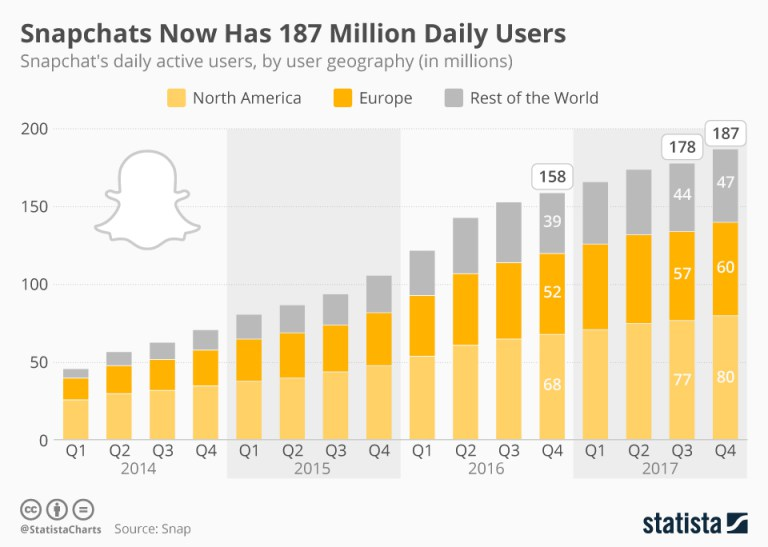
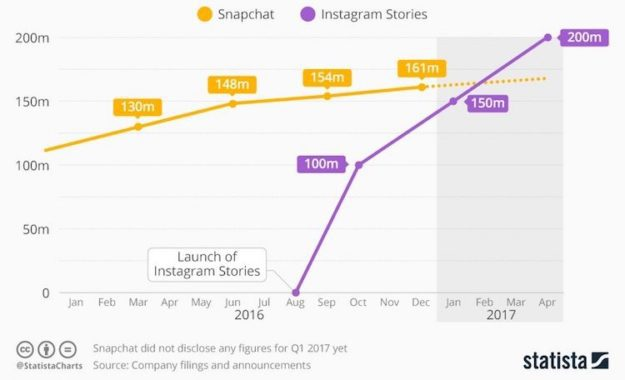

<block-quote>Snapchat isn't about capturing the Kodak moment. It's about communicating with the full range of human emotion, not just what appears to be pretty or perfect.  
Snapchat's CEO, Evan Spiegel</block-quote>

Imagine a space where everything you post vanishes in a matter of hours. Nothing can be tracked, you have notifications if someone screenshot one of your selfies, it is impossible to keep metrics on the number of people following you or viewing your posts, etc. Critics looked at this as the certain formula of failure but against any possibility: this was the **Snapchat's** appeal. 

In a world where we are used to live with eternal stresses caused by the longevity of personal information posted online and not being able later to take it down, the ephemeral nature of **Snapchat** allows its audience to feel free to express whatever they want inscribed in stone. 

**The start** 

In the beginning no one could possible imagine the amount of success of **Snapchat**. The app was originally launched on 2011 and by May 2012, 25 images were being sent per second, by November users have shared over one billion photos over **Snapchat**, according to its published statistics.

<title-3>The undeniable growth</title-3>

Source: [Statista](https://www.statista.com/topics/2882/snapchat)

The **growth** of the **startup** is irrefutable, by 2016 the company raised $1.81 billion in equity offering, the company reported in a U.S regulatory filing in the mentioned year, translating into strong investor interest on it. 

Over 160 million of people use it in a daily basis to connect with their friends and explore curated content from top publishers, **Snapchat** had built a very strong community, reaching 45% of all 18 to 24 years old social media users in the US, according to eMarketer.

<title-3>The developing</title-3>

In spite of this Millennials are still the prior users of the app, brands that targets youth, Snapchat is the social media channel where you should be doing it.

<title-3>The Stories about the Discover of marketing chances</title-3>

It was the introduction of **Snapchat** Stories that made every major brand to turn their looks to the Snap’s appeal, they saw in the 24 hours lasting content the potential **growth** for their own companies. Stories are the compilation of snaps that relate to certain topic or event. 

The opportunity for major media companies came with the activation of Discovery, where content developers like BuzzFeed, Vanity Fair, National Geographic, were able to provide high quality videos for **Snapchat** younger users whom doesn’t consume their contents in a daily basis. 

Investors and brands took the opportunity to **engage** with their audience and **humanize** their products or services and make them seem more authentic. A very good example of this was the **Taco Bell** experience during the 2017 **Super Bowl**, they launched a new item, the Quesalupa, in their menu over a **Snapchat** campaign and it resulted in more than 40.000 pre-orders of the product.

<title-3>Imitation is the sincerest form of flattery</title-3>

As imitation is the sincerest form of flattery, **Facebook** and **Instagram** has included some of Snapchat's best features, including expiring video and even geofilters. 

Source: [BussinessInsider](http://www.businessinsider.com/instagram-is-ruining-snapchats-story-2017-2)

However, the penetration of both **Snapchat Stories** and **Instagram Stories** among to 18-34 years old users is incomparable, **Snapchat’s** still the winner with 45% of the interviewed people preferring it over its competitors.

Source: [Statista](https://www.statista.com/chart/9086/daily-active-users-instagram-stories-snapchat/)

When we compare the **DAU** data (stands for _daily active users_), we can see the big difference for **Instagram** during the introduction of their **stories**, we see the growth from 0 to 100 million of **DAU** within the next two months that added a progressive grow of 200 million. Meanwhile **Snapchat** maintained their regular **growth.**

<title-3>A brief story of influencers</title-3>

The success of **Snapchat** was also built by celebrity influencers that attracted their audience to the app, their founders understood the concept on **niche-focused platforms**, and they gave to Millennials what they loved the most: the possibility of entering through candid shots at someone else’s life. 

That's how the whole concept of **Snapchat** influencers came to life, we saw every snap as the window to the personal life of a celebrity, and they talked to us in their beds and even gave out little advices of what famous or not-so-famous product we should buy. 

Influencers became the **messengers for branded content**, maintaining close relationships with a community of followers and even **co-creating content featuring brand-related topics and products**. 

The whole Influencers things are very dynamic for brands, for example,  Sour Patch Kids gave their **Snapchat** account to Vlogger Logan Paul for five days, in which the Vine star pranked a people with life-sized Sour Pitch characters. The result? 120.000 of Logan’s fans followed the Sour Patch Kids account. 

**The plummet** 

By the end of 2017 the company reported net loss of $2.2 billion, Snap Inc. stock has dropped 34% in the last six months. In November 2017 Snapchat launched a redesign for the app that resulted in more than 30 Change.org petitions in a single day, with more than [1.2 million of signs](https://www.change.org/p/snap-inc-remove-the-new-snapchat-update), as a form of protest against the changes. They will trying to "make easier" the use of the app so they could expand their age grasp.

<title-3>Separating the Social from the Media</title-3>

Millennials hated the new layout, contradicting with the company intentions they found it “confusing” and “over complicated”. The update is trying to keep friends and professional content separate. 

According to the founder Spiegel, “separating social from media has allowed us to build the best way to communicate with friends and the best way to watch great content”. They included a new algorithm that is supposed to eventually bring more personalized content higher up on the Discover page to its users.

<title-3>The legacy of influencers</title-3>

“sooo does anyone else not open Snapchat anymore? Or is it just me… ugh, this is so sad.” With a single tweet the most famous Snap celebrity Kylie Jenner knocked $1.3 billion off company’s market value, according to [CNNMoney](http://money.cnn.com/2018/02/22/technology/snapchat-update-kylie-jenner/index.html). 
But is Snapchat listening? Everything says: they’re not. And for even worse news, many sources says that they’re planning to introduce some changes that might make you loathe it a little less. 

**_What you, as an entrepreneur, could learn from Snapchat’s downs_** 

It is important for startups to remember that customers come first and are the reason for success, to remain silence during a major crisis doesn't mitigate negative sentiments; having a fluid communication with your audience could make the difference between a trustworthy company and an unfaithful one. 

We already talked about how passionate Snap users are, of course their voices weren't quiet about the redesign. 

After the update, a tweet appeared with a fake conversation with Snapchat's Staff, saying they would change back to the original layout if the tweet got 50k retweets. The tweet immediately become the 6th most retweeted tweet of all time, with almost 1.5 million retweets. 

The Staff released a statement which included "we hear you, and appreciate that you took the time to let us know how you feel". Showing your clients that you care about how they feel, listen to their concerns and having a feedback with them is a very good way to keep them engaged. 

We want to hear your opinion as an **entrepreneur**, what do you think it might be the principal issue with **Snapchat**? Do you think they’re listening to their audience? Did you enjoyed the new update? Let us know in the comments and we will be reading!
