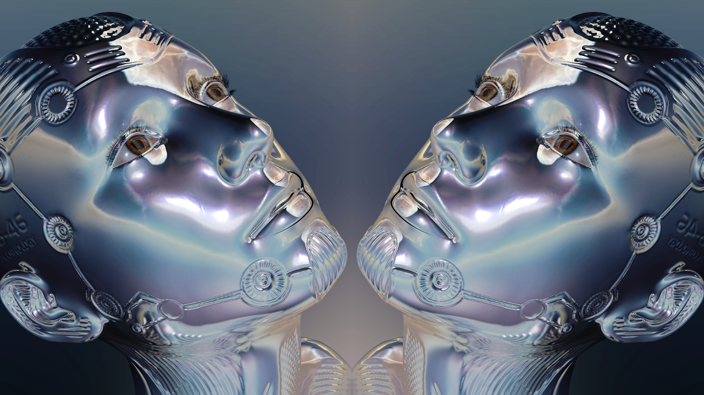

Artificial Intelligence is a constant presence among us. The future is as bright and infinite as the imagination of human beings, and it has been well demonstrated by William Hanna and Joseph Barbera who imagined a futuristic world that no one at the time dared to think would be a reality a few decades later.

The  Jetsons premiered in 1962 and it was set in the year 2062. As of May 2021, we can all agree that when Hanna-Barbera created this futuristic family cartoon that might inspire so much of the technology we now use on a daily basis, they predicted the future. From video calls, smartwatches, flat-screen tv to robotic vacuums, robotic house help, drones, and flying cars; we can even dare to say that if they have had the COVID-19 around, it wouldn’t have been a problem at all because they already had online classes, home office setups, holograms and even 3D printed food! 2062 is not here yet but we’re already halfway there when it comes to technology. Nasa Astronauts can now 3D print pizzas in space! How futuristic is that?    

<title-3 align="centered"> THE FUTURE OF ARTIFICIAL INTELLIGENCE </title-3>

One of the most futuristic technologies is Artificial Intelligence, which we have previously discussed on this blog and continues to be as fascinating a topic as The Jetsons were in the ‘60s. While for some of us life without Siri or Alexa wouldn't be the same, others remain very skeptical about the advancement of Artificial Intelligence. 

The report <a target="_blank" href="https://obamawhitehouse.archives.gov/sites/default/files/whitehouse_files/microsites/ostp/NSTC/preparing_for_the_future_of_ai.pdf">  Preparing for the Future of Artificial Intelligence</a>, prepared by the Executive Office of the President of the United States and the White House Committee on Science and Technology, states that in the next 20 years there will be no machines that *"exhibit broadly-applicable intelligence comparable or superior to that of humans"*, although it admits that *"machines will meet and exceed human performance in more and more tasks"*.

For the renowned assistant professor of Computer Science, Engineering and Interactive Biology at the University of Michigan, Arend Hintze, the study conducted by the White House only focuses on the most popular tools of Artificial Intelligence: machine learning and deep learning, leaving aside the two characteristics that will define machines in the future: memory and consciousness. 

Hintze works studying and creating machines with the aim of crossing the frontier of Artificial Intelligence that needs the previous teaching by a human being, in other words, to be able to learn by itself. In an article published by the <a target="_blank" href="https://www.weforum.org/">  World Economic Forum</a>, Professor Hintze has established a classification with <a target="_blank" href="https://www.weforum.org/agenda/2016/11/the-four-types-of-ai-what-you-need-to-know/">  four types of artificial intelligence</a>:    

<title-4 align="centered"> 1. Reactive machines </title-4>

Hintze defines this type of AI as the most basic type of AI that exists. Purely reactive AI systems were among the first to be developed, they identify current situations or elements and react by choosing certain states or actions based only on what they perceive at the moment, they react in the present to events in the present.

Although these types of systems don't possess the ability to form memories or use resources from past experiences to make decisions, they possess an incredible ability to make the right choice from among millions of possibilities, according to the immediate situation they are faced with. This also implies the limitation that they can only perform the task for which they were created, and although they can’t learn to perform other tasks with the resources they possess, we can be sure that the only task they do they will do very well.

A good example of this type of reactive machine is IBM's famous chess-playing supercomputer Deep Blue, which was able to beat one of the greatest chess players in history, Garry Kasparov. Released in 1996, Deep Blue was a massively parallel processing computer whose processors were specialized in chess, being able to calculate 200 million positions per second. Now, this supercomputer could play chess very well but it couldn't use its knowledge to learn to play something else like checkers, which uses the same board and is much simpler than chess.

AlphaGO is a more recent example of a reactive AI machine. Developed by Google to play the Japanese board game GO, in 2015 it became the first machine to beat a professional GO player without employing handicap stones on a 19x19 board. And just like Deep Blue, AlphaGo also had no conception beyond the task for which it was created.    

<title-6 align="centered"> Garry Kasparov faced off against Deep Blue, IBM’s chess-playing computer, in 1997. Deep Blue was able to imagine an average of 200,000,000 positions per second. Kasparov ended up losing the match. Credit: Peter Morgan/Reuters  </title-6>    

<title-4 align="centered"> 2. Limited memory machines </title-4> 

This type of Artificial Intelligence also has the ability to react to immediate stimuli, but unlike reactive machines, they can learn from previous information to make decisions. This type of AI maintains memories and data that allow it to generate transitory actions based on the information collected, but as its name suggests, its memory is quite limited so it doesn't generate learning based on experience. Most of the apps we use on a daily basis have this type of AI, we can all agree that Siri and Alexa always get us out of doubts, right? 

How do they work? This type of machine uses a large amount of training data in its memory, and when it has to solve a task or problem, it simply uses the reference data stored in its memory to generate an action. This type of AI is used in autonomous cars that have the ability to monitor speed and direction for a specific period of time, according to Hintze, this data is added to the representation of the world that has been loaded into the computer's memory. But because it is limited, data about passing cars is not stored in a library of information from which it can learn, as is the case with human drivers who learn from their experience behind the wheel. 

The future goal is to provide these machines with the ability to form not only complete representations about the world but also about other agents, to remember their experiences, and to learn how to handle new situations.     

<title-4 align="centered"> 3. Machines with a Theory of Mind </title-4> 

The origin of the " theory of mind " concept can be found in the pioneering work of David Premack and Guy Woodruff, when they asked themselves, <a target="_blank" href="https://www.cambridge.org/core/journals/behavioral-and-brain-sciences/article/does-the-chimpanzee-have-a-theory-of-mind/1E96B02CD9850016B7C93BC6D2FEF1D0">  Does the chimpanzee have a theory of mind?</a> This refers to the ability to understand and predict other people's behavior, knowledge, intentions, emotions, and beliefs. 

The machines that have been built so far do not have a Theory of Mind and for Hintze, this is the main feature that differentiates them from the machines that will be developed in the future.

<block-quote> “This is crucial to how we humans formed societies because they allowed us to have social interactions. Without understanding each other’s motives and intentions, and without taking into account what somebody else knows either about me or the environment, working together is at best difficult, at worst impossible.” Explained Hintze </block-quote>

When this type of Artificial Intelligence is developed, we will have machines capable of recognizing and understanding that there are people and individuals around them with emotions and thoughts of their own, and they will be able to adapt their behavior accordingly.    

<title-4 align="centered"> 4. Machines with self-awareness </title-4> 

Although we believe that there is still a long way to go to develop this type of Artificial Intelligence, we cannot help but imagine what it would be like to have among us machines that have a self-aware system with all of the above characteristics. Machines capable of recognizing themselves and the individuals around them, generating cognitive learning based on their own experience and that of other individuals. 

*“Artificial Intelligence researchers must not only know how consciousness works, but we must build machines that have one"* explains Hintze.

We may still be far away from Self-Aware Artificial Intelligence but it is clear what man's intentions are about the future of the machine. Many doubts and complications may arise along the way but AI is here to stay, it will continue to grow and expand its uses in our daily lives, in how we do business, very soon big cities will be like Orbit City, and we will be living the futuristic life of the Jetsons.    

<title-4 align="left"> About Cobuild Lab </title-4>

At Cobuild Lab, we partner with Industry Experts to solve Logistical and Productivity problems with Custom Software Solutions, Artificial Intelligence, and IoT.  Since 2012 we've focused on developing and combining cutting-edge techniques, tools, and technologies to increase development speed to deliver faster results

<youtube-video id="5fbYxQNgJ7s&"></youtube-video>  

Got an idea for a web or mobile app? Let’s build it! Check out our <a target="_blank" href="https://cobuildlab.com/price-calculator/">  price calculator</a> to have an estimate of the cost of your project or email us at contact@cobuildlab.com and get a FREE online consultation. 
