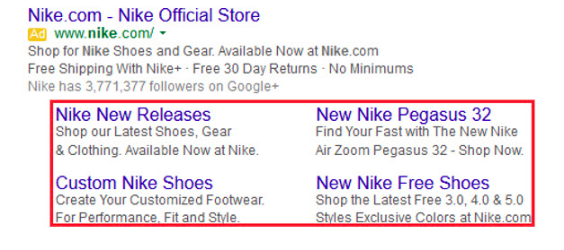

Just as we told you in one of our last posts about [campaign planning](https://cobuildlab.com/blog/Planning-your-ads-campaign-on-10-steps/), one of the last but most important steps in this process is the **optimization of ad campaigns**. Much of your success on the web depends on that and we will explain how to do it and why this is so important. 

<title-2>First things first: Campaign Optimization?</title-2>

Optimization is defined as a process in which all the variables involved are the best or the most suitable to obtain the best possible result. 

When it comes to ad campaigns, the essence of this meaning is not altered either. 

When you launch an Ad Campaign, alway,s at the end of it, whatever the platform on which you do it, Facebook Ads, Google Ads, Google AdSense, among others, you will have access to the results of each campaign. 

These results include the views or impressions that you had, the conversions that were achieved, the scope, and in general all the interactions that people had with your ad or ads group. 

When you get those results, the right thing to do is to analyze the data that the platform provides and refine certain details of the campaign that you think didn't perform well, or that can simply be improved. An example of this could be reducing the cost per lead, increasing reach, increasing the number of clicks and even improving content.

Each of these improvements you make on the data from previous campaigns is known as **Optimization of Ad Campaigns**. 

Now that you know the meaning, comes what we were all waiting for, the advice guide to optimize our ad campaigns in the best possible way. 

<title-2>It's time for tips for optimizing Ads Campaigns</title-2>

<title-3>* Segment and organize your campaign to the maximum</title-3>

If there is a universal truth in the world of marketing that would be: segment your audiences well and you will win. Segmenting is the equivalent of aiming at the sport of bow and arrow. Your efficiency and effectiveness will mainly depend on how well or bad you have directed your content, your strategies in a digital plane. 

If your segmentation is very specific, better, it will surely be more effective, and as the message you want to transmit is more effective and direct, you will have to make less investment in the campaign as well, because as it is very specific and the reach would be more selective, of higher quality over quantity. 

By segmentation we mean the segmentation of your campaign's target audience: demographics, location, interests, etc.

<title-3>* Be careful with the content, group ads efficiently</title-3>

This tip is basically about the content strategies you have for your brand and specifically for your campaigns. 

Select the keywords that you are going to use either in the text, in the descriptions or titles, eliminate all the words or unnecessary keywords, and publish clean contents, well oriented and with destination to any page of your website. 

If the campaign is in a social media platform, what we recommend is that if you guide traffic to a publication you made, in this publication of your social media account, invite consumers to visit your web site. This is the destination platform par excellence. That route can be done well with a well thought out content strategy.

With reference to grouping the ads, we consider that this can not miss in any optimization. If you haven't done it before, now is the time. It has been shown that if you classify them by content, by landing page and even by keyword, the effectiveness will increase to the maximum, and you will have to make fewer dispersed campaigns, that is, you will also be more efficient. 

<title-3>* Make your Ad more attractive</title-3>

This is a tip that you should apply from the first campaign you do, but as we are talking about optimization, we can not overlook it. 

If you have made your ads attractive from the beginning, congratulations, but this is a job that should not end. Meet with your team, brainstorm and stimulate always their creativity, so that they can make their ads more and more attractive with each new campaign. 

By attractive I don't just mean pretty or with an ideal design. With attractive ads we want to tell you that you must use better resources, for example, if you used text before, now add a quality image, and then try videos, with sounds, always innovate, and attract the attention of your leads. [You can know how to make attractive content here](https://buffer.com/resources/a-complete-guide-to-creating-awesome-visual-content).

<title-3>* Focus on tracking conversions and Cost Per Acquisition (CPA)</title-3>

The number of clicks or views your ads receive is important, but what matters most to us when launching an Ads Campaign are the conversions that are made. 

A **Conversion** can be defined as the valuable action that you are trying to push on to a user that is consuming or seeing your Ad and Acquisition it refers to the goal of transforming a user, impression or conversion into a Paying Customer.

Therefore the CPA or Cost Per Acquisition is the total amount of money invested in Campaigns and any other marketing effort divided by the amount of Paying Customers Acquired also know as Acquisitions.

Therefore, depending on the platform you are using for your campaign what we can best recommend is that you invest a little more in the CPA or make any changes you see that significantly improve the conversions. Because 10 conversions are worth more than 10 clicks or views. 

But remember, that CPA is not the same that conversions. In any case, what is important to emphasize is that the conversions are the most important.

But watch out, it doesn't mean that the range or views aren't important; they are. But since we are at the point of optimization, we must prioritize very well the concepts that we must improve or focus on.

With this information, you can even calculate the return on investment of the campaign, so it is very useful to focus on it, to analyze it and to improve it.

<title-3>* If the platform allows it, add Ad Extensions</title-3>

Much has been said in recent years about the [humanization of brands](https://cobuildlab.com/blog/actions-that-will-humanize-your-brand/), about the direct and personal treatment that should be given to consumers so that they not only buy or consume you but also are emotionally and rationally linked to your brand, have a long relationship with it, identify, and feel confident with you. 

The extensions that some platforms allow you to add with or without cost, help you a little with that work. 

Extensions with a location, with a distinctive phrase, with highlighted text, with a contact number or email or even with a form, can be an ace up your sleeve when optimizing a campaign. Try it out and see how profitable it was for your brand.

**See the following example of extensions in Google Ads**

Source: [Wordstream](https://www.wordstream.com/blog/ws/2016/09/06/sitelink-extensions-dos-and-donts)

Which of the two would attract your attention the most?

<title-3>* Look what your competition is doing</title-3>

In this world of advertising, you should know that you are not alone. There is a complete market where you have several competitors who are trying to reach the same audience as you. 
 
Competition is necessary, and it can help you a lot too. There is something called Benchmarking that is basically the search and analysis of what the competition is doing, to take certain ideas on the one hand and improve them to the maximum, add our master touch.

Also for a long time, not only this area of the [SEM](https://emergentdigital.com/digital-marketing-seo-sem-smm/) but also in [SEO](https://cobuildlab.com/blog/seo-tips-that-will-increase-your-position-in-search-engines/), it is usual to make analyses of the competition, its content and its strategies, to always try to be above them and not make the same mistakes.  In fact, there are many tools that facilitate this work, such as [SEMrush](https://www.semrush.com/), for example, which gives you analysis of any domain you enter in it. 
 
This also works for ads campaigns. Look at the search patterns they're following, their calls to action, what resources they're using, their content strategy, and see what you think is missing. That information is very valuable because you can take advantage of those flaws or disadvantages and make them your strengths, or simply have a knowledge of how the ads market in which you are working is being managed.

This information is always useful when optimizing a campaign, because your competition also changes, the market is dynamic, and you must always be studying it. 

<title-3>* Don't be afraid to experiment, follow your intuition</title-3>

Trying new things is for the brave. 

If you want to get out of the configurations you traditionally use, such as segmentation, remove or reduce some investment, make a new Ad Group, change keywords for new volumes, or anything you can think of, it may be your intuition that is talking to you: listen to it. 

There is a saying that goes: if you don't take risks, you don't win and we all want to win. But if there's something you want to try, do it, it's part of innovation.

This is the end for now of our guide of tips to **optimize ads campaigns**.  We hope you find them very useful and that you can succeed with them.  If you want to know information like this, we invite you to subscribe to our newsletter, so that you get directly to your mail all these tips to help you manage your brand.

<!--stackedit_data:
eyJoaXN0b3J5IjpbLTg3ODYzODMyNF19
-->
