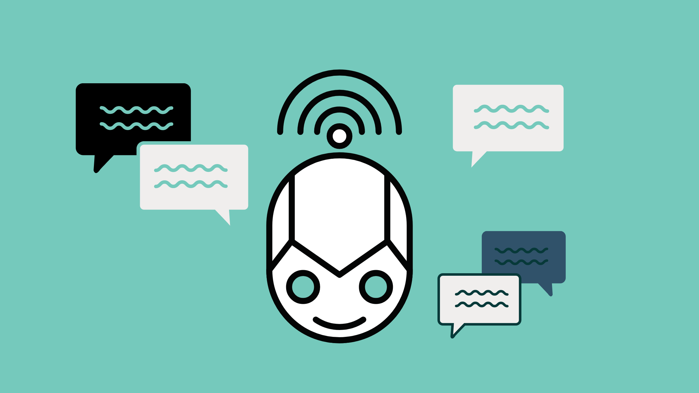

Artificial Intelligence is the part of computer science devoted to developing programs that can learn, reason, and understand as if they were human beings. Although we still have a lot to discover and develop in this field, the unlimited amount of uses that have been given to this technology so far has not ceased to amaze us. 

More and more companies are adopting the use of Artificial Intelligence in their processes, and for many of them, the proper use of this technology can lead to an increase in sales, optimization of operational processes, improvement of workflow efficiency all while saving time and resources. In fact, **37% of organizations surveyed by <a target="_blank" href="https://www.gartner.com/en/newsroom/press-releases/2019-01-21-gartner-survey-shows-37-percent-of-organizations-have#:~:text=%E2%80%9CFour%20years%20ago%2C%20AI%20implementation,research%20vice%20president%20at%20Gartner.">  Gartner</a> in 2019 now use AI in the workplace**, which may give us an indication of the increasing demand for this technology. 

**According to <a target="_blank" href="https://www.fortunebusinessinsights.com/industry-reports/artificial-intelligence-market-100114">  Fortune Business Insights</a>, The global AI market value is expected to reach $267 billion by 2027**; positioning it as one of the strongest trends in today's companies.    

<title-3 align="centered">  Why should artificial intelligence be used for business purposes?  </title-3> 

According to <a target="_blank" href="https://www.statista.com/chart/23779/ai-productivity-increase/">  Statista</a> **labor productivity in developed countries can increase by up to 40 percent until 2035 due to the influence of artificial intelligence**. As we have mentioned in our blog before, <a target="_blank" href="https://cobuildlab.com/blog/what-is-digital-transformation-and-how-can-small-businesses-take-advantage-of-it-this-2020/amp/"> Digital Transformation </a> is here to stay, companies that want to stay in business are going to have to adapt and start embracing new technologies that will help them boost economic growth in their industry.

There are many benefits from applying Artificial Intelligence to a company's processes, such as improved time management and task organization, which promotes efficiency, automation, and improved productivity in general. Here are the **top 3 benefits of using Artificial Intelligence in your company:**    

<title-3 align="centered"> 1. It’ll make things easier for your company   </title-3>

It is no secret that companies are no longer operating the same way they did 40 years ago. Technology has completely transformed the world we live in, and now the use of artificial intelligence in business workflows is proof that nothing will ever go back to the way it used to be. 

In business, the main application of artificial intelligence is <a target="_blank" href="https://cobuildlab.com/services/process-automation"> process automation </a>, which is the use of digital technology to carry out one or more processes in order to perform a specific function or improve a workflow, therefore saving time and money. 

A growing number of industries are adopting <a target="_blank" href="https://cobuildlab.com/blog/How-artificial-intelligence-impacts-your-business-supply-chain/amp/"> artificial intelligence to optimize their processes </a> because in this way companies can speed up their work pace and cover many more activities with much less effort.

👉 See <a target="_blank" href="https://cobuildlab.com/blog/artificial-intelligence-in-logistics/"> how Artificial Intelligence is revolutionizing the logistics industry </a>    

<title-3 align="centered">  2. Optimize your company's customer service  </title-3>

Holy Chatbot! 

Well, we've got to talk this through first, because any company understands perfectly well that customer service is everything. Who has ever enjoyed being on hold on the phone being answered by a machine hundreds of times until you get through to the right person? That's right: NOBODY. Today's world is moving at an increasingly fast pace which means that potential customers are looking for a quick response, and applying Artificial Intelligence to your business can be very beneficial.

Chatbots are by far one of the best AI solutions you can implement in your company, since chatbots process and analyze customer information from the very first contact, giving you new and very useful insights on how to better serve your customers. 

Hey, Siri… how you doin’? 😏

Voice recognition and Artificial Intelligence went for a walk one day and brought us, Virtual Assistants.  This character who helps us answer our questions or make our days easier by simply saying the word is one of the many wonders of Artificial Intelligence and is increasingly used in mobile devices and web pages to help users find what they need.

Please, Siri, read this for me... 

Oh yes, these are tools designed to improve the user experience and we can use them in different approaches in our company, as they are very versatile and easily adaptable to any situation. We always recommend having a good development team that can give you all the support you need to get the best results.    

<title-3 align="centered">  3. It can tell the future </title-3>

There’s a saying that goes sort of like... *“Give a man a fish and you feed him for a day; teach a machine a pattern of behavior and you will know the future”*. Oh no, we are not kidding here, because by using Machine Learning algorithms you could actually use predictive analytics to your advantage. 

The fact is that customer behavior is not always the same, and you have to be prepared to be able to provide them with the best products and services. Predictive analysis helps companies know how their customers will evolve and therefore, have the possibility of adapting, preventing, and programming.

The data-driven model adopted by many companies and driven by the emergence of business models that benefit from data have made applying predictive artificial intelligence -and AI in general- not only beneficial due to its effectiveness, but also completely necessary, especially if we take into account the human factor and the logical natural limitation of any person to manage without the help of technology the vast amount of data that is currently generated and collected.

From customer service to predictive analytics, cybersecurity, and fraud detection, the role of data is more important now than ever before, because it can create a competitive advantage.  If you have the best data in a competitive industry, even if everyone applies similar techniques, the best data will win, and that's where AI gives you the edge. 

**<a target="_blank" href="https://www.accenture.com/fr-fr/_acnmedia/36dc7f76eab444cab6a7f44017cc3997.pdf"> Accenture Research </a> found that AI will increase economic growth by an average of 1.7% across 16 industries by 2035.**

It's easy to find many use cases for a technology that, until not long ago, seemed too good to be true. Fortunately, the greatest advantage of technology is that in most cases it can be developed according to the needs of any particular business. Artificial intelligence is not the exception. 

Here at <a target="_blank" href="https://cobuildlab.com/"> Cobuild Lab</a>, we're ready to help you take the leap and set you on the road of digital transformation and AI implementation. The transformation you dream of for your company could be just a click away.

Contact us at contact@cobuildlab.com
