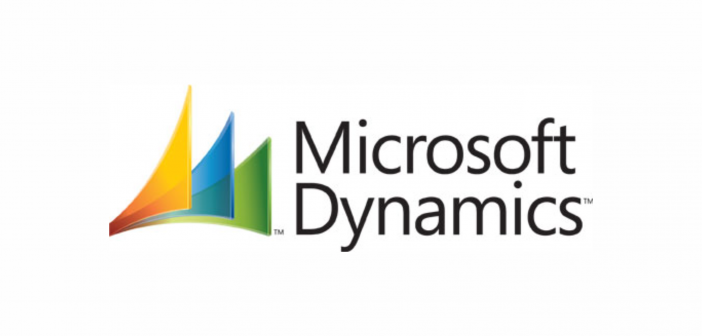

Maintaining administrative order and processes can become an insurmountable challenge due to the sheer number of changes and how aggressive the market can be nowadays.  But don't worry, thanks to Field service management software this task can be much easier, always hand in hand with RCM. These technologies allow you to manage work orders and inventory, merchandise dispatching and scheduling, as well as tracking to know their status, among many other things Below we’ll show you a little more about this technology. 

 

<title-2>Field Service Management software</title-2>

 

Field service management software helps organizations solve their field service management problems as efficiently as possible.  Field service software and mobile applications are designed to streamline communication, automate scheduling, and improve the routing and sharing of general information between field workers and the office.

Key features include customer appointment management, ticket management, order management, complex scheduling and route optimization, worker activity management, driver logs, time tracking, job status updates, automatic vehicle location and driver safety data, integration of inventory, accounting, and other back-office systems.

 

<youtube-video id="xSkJAUr7jAg"></youtube-video>

 

<title-2>What does the field service management software need?</title-2>

 

**Mobile:** You must be sure that your employees can easily access the software and each of the tools available to the company, even from their mobile phones. In this way, it ensures efficiency in working time without forcing the employee to be static all day in one place, being able to move and achieve various objectives and tasks in a single day.

**Easy integration with other systems:** Whatever your solution, it should work seamlessly with the other systems you use. Make sure your field service operation works in tandem with your CRM, HR system of record, IT system, payroll software, etc.

**Real-time data capture:** Every field service management system must record in real time and update its database at all times, thus ensuring that there is no loss of information, and that we are more accurate with future projections and reports. In this ever-changing market, keeping information organized and updated is of vital importance to keep each of the departments within your company operational.

 

<title-2>Some Benefits of Field Service Management Software</title-2>

 

* Increased Productivity

* Streamline Work Orders

* Improve Job Scheduling

* Effective Communication with Customers & Field Service Technicians

* Reduced Cost of Production

* Accuracy in Data Collection and Recording

* Work Automation

* Track Equipment

* Fast Invoicing 

* Minimizing the Waste

* Better Coordination with the Team

 

<title-2>Top 5 Field Service Management Software on the Market</title-2>

 

<title-3>Visual Planning:</title-3>

 

By using <a target="_blank" href="https://www.visual-planning.com/">  Visual Planning </a> for field service management, get a user-friendly application that meets all your specific requirements to manage your after-sales operations, allocate your teams, plan your interventions and easily track your customer's needs.

 

 

<title-3>Microsoft Dynamics:</title-3>

 

<a target="_blank" href="https://dynamics.microsoft.com/">  Microsoft Dynamics </a> is a line of integrated, adaptable business management solutions that enable your people to make important business decisions with greater confidence. Microsoft Dynamics works like and with familiar Microsoft software-easing adoption and reducing the risks inherent when implementing a new solution. These solutions automate and streamline financial, customer relationships, and supply chain processes in a way that can help you drive business success.

 

 

<title-3>Okdesk:</title-3>

 

<a target="_blank" href="https://okdesk.com/">  Okdesk </a> is a powerful Field Service Management software for your service automation. Today this solution is used by more than 700 B2B companies from South America, Europe, Asia, and Russia & CIS. Technician's mobile workplace (iOS & Android), calendar and map view, client's and service contract's profiles, etc. Customization of roles and permissions for all the users. It can also be used to manage facilities and related equipment.

 

 

<title-3>Wrike:</title-3>

 

<a target="_blank" href="https://www.wrike.com/"> Wrike </a> is a powerful field management software trusted by 20,000+ companies worldwide. Plan, execute and report on projects using custom request forms, Kanban boards, Gantt charts, time tracking, real-time updates, and performance reports all in one place that can be shared company-wide.

 

 

<title-3>Verizon Connect:</title-3>

 

<a target="_blank" href="https://www.verizonconnect.com/"> Verizon Connect </a> is a user-friendly field service management solution to help simplify job management, scheduling, and dispatching. It can increase productivity by removing the need to call technicians for job updates and streamlines your field service management tools, CRM functions, and business processes into one solution.

 

 

This market is increasingly growing and is being implemented with other technologies to make it even more productive. Now you’ve seen how implementing this technology in the logistics and administrative process of your company generates great benefits for both employees and consumers and, of course, also for you as the owner since it helps you reduce costs and errors at work. So get this technology today to help your company and employees be a lot more productive and efficient.
