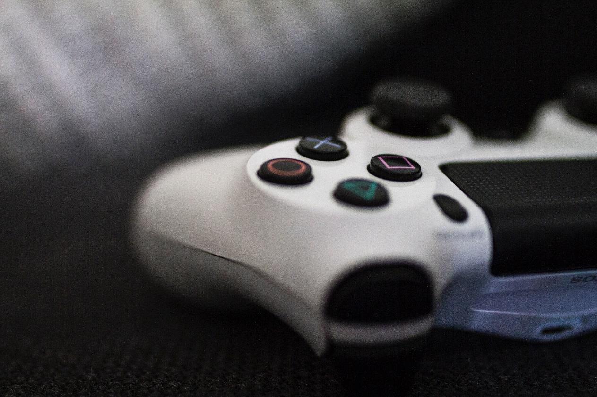

<credits>Photo by [Caspar Rubin](https://unsplash.com/photos/DrL-cwqD6tM?utm_source=unsplash&utm_medium=referral&utm_content=creditCopyText) on [Unsplash](https://unsplash.com/search/photos/twitch?utm_source=unsplash&utm_medium=referral&utm_content=creditCopyText)</credits>

For many years now, the majority of videogame fans have flocked to two different platforms to watch their favorite player's smash rivals online. If they want to see a video already recorded or consume the taste and rhythm that they mark themselves, they go to YouTube, while Twitch is the most used website when interacting and watching live games or online eSports tournaments.

YouTube created in 2015 a subdivision called YouTube Gaming to fight against the giant of live video game emissions owned by Amazon (Twitch). After two and a half years the success in its mission has been limited, although it has served to broadcast certain first level tournaments like the ELEAGUE of CS: GO.

It is increasingly common for content creators to replicate the TV formulas on their channels, with uploads to YouTube on specific days and times or with live shows on different programmed social networks. And Twitch is the reference in live content. For many young people, Twitch and YouTube are their TV channels, to connect when they have free time and nothing more important to do. They want to see if their favorite streamer is broadcasting or how the new game looks like everyone is talking on the forums.

<credits>Photo by [Caspar Rubin](https://unsplash.com/photos/HUBNTCzE-R8?utm_source=unsplash&utm_medium=referral&utm_content=creditCopyText) on [Unsplash](https://unsplash.com/search/photos/twitch?utm_source=unsplash&utm_medium=referral&utm_content=creditCopyText)</credits>

It isn't the first time that Twitch, which was acquired by Amazon in 2014 for less than 1,000 million dollars, makes an effort to diversify its audience, mainly video gamers who watch electronic sports professionals play, and their revenue streams. The company tries with new creative sections, debate and, a few weeks ago, a marathon of the Power Rangers series. Twitch is the main player in electronic sports explosion, is interested in increasing its revenues by attracting more creators with its subscription and donation payment systems and adding viewers by making its platform inclusive.

Recorded videos begin to have an interesting home in the purple house of the audiovisual with the new tools that Twitch has just presented: Video Producer. The launch of these new tools is a big example of the challenge to YouTube. Video Producer wants to lend a hand, to those creators who are passionate about videos made on their own terms.

Premieres feature, events (streams) are programmed through the platform, converting it into an experience with the possibility of including add-ons such as countdown introductions, reminders for viewers or a special start page who wants to attract the audience, new or recurrent, at the first viewing. Then, of course, the video will be available for viewing on demand.

Unquestionably Twitch is the king of the games broadcast live and direct. It is the feature that has made the platform known worldwide to Amazon, making it the main reference when it comes to enjoying gameplays, eSports transmissions and various events related to the world of video games.

Possibly, in a not so distant future, Twitch managed to diversify its business and create relevant thematic TV channels for its young audience. And there they will comment on what happens. From your smartphone or from your TV. With another Internet user, without a family member. What do you think? Who will win this fight? leave it in the comments.
