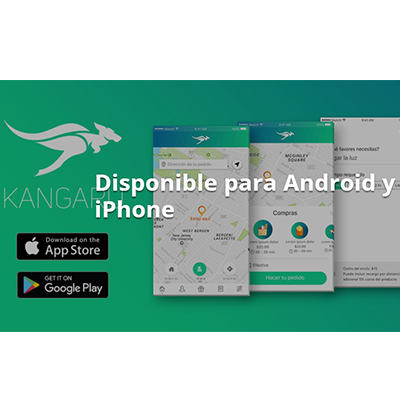
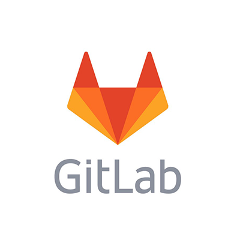

At the beginning of every business project the goal is the same: succeed, make lots of money and be on the top of the market. Part of that is possible with enough investment and others details which are vital to start and develop in the right way. **Unicorn startup** is related to this point and next, we are going to explain it better so you will do it. 

<title-2>The Startup</title-2>

To know what is it a unicorn startup, we need to clarify the meaning of a startup. 

Have you ever heard something about emerging companies? Startups are one of them but generally related to innovation and technology, well in its products, services or resources. 

Startups have the peculiarity of working with low costs and income that evolve and tend to increase through time.   

Changes, innovation, human organization, design and commercialization oriented to customers are some of the principal qualities of startups nowadays. Recognize it is very important, especially if you have a business project that has all these characteristics. 

<title-2>What does Unicorn Startup mean?</title-2>

A unicorn is something special, a mythological animal that is awesome and beautiful. In some movies, people show them like life’s source. Ask to Voldermort if it is not like that. 

But what is the meaning of a unicorn when it is related to business, and more specific, startups. 

In simple words, a unicorn startup it is a company that it has over a 1 billion dollars valuation. This happened for the first time in 2013 when Aileen Lee, founder of Cowboy Ventures, said this term to refer a company which invests more than a billion in some phase of its capital raising process.  

In those days, it only was 39 unicorns in the world, but now, there are many more. 

Another characteristic of a unicorn startup is a particular commercial strategy to socialize more directly with final customers. Actually, unicorns companies were born in the social media era. This specifically it is present in this kind of startups.

<title-3>Some unicorn startups in Miami and the World:</title-3>

<title-4>Let’s see first unicorn startups in Miami:</title-4>

**1. Magic Leap**

<credits>Photo by [variety](https://variety.com/)<credits>

It is a really nice startup that is valued over 4.5 billion this year. They are working on a head-mounted virtual retina display called Magic Leap One. This product gives us the opportunity to enjoy an augmented reality and to see the world in another interesting way.  

**2. JetSmarter**

<credits>Photo by [JetSmarter](https://jetsmarter.com/)<credits>
  
  
 According to Pitchbook, this startup is valued over 1,5 billion dollars. 

They are dedicated to private and public flights which are shared through a mobile community. 

They connect flights and routes of three places in the world: United States, Europe, and the Middle East. 

Source:[Wikipedia](https://en.wikipedia.org/wiki/JetSmarter)

<title-4>Let’s know others unicorn startups in the world</title-4>

**1. Kangaru App**

<credits>Photo by [Kangaru App](https://kangaruapp.com/)<credits>
  
This is a new unicorn that comes from Panamá. A few months ago get over a billion dollars in investment.

His specialty is shipments that they are around Panama cities. They have a mobile App that people can download on iOS and Android. 

**2. Uber**

<credits>Photo by [Uber](https://venezuela.as.com/venezuela/)<credits>
  
Surely you know this company, but did you know that is it valued on 72 billion dollars?

When someone needs a taxi, it is possible to find it in a fast and easy way. It is only necessary to go to uber app, and asking for it. This is the work of this unicorn startup, and they are so good doing it. 

**3. GitHub**

<credits>Photo by [Medium](https://medium.com/)<credits>

This company related to software development it has been valued on 2 billion. 

It is a repository of software projects in git’s versions. They are working from 2008 when Tom Preston Werner decided to create it. From there they have evolved so much until being the unicorn startup they are now.  

**4. GitLab**

<credits>Photo by [Medium](https://medium.com/)<credits>
  
GitHub's competition it is also a unicorn. This startup was valued on 1,1 billion. 

It is a platform of collaborative software development process that also uses git’s versions. 

**5. Canva**

<credits>Photo by [Canva](https://www.canva.com/)<credits>
 
This is another startup that it was converted in unicorn this 2018, in January. Now its value is 1 billion exactly.  

If you want a website that helps you to design something pretty, Canva is the indicated one. This is his specialty.  

**How to become a Unicorn Startup**

This could be one of the most important things. Why? Because it is not enough to know what is a unicorn startup. The ideal would be to become in one. 

* Faster growing strategy. Using less economical resources at the beginning and planning activities to evolve income as fast as it is possible. 
* You look for investors how if your life depends on it. It is not necessary that all money invested comes from you. Actually, it is better when you can join more and more people through time.
* Companies’ purchases. Some startups become in a unicorn when others big companies invest in theirs. Even it could happen that big companies buy it. And that does mean more money and investment, that is to say, more value. 
* Use new and better technologies through time. This is one of the principal qualities of startups. You need to learn and take advantage of every new technology in your company. In that way, you can control massive economies, and of course, to produce more money.
* The capital gets it so higher you can. This is a form of how the company can increase its value.

Time passes, and startups are most common. Some of that it is due to its ease for getting simpler some processes that are not using new technologies. All of these without mentioning time, that is used in an efficient and faster way, mass sells, communication with customers, and innovation. 

Now, to be a **unicorn startup** it is a goal higher but possible if we focus and work for that. What are you waiting for?  
