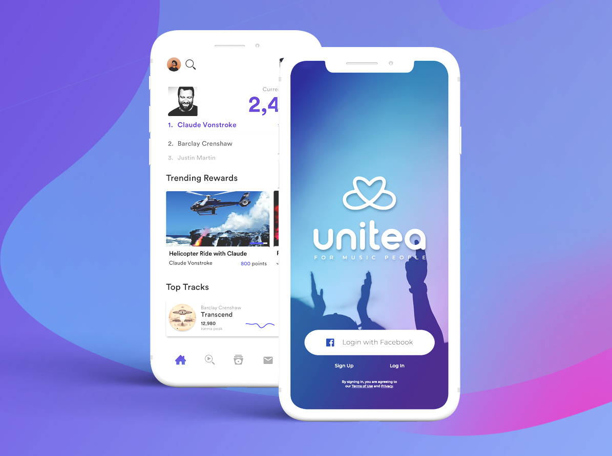

* **Location:** Miami, Florida.
* **Industry:** Music, Art, Big Data 
* **Founded in:** 2014
* **Website:** https://unitea.com/      

<a target="_blank" href="https://unitea.com/">  Unitea </a> is a community that allows artists to creatively devise rewards that benefit its most engaged fans, who earn currency — called “Karma” — for listening to and sharing the music of their favorite artists. It was founded in 2014 by <a target="_blank" href="https://www.linkedin.com/in/ketanrahangdale/">  Ketan Rahangdale </a> and <a target="_blank" href="https://www.linkedin.com/in/richardalangrant/">  Richard Grant</a>.     

Mr. Rahangdale is a Tallahassee native that grew up inspired by his favorite artists and in his teenage years began modestly promoting shows and DJing around town. At 18, he founded his first company, pioneering high-fidelity Bluetooth technology for headphones that would later be used in iPhone, Beats by Dre, and Bose products.    

Then, the “19-year-old wunderkind” became the youngest person to grace the <a target="_blank" href="https://www.empactshowcase.com/100">  Empact100 </a> list in 2012 awarded by President Obama. Around that time, Rahangdale became exposed to one of the big issues that plague today’s artists. While recorded sales of music are currently valued at $16.9 billion and the data the artists and their fans generate is estimated at over $360 billion, little of this goes back to the artists.    

Rahangdale set out to create something that would effectively cut out the middleman and help artists directly communicate with their fans. In 2016, he debuted the beta for his new app, Unitea. With a team comprised of tech veterans from companies like Tinder, Snapchat, and OWSLA, Rahangdale created the first platform that monetized data through experiential ad units in the form of rewards to fans.    

<title-6 align="centered"> Source: <a target="_blank" href="https://unitea.com/">  Unitea </a> </title-6>    

In layman's terms, Unitea would be the first <a target="_blank" href="https://cobuildlab.com/blog/mobile-apps-web-apps-or-cross-platform-what%E2%80%99s-the-best-for-my-small-business/">  mobile app </a> to allow artists to directly engage with the fans generating this data through offering rewards and experiences while allowing them to keep the profit generated from said data for themselves. As artists generate more data through the app, they will have the opportunity to partner on rewards with sponsors.    

This ultimately allows them to finally have control over how their brand is marketed. In addition to its benefit to creatives through its Artist Digital Revenue Service, the app has created a system that rewards fans for their listening and streaming habits.    

With the backing of investment funds such as <a target="_blank" href="https://cobuildlab.com/blog/rokk3r/">  Rokker Fuel </a>
, the Unitea Music app was introduced in 2019 with a clear goal: to create fan/artist relationships innovatively by uniting people with the community they enjoy. Thank you so much for reading!
