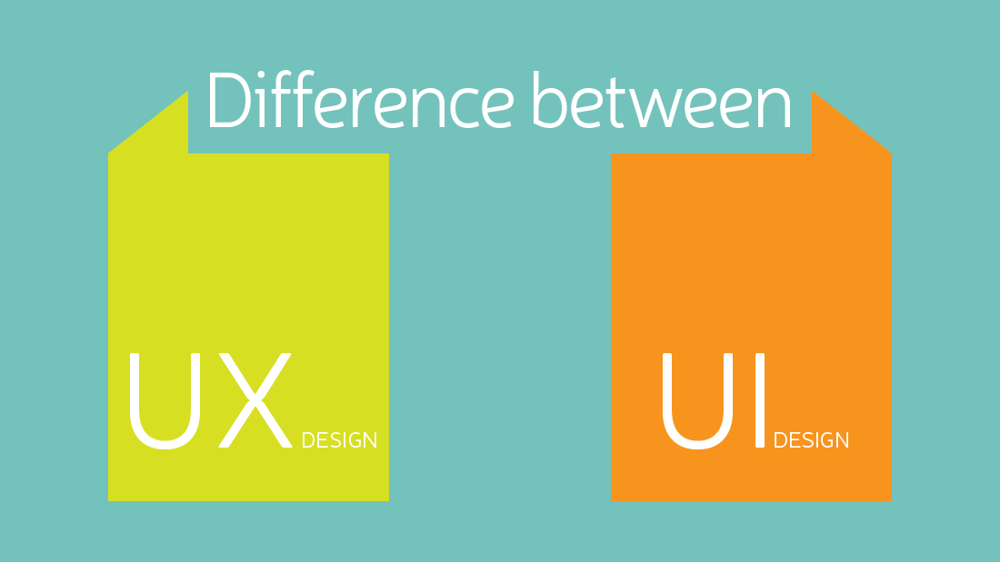

For us is really normal to give opinions about everything that is around. Software products, systems, apps, and services don’t escape from this. That’s why **user experience** is on the table now. To know its importance, use, and all the important things about them, don’t lose any detail we are going to talk about next.

<title-2>User experience’s meaning</tittle-2>

User opinions come from experiences, perceptions, even responses after using a product.

You will think is it related to user stories? The answer is not. User stories are functionality reviews while user experience is how they feel during and after using or doing something, how they could interact; it is related to experience.

Experiences that define if you like or dislike an app, software, product or services.

<title-3>User experience: usability</tittle-3>

Until now, we are talking about user experience in a working product, like an important phase. But user experience also applies to prototypes.
 
But, what is it? Make a prototype is making an incomplete version of the software product, service, app or product to prove it.
 
Have you ever used a beta version of anything? That is an example of prototyping. The full version of a software product is not in the market, but developers want to know opinions from customers about their experience early in the software development process.
 
 
Remember: The most important thing at software prototyping is to know how a product will look and how customers feel while they are using it. In a few words, we are referring to the user experience.

 
<title-2>Tips to do user experience better</tittle-2>

<title-4>* Keep it simple:</tittle-4>  

User experience will be better if you don’t use too much technical vocabulary because usually, they are not experts. That’s why they come to you. For professional help

<title-4>*Good user experience come from usable architecture</tittle-4> 

Sometimes people prefer a software product that looks very well, and they don’t pay enough attention to usability or performance.

If you are in that group, now you can reconsider it and take the right way. Which is it? The way where design is important but performance and usability is more important than ever. Users want to use your software product, not only look it.

<title-4>* Take a break if it’s necessary</tittle-4>

It could happen that your mind was blocked. To design a good user experience you need creativity.

If these happen, the best thing you can do it takes a break, refresh yourself, make another thing which is not common for you, break the routine, in order to develop new ideas and improve your creativity.

Usually, associate or join new teams work very well.

<title-4>* Communicate effectively</tittle-4>

A really nice way to do this is telling a story through the design. What story? Maybe the brand’s story.

Some specialists think that storytelling is the best technique to make real this tip.
Why? Because of storytelling brings enough and concise information about the story behind the software product, not only for clients also team’s members can know it. In that way, they can be able to understand and share it through the UX.

<title-4>* Several ideas are better than one</tittle-4>

This advice applies to everything, especially when we are talking about UX design. It is a mistake get carried away by the first idea. That doesn’t mean this idea is not the best, that means that you should have several ideas before designing. In this case, you can compare them, take the best and the worst of each one, and be sure about your project.

<title-4>* If you can, recycle</tittle-4>

When you have participated in some projects, for sure you should have lots of ideas. Use them again without restriction, and don't forget to get them better.
Be practical is a nice way to design good user experiences. It doesn’t matter if you used it.

But that’s doesn’t mean you will copy a UX design from a client. It is related to use an idea to solve new situations, and of course, adapting them to new products.

 
<title-4>* Focus on what users want, not in what they are using now</tittle-4>

In that way, you will have the opportunity to offer new things in the market. Something they have no idea. Something really innovative.

This also conforms the user experience you have to create.

<title-3>These aspects have to be present when we are working on good user experiences</tittle-3>

This thing about user experience is more complicated than you though. That’s why we need to share more advice to you.
 
All good user experience has to be:

1. **Useful:** That's why you are creating a software or product. If your product won’t be useful, for sure the user experience won’t be good. Take your time when you are designing to make everything special and different of others. In that way, you will offer software, app, product or services really useful.
2. **Usable:** this point is related to how easy is using a software product. We love simplicity. For that reason, people said, “less is more”. If software’s experience is easy to use and predictable, you can be proud, the user experience will be good, and your product have more possibilities to capitalize on the market.
3. **Valuable:** If you don’t offer something valuable to customers, they won’t have a good experience. In fact, they won’t be interested in using your software product, app, service or whatever you offer at the market. Focusing on the value, you will bring something that others don’t have.
4. **Reliable:** this characteristic is so important, especially nowadays. If your app, software, website or product don’t transmit confidence, users won’t feel well. What does it mean? User experience will be bad. If you need to keep personal information from the user, like number card numbers, email, location, etc, even more, you have to improve your safety. So, focus on reliability and get some good user experience.
5. **Intuitive:** this is the trend now. User’s experiences will be better if they can predict or use your software without very much knowledge about it.
 
<title-4>User experience and user interface are the same?</tittle-4>

<credits>fuente:Pro Web Design</credits>

The short answer is no.

They are related even they are used at the same phase during the development process, but they are different. And next, we will give you the most important and different things between them.

UX design it is about code, every element that makes of design works well when users are interacting. Meanwhile, UI design is the external look. The appearance of customers is going to enjoy. 

Both are related. Some people think that we cannot talk about one without including the other. And could be possible, but even so, they are not synonyms. 

We hope you have been able to understand the big importance of **user experience** while you are developing a software, prototype, product or service. If you need help in this, keep calm and contact us. What are you waiting for? it is time to take the next level.

