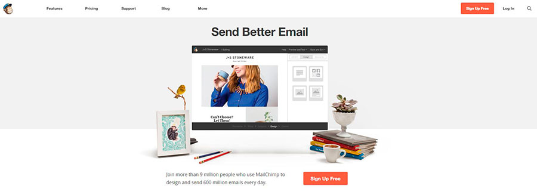
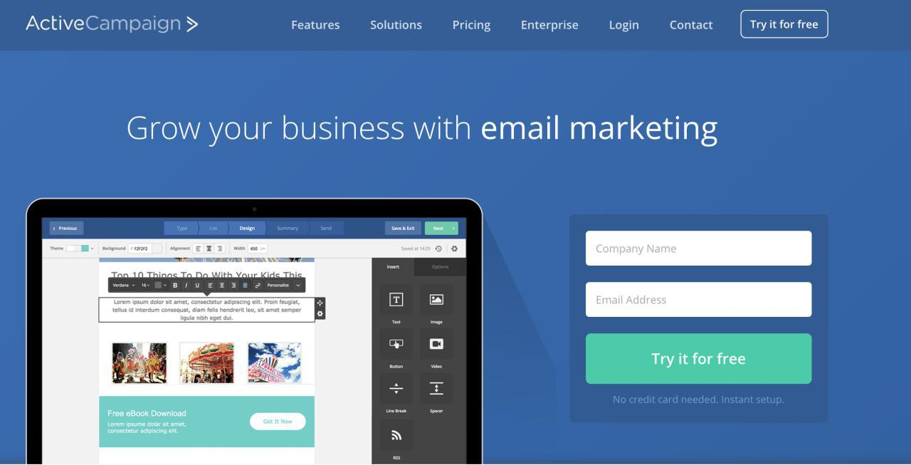
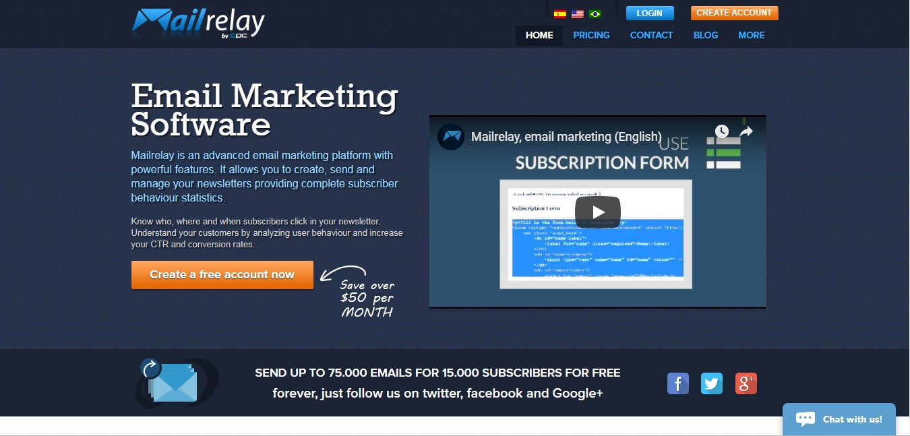
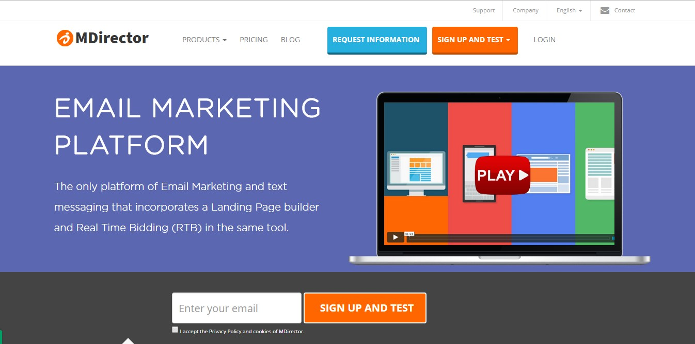
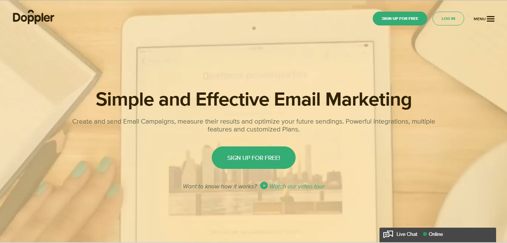

Information is power. This is a phrase really known nowadays. But information also can be the key to connect better with your customers. How? Thanks to **newsletters.**

A newsletter is a digital publication that you can make daily, weekly, monthly, even every two or three months. This publication may include posts of your blog or digital platform, or updates of your business. 

Is a kind of informative email that you share with everyone that previously accept it. 

These articles have to have interesting information for readers and they should be related to your brand and your value proposition. 

Newsletters are really important especially if you want to keep a close relationship with your customers. It is a good option to give them valuable information, connecting with their interests, and keeping communication with theirs.

<title-2>How to properly do a Newsletter</title-2>

<title-3>1. Plan</title-3>

A newsletter is a kind of an email marketing campaign, and every campaign has to plan it. 

The goal, the segmentation, the customer profile you want to catch, etc. It is recommendable if you make a plan monthly. In effect, when the month begins, you plan the campaigns for the whole month and you will save time without mentioning that you will work with a certain base. 

We love a technique for making a specific segmentation and use the right words, images, and content for your customer’s profile. 

The technique is the Buyer Persona and it is an ideal client archetype. You have to create a character, with a name, likes, behaviors, with a specific work, age, preferences, gender, and every aspect that a human has. 

That will be your perfect client. And you need to think as he or she and plan the newsletter based on what, how, when and for what they should read you.

<title-3>2. Give it a name</title-3> 

This It will give power to your newsletter. When we say give It a name, we are talking about a campaign name or just a subject. It is an email, you have to do It if you don't want to slip past.

<title-3>3. Make a calendar (a schedule if It is possible)</title-3> 

This step will be easier if you define well all characteristics and the behavior of your potential customers. You could choose the better day and hour to send the newsletter, taking in consideration when you think that they Will be free and willing to read. 

Pd: Weekends or Mondays usually are the best days for this. But remember, everything Will depend on your audience. 

<title-3>4. Select the content</title-3>

The content for newsletters usually comes from a blog or post on a web platform. 

Depending on your goals choose the best content that helps you accomplish every goal. 

For example, if you have an app that helps to organize the time and people's lives, and your goal is to show how your product works, a good content that you can share through a newsletter is the importance of being organized in life. How to do it. Benefits, some tips that help, some motivating quotes, and of course some apps which make this goal possible. Even, you could make a step by step to use It.

In that way, you share important and valuable information, you don't sell directly, and the best, you will achieve your goal. 

All of this information, of course, should be on your blog. A newsletter just put the information together to send it.

<title-3>5. Write a description or a summary of the question you will answer in every post involved</title-3>

Here is the magic of newsletters. It is a short description but very descriptive and striking. When a user read it, they must be sure of what it is about the article. 

Write an initial paragraph, an introduction. Then, take the main idea of the article and put it together with the goal of the post. 

You can complement this main idea with a fact, or another complementary idea in the post. 

The third step is adding the utility that the information will have for the user, and close the description writing a conclusion. Not too long and not so short!

Follow this structure in every post, and write effective and really good post summaries. 

You also can choose an image to complement it but is not necessary.

<title-3>6. Design it</title-3>

At this point, you would have the plan, the name or subject of the newsletter, the day an hour to send it, the specific articles or content you will share, and the summary of each post. 

Next, you will have to do is the structure of the newsletter. Put the images in the right place. If there is more than one content, well, structure them, put them in order, and separate every post or description, add the links of articles, and make the newsletter more clear and enjoyable for customers. 

There are many tools for doing easier this work, and we will show you later. Continue reading! 

<title-3>7. Test it</title-3>

It is high recommendable sending a test of the newsletter first. When you have finished send it first to your email, check that everything is alright, and then send the newsletter to your readers.

Some things you need to keep in mind are the subject can see it complete? , if images work with the alternative text, if there are some broken links or images, if there are some grammatical mistake. The last is so so so important.

<title-3>8. Send the newsletter</title-3>

You can send the newsletter to every user who accepts before to be part of your community of readers. 

They should know that periodically the content you publish on your blog will reach your email.

You can write manually emails of customers, but that’s not the best method. You should have a database where this information is stored, and you just have to import it.

<title-3>9. Analyze its effectiveness and the customer’s acceptance</title-3>

As every marketing campaign, you need to know and measure the results to reinforce hits and correct weakness. 

What you should measure in a newsletter? 

First, the **opening rate** that is the number of people who opened the message divided by the number of people who received it.

Then, measure the **click rate**. This is the number of clicks on a link in the newsletter divided by the number of people who received it. 

And last, the **conversion rate**. This is all people who made some conversion from the newsletter.

<title-2>Tools for doing newsletters</title-2>

*** Mail Chimp**

- Integration with almost any WordPress plugin to collect emails.
- Create our forms.
- Add forms on your web.
- Create pop-up to integrate them in our web. Although this is not interesting since the lead that is generated.
- Schedule our emails and campaigns.
- Autoresponder (payment option).
- Segmentation by lists and recipients.
- The free version offers the sending of 12,000 newsletters to 2,000 subscribers.
- Reports of your very complete campaigns (percentage of opening, click on links, automatic deletion of users who have been removed, the percentage of bounce, shows the best time to send the campaign of Email Marketing).
- Default templates
- Template editor.
- Design our templates in HTML and copy the code for your shipment.
- Download contacts in Excel or CSV.
- Automatic management of casualties.
- Link with Google Analytics.
- Mailchimp plugin to install in WordPress.
- Guides to solve all your doubts.
- Download campaign data.

*** Active Campaign**

- 14 days of testing that allows you to tune the tool with 100 contacts.
- Automation.
- Normal segmentation
- Segmentation by labels.
- Personalized mail according to segmentation, labels and even conditional. That is if this contact has not opened three consecutive emails send "x" mail, or delete it from the database.
- CRM to control your customers.
- A range of possibilities that few, very few tools allow you.
- Clear, clean interface and ease of use.
- Analysis report of all the data.
- Pixel tracking to track all your contacts.
- Creating funnels easier.

*** Mail Relay**

- Sending 15,000 free emails per month or up to 3,000 subscribers. This number increases to 75,000 emails or 15,000 subscribers just for the fact of following them on their social networks.
- Technical support for all accounts.
- HTML editor with default templates.
- Free templates
- Subscription form for our website.
- Scheduled delivery
- Autoresponders
- Control of automatic rebounds.
- Automatic management of casualties.
- Reports of email marketing campaigns: opening ratio, clicks, where they clicked, which subscribers opened their account, browser, operating system.
- Shipping of RRSS.
- Automate the inclusion of Google Analytics tags.
- In addition to the normal segmentation by created lists, it has the advanced segmentation of subscribers (by a number of openings, if they have not clicked on any link or clicked, marked as bounced)
- Integration in multiple platforms.
- Plugin for WordPress.
- Video tutorials and post to know how to use it. It's all in Spanish.

*** MDirector**

- 5,000 free emails per month.
- Test A / B to check the fidelity of your newsletters. 
- More than 100 predesigned templates.
- Customization of templates in a very easy way.
- Recipient segmentation.
- Automatic management of casualties and rebounds.
- Creation of lists.
- Analysis of results.
- Download contacts
- Automatic shipments
- Schedule the autoresponder.
- Publish your emails through social networks.
- Synchronize your CRM.
- Recharge email bonus.

*** Doppler**

- Maximum 500 contacts but no shipping limit for your emails.
- Programming emails with designated dates.
- Pre-designed templates for your newsletter and editor for the templates.
- Social campaign, to promote in your social networks.
- List of subscriptions.
- Download list of subscriptions.
- Segment subscribers by demographic data.
- Subscription form.
- Administration of rebounds.
- Summary of metrics in your email marketing campaigns.
- Unique and total openings.
- Integration with Google Analytics.
- Channel to program your RSS.
- Download Marketing Online materials.
- Video tutorials.

<title-2>To have a newsletter you have to be sure of:</title-2>

1. The real importance of the information you are sharing. Try to explain tools, tips, new strategies, and every information that answer all questions, doubts, and concerns of your customers or potential customers. The information needs to be attractive, useful, important, recent, and It should be related to your brand concept. 
2. Having a blog. Or maybe some digital platform where you share content frequently. That's the essence of newsletters. 
3. The simplicity of the layout. Less is more when is related to newsletters. The goal of one is that customers can understand it well. So, It is not recommendable using lots of images and texts. Write and organize well the whole information and get easier the comprehension of customers while read and enjoy the newsletter. 
4. Checking the newsletter before or sending it. Never is enough when the test or proves is related. Once you have finished of structure the newsletter sends It first to your email and look It well. If everything is alright It Will is time to share it with your readers.

**Newsletters** are very helpful to be close to your customers and for position yourself on the internet. They put together the content you share through your web platforms. So, follow these steps, use any of these tools, put into practice these tips, and win a successful newsletter. Once you have the statistics share them with us for celebrating your success.
