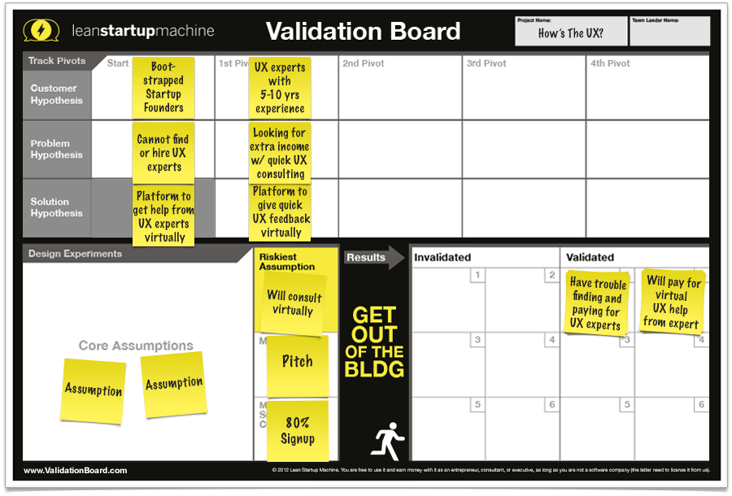

>*Plain and simple: Don’t offer what people don’t want.*

Often people (especially technical people) start building their idea spending months of time an resources in a product that is not viable or worse, is something that people don't want or doesn't solve the problem from which it was designed.

Validation is the most important step to create a business. It corresponds to the activities to prove the assumption that the problem that your aiming exists, that enough people are facing the same problem and finally, that the solution that you are proposing is wanted.

Many different methods exist to validate your idea, from Web pages, Surveys to MVP's, each one of them with specific purposes and for different scenarios.

After reviewing and testing different methods in Cobuild Lab, we have chosen the [Validation Board by the Lean Startup Machine](https://www.leanstartupmachine.com/validationboard/)

##Learning the hard way

<youtube-video id="G8Rk0c3axtI"></youtube-video>

## Validation Board

The validation board is a canvas or a model built with a set of necessary elements and tools to validate an idea, based on testing, learning and pivoting.

### Advantages of using the Validation Board

- It's a proven technique
- Is based on reality: Your idea is based mostly on assumptions
- It's lean
- It's easy to understand

<youtube-video id="HhoducyStMw"></youtube-video>

### Customer Hypothesis

First, we describe our audience or target customer in terms of the problem that they are facing. Gender, income, housing, location, position, etc.

Example 1:

- Ad Buyer
- Marketing Manager for a Dog Clothing store
- High school teacher

Example 2

- Technical experts now in management (Team Leads, Supervisors, Managers). This is their first management position, likely less than one year in the new role, have previously been successful in prior roles; likely to continue to be successful

### Problem Hypothesis

This is the assumption that the Customer has that you can solve.

Example:

- The Marketing Manager has a common problem in today dominated Digital Ads Market. The cost of advertising is greater than the maximum amount of money that they can pay for customer acquisition.

### Solution Hypothesis

In this part, we provide a brief description of our product and how it solves the Problem defined.

Example:

- We are gonna create a marketplace for traditional and local mediums of advertising for small business.

###  Assumptions

These are all the assumptions about the customer, problem and solution hypothesis that require testing. 

Example:

- The small business Marketing Manager does not have enough budget to advertise in Digital Ads Platforms
- The small business Marketing Manager wants to advertise
- There is no other platform for advertising for small business owners 

### Riskiest Assumption

After we reviewed the assumptions and hypothesis, we prioritize putting as the most important one the one that represents the major amount of risks. (most amount of money or time spent)

### Method (How we test it)

The Lean Startup Machine proposes three possible types of Methods to validate your Riskiest Assumption: (you can use more than one)

1. Exploration: Reproduce the problem
2. Pitch: Pitch de solution in exchange of currency (email, phone number, cash)
3. Concierge: Deliver the solution, with the fewer amount of technology as possible

We can add to that:

4. Surveys
5. Contradiction: If validate your assumption becomes too difficult or too expensive, assume the opposite and use on a simpler method

Here are some of the ideas we had (geared around identifying and learning from new technology managers):

### Minimum Success Criteria

Define what's gonna probe that your Assumption was Validated or Invalidated

Example

- If X amount of Marketing Managers answer 10 points or less in the survey it means that the assumption is Validated.

### Get Out of the Building

- In person surveys
- Email forms
- Phone Calls, etc

