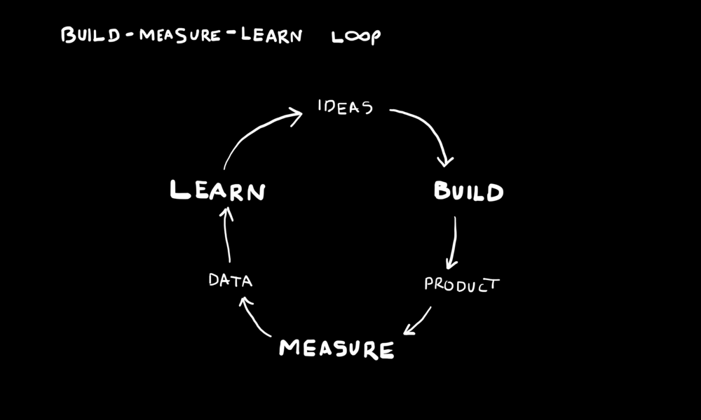
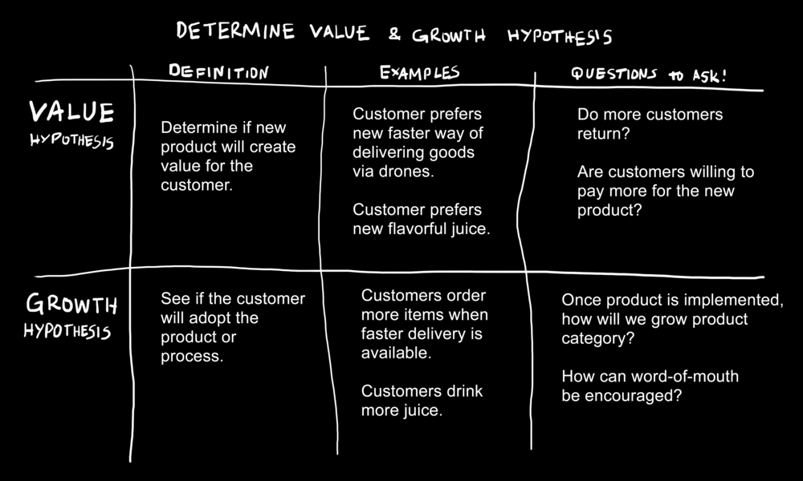

Try to predict the future is a power that everybody in the world would like to have especially when a business is starting. That’s not possible, but we try to anticipate the future we want, and how to accomplish it. More specifically we are talking about the **growth hypothesis and value hypothesis of our product.**

**These two assumptions form a big part of the process of [Validation of your idea](https://cobuildlab.com/blog/cobuild-process-part-1/)**

<title-2>Understanding the value hypothesis and the growth hypothesis</title-2>
**Hypothesis:**

A hypothesis is something that we expect to happen in the future, and we try to recognize it and explain it with the current facts or evidence without the certainty of being true, it is a supposition.

People tend to do this for everything, but when it is related to businesses we make assumptions on our product, the problem that we are solving, the market, etc, for example:
* the problem magnitude of my potential client, 
* the better channel that I will use for promotion taking in consideration statistics and my customers’ profile, 
* how much my client would be paying for my product, 
* how we will increase our leads, 
* the resources that I need, etc.

All of these are hypotheses because we don’t have a way to be sure that they are correct, but it is necessary to think on them and keeping them in mind for many reasons before starting, to evaluate the market and to think how they can change with our product or service. 

<title-3>Value Hypothesis:</title-3>

A value hypothesis proposes an assumption on how a product is valuable to potential customers. Even though your “potential customers” could be an assumption as well.

**A value hypothesis** is more on the market now. It is a hypothesis that contains the exact value you would give to potential clients. In this point you have to think how to offer something really valuable that solves client’s problems and desires, and also, they can use and buy.

It is related to the traditional market study that you have to make at the beginning of the development of your idea. But in this case, you make suppositions based on studies and the reach of your business.

These suppositions can give you the conversion percent you will have in short and medium period of time and the best part is that you can probe them making exercises and experiments with people.

Examples: 
* Customers use my product because they want to share their special moments  with others
* Customers use my platform because they want to learn how to develop a new career
* Customers user my app because they want to keep in touch with their relatives

<title-3>Growth Hypothesis:</title-3>

A **growth hypothesis** is a supposition that looks like a plan about how our business will grow or evolve in a long future. This hypothesis makes the business scalable and sustainable through time.

This kind of hypothesis allows detecting if the business we want to start it is valid and if you will have enough amount of clients converted to support the cost’s structure, even if it can cover the evolution of your processes or production.

In the software world, usually, this hypothesis is used to explain how the system, app or platform it’s gonna be discovered by new users. 

In that way, you can **validate** at the beginning if it is sustainable and viable the business you want to start.

<title-2>How is related the value and growth hypothesis with the Cobuild Process?</title-2>

How we said some posts ago, in [part 1 of Cobuild’s Process](https://cobuildlab.com/blog/cobuild-process-part-1/) we have to validate the idea because we are getting it better, and this means that we work on that until making it more likely to succeed.

The complete process of validation will be surrounded by hypotheses: Problem, Hypothesis (all we know of the problem they have), Product hypothesis (all we will do to solve it), Client Hypothesis (Who is the client), Solution Hypothesis, Value Hypothesis, Grow Hypothesis, etc so the purpose of this stage is to prove them to a point that a least we achieve certainty that they are not completely wrong.

It doesn’t matter if we want to validate hypotheses on the future (growth hypothesis) or now (value hypothesis) the most important thing it is that you finally be confident that your idea is the solution to desires and necessities of customers.

So, growth and value hypothesis are too much related with the Cobuild’s process in the first phase of validation. And as we said, this is the most important step before starting a business.

A good and proven way to test a hypothesis is to use the Build-Measure-Learn feedback loop, proposed by [the Lean Startup]( http://theleanstartup.com/principles).  Here the goal is to design experiments and create small tests to apply to potential customers, to acquire results, measure, and learn from them to achieve **Validated Learning**

[Source](https://youexec.com/book-summaries/hjy7654kl/the-startup-way-by-eric-ries)

<title-2>Doing a value hypothesis and a growth hypothesis</title-2>

You can make many hypotheses of your business idea as you want, but here, we will show you a bit of advice to do it:

1. First, writing the  idea
2. Make the next questions:
* Who is the client?
* What problems he really has?
* How many potential clients like him are around?
* What can I do to convert them?
* Can they pay for my service or product?
* How much they are willing to pay?
* Where are they?
* How I can access them?
* How to attract them?
* How my product will be known?
* Which characteristics of my product are values for them?
* Have they enough economical resources?
* What are they looking for?
* What do I need to solve the problem?
* Which resources are involved?
* Which is my expectative in some years?
* Which resources will I need in the future?
* Which I think will be the conversion percent?
 
3. Answer these questions an order the list depending on your priorities.
4. Separate the answer on things you can know and make now from the things that are in the future. In that way, you will get the growth and the value hypotheses.
5. Write them and probe them using, test, interviews, surveys, and other resources.
6. Get a conclusion
7. Improve your idea.

<title-3>Let’s see an example</title-3>

[Source](https://youexec.com/book-summaries/hjy7654kl/the-startup-way-by-eric-ries)

<title-3>Another Example</title-3>

<youtube-video id="QaoVWtLX038"></youtube-video>

Now you know: the **value hypothesis and growth hypothesis** are more than necessaries to start your business idea correctly. They are in the first step of the Cobuild’s Process, and they will increase your chances of your company of satisfying customers. So we invite you to do it now. If you need assistance we are here to help you. 
