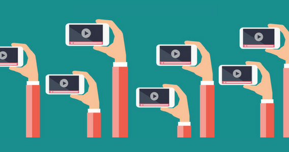

Did you know that 70% of people in the world are visual? Well, now you know it, 20% is auditory, and the rest are kinesthetic. What does it mean? 90% of people in the whole world will connect better with your brand if you use audiovisual products. 

But it is not enough to talk about separate and individual videos. To be more effective, you need to make a campaign of videos with a specific intention, objective and content. In a few words, you should do a **video marketing** campaign. How to do it? Why and for what? We will explain this to you.

<title-2>This is video marketing</title-2>

An image has more value than a word, especially in video marketing. For that reason, we share this amazing video that explains how video marketing works for your brand. And what’s its meaning: 

<youtube-video id="gtp_dLizo7E"></youtube-video>

Video marketing is a strategy where you make a group of videos with an objective: show your brand. 

These videos have the essence and the value proposal you offer, and they have images, sounds, and information to achieve a goal: keep the attention of customers, convert them and get their loyalty. 

We already know that video marketing is a group of videos, but also, you have to know that each one has different formats because they will be for different platform. How is it? Well, suppose that you have a brand and you want to position on the internet to get more customers. In that case, we recommend you videos for social media, for your website, for ads, and every platform you are using to expose your brand. 

For example, if we have an account on Instagram, Facebook, and Youtube, the videos you produce for each one are different. For Facebook and Youtube, the video should be longer and in a specific format. While for Instagram it must be of 60 seconds maximum. If it is for stories, the format is vertical, etc. 

What does it mean? A campaign of video marketing has many videos adapted to each platform you will use. 

And these videos take you to one place: your website where you should have more videos. It works like a chain, and this chain will help you to capitalize the market, to get more customers, and winning money.

<title-3>Data and statistics that show the importance of video marketing</title-3>

Source: [Optimonster](https://optinmonster.com/video-marketing-statistics-what-you-must-know/)

You would be surprised of power that videos have. How we said, you could reach 90% percent of people on the internet with sounds and attractive images. 

Besides that, experts say that in 2019 more of 80% content on the internet will be audiovisual. That’s more than a trend. 

Why is happening this?  Reasons are too much. 

Google loves videos and they give you a better position in its searcher if you use them a lot. So, a video is an SEO’s technique. 

Also, much people in the world look for a video before buying something. Reviews, publicity, functionality, and information about the product or service. So, 
would you like to be who give them the information they need? We think that yes and video marketing help you with this work. 

Video marketing gives you the opportunity to aim directly at the emotions of customers. In that way, they will feel identified with your brand. Whether you are telling stories, making them feel something special or just entertaining them. Video marketing makes it possible. 

Videos are so powerful that 84% of people who don’t know anything about a product if they watch a video of it, they buy the product. That is too many people in the world!

Source: [Optimonster](https://optinmonster.com/video-marketing-statistics-what-you-must-know/)

Google said that 50% of web users look for a video before visiting a store too.

[Hubspot’s](https://www.hubspot.com/reports/the-future-of-content-marketing) research shows that 45% of people watch an hour or more of video per day.

And all of this information doesn’t apply to mobile videos, that are consumed much more than others. Because of millions of people in the world have one and use them almost the whole day.

Source: [Optimonster](https://optinmonster.com/video-marketing-statistics-what-you-must-know/)

These are enough good reasons in favor of video marketing for you? 

<title-2>This brand took advantage of the power of video marketing</title-2>

If you don’t know it, Coca-Cola is a monster on video marketing campaigns. This team is one of the best in the world doing it. 

For sure you loved a Coca-Cola commercial in the past, but did you know that this video was on a structure? and really good video marketing campaign whit a specific goal? 

For you to see it better, we choose the campaign called “Taste the feeling” of Coca-Cola in 2016. 

They joint commercials in different languages, with different people using the same concept during a year. 

In that way, you will see that they made videos for Christmas, for the summer, in October, and the whole year. But all of these videos kept the concept of “taste the feeling”. Enjoy it by yourself:

<youtube-video id="Eun0rWKpA5I"></youtube-video>

<youtube-video id="6W5pqlbh5sQ"></youtube-video>

<youtube-video id="13r_LUxWPaY"></youtube-video>

<youtube-video id="F411acOyIzw"></youtube-video>

<title-2>How to do a video marketing campaign: step by step</title-2>

At this point, you know what is a video marketing campaign but the most important thing is to know how to create one. Next, we will explain to you:

**1. Define your goals:** a video marketing campaign is like other marketing campaigns. You need to know what you want, where do you want to go with this videos.

**2. Think in the customers' qualities and preferences:** this step is the typical market segmentation. In video marketing, this aspect is even more important because you need to tell a story, select images, select the right language, and look for everything you think can help you to accomplish the goal.

**3. Select the channels you will use;** to know the format and the qualities of each video.

**4. Plan, prepare and select all resources (human and technical):** in audiovisual production, this step is known as pre-production. Is very important because if you lose something, you can be in trouble in the next steps. All you need, you have to plan and prepare it here. Scripts are made here. 

**5. Production phase:** at this moment you need to collect all the information and resources you plan in the last steps. Songs, sounds, images, and all element you are going to use for each video.

**6. Post-production:**  now it will be time to edit everything and perfection technical details until getting a video or a group of videos.

**7. Make it public:** Once you have all videos you only have to post them in the platform you selected.

**8. Measure and correct:** the key to success in any marketing campaign is studying the number, statistics, and results of every action to get it better or reinforce it.

<title-3>Video marketing trends</title-3>

*** Storytelling**

This is the art of telling a story. Stories that have messages and touching emotions. This technique is used to connect with users through images, sounds, texts, and animations that tell a story. In storytelling you use characters and they are involved in a story which keeps the customer attention. That is the POWER of a good story. In that way, you will sell indirectly.

<youtube-video id="N1ltwg2nTK4"></youtube-video>

*** 360 immersive videos**

This video trend is the favorite of lots of people in the world because it take you to a next level on feeling. In this kind of videos you can see, enjoy, even come closer to every area of a determined space. 

It is more than virtual reality because of is the reality in essence. This videos are record for specific cameras that catch an space on 360 degrees. In effect, you can move the image and seeing a different spaces. It is like being in the place, even if you are on the other side of the world. For you can see it better we share you this video.

<youtube-video id="-xNN-bJQ4vI"></youtube-video>

**Video marketing** revolutionized the world and we think that it continue doing it. So, what are you waiting to begin to use it? Videos are fun, effective, beautiful, viral, and your ticket to success. 
 
 

