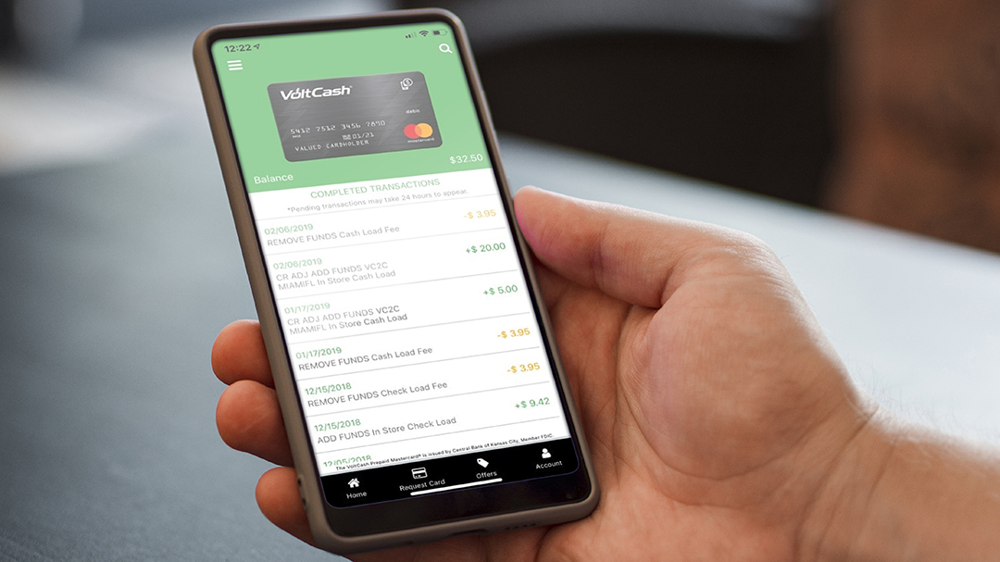

There is no need to go to a check cashing store again, this Miami based startup allows you to access your check funds immediately at your local  convenience store, supermarket or even a gas station!    

Founded in 2014, <a target="_blank" href="https://voltcash.com/"> VoltCash </a>  is a financial technology company that provides an alternative to check cashing for all its users in addition to providing immediate cash availability by partnering with local retailers. Anyone with a valid ID can bring in their cash or checks to their local retailer and instantly gain access to full financial services. It is that quick and easy.    

    

<title-3 align="centered"> Partner with VoltCash </title-3>    

If you are a retailer, VoltCash will be a value-added service for your business that allows you to help your customers and bring you additional income. You can increase traffic since users looking to cash their checks or reload their VoltCash card can purchase  in your store as well.    

By <a target="_blank" href="https://voltcash.com/retailer-benefits/"> partnering with VoltCash </a>
 you can earn commissions on every card activation, check load, cash load and VoltCash card purchase made in your store. They provide and install for you the VoltCash POS terminal, which is a small machine to do all the transactions. They will also provide marketing, training, and all the support you might need.    

They assume all risks and guarantee the funds for all VoltCash approved checks and card transactions so you don't have to worry about fraudulent checks. All this without the need to obtain any regulatory approval.    

<youtube-video id="MrKB5q9GGt4"></youtube-video>    

As it’s shown on the video,  you will  receive a VoltCash debit card that you can use at almost anywhere in-store and online. You can reload it as many times as you want or need with cash or check at the nearest store and you always have the option to request cash back.     

<title-3 align="centered"> VoltCash Mobile App </title-3>    

Get an insight into all your transactions info from your phone with the <a target="_blank" href="https://voltcash.com/features/mobile-app/"> VoltCash Mobile App </a>. You'll be able to see when, where and what you're buying so you can keep track of your spendings. You can also get offers for discounts at your favorite stores and even request a card.    

    

The VoltCash Mobile App lets you  find store locations near you and set custom alerts to notify you when a certain spending event occurs, like when you have a Low Balance or Zero Balance. It can present you a Weekly Balance giving you more control over your money and a better understanding of how you’re spending. You can also automate when you pay your bills setting up Online Bill Pay with VoltCash and keep track of them with the VoltCash Mobile App.    

For this and so much more VoltCash is one of the  <a target="_blank" href="http://thetechtribune.com/10-best-tech-startups-in-miami/"> 2020 Best Tech Startups in Miami </a> and one of our favorites!. Would you use volt cash? Let us know in the comments.    
