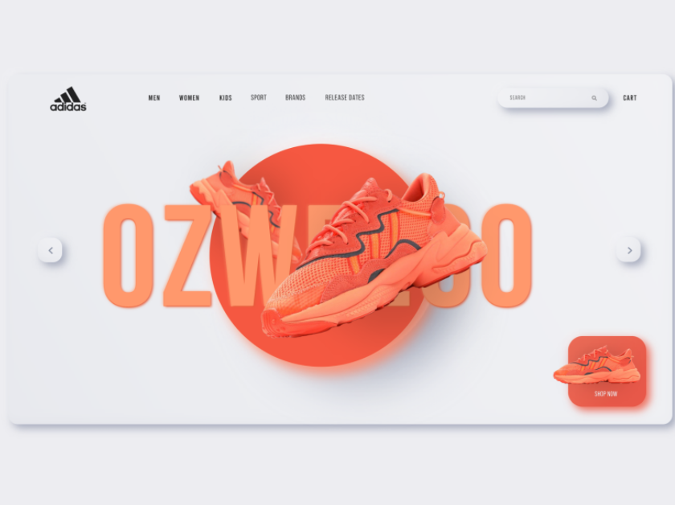

Every year, web design trends seem to bring us a little closer to the fabric of our dreams for the future and how we envision and aspire our technological interfaces to be. Last year we saw an increase in heightened reality and minimalist approaches to design, focusing more on the power of the photographic image and intuitive navigation not only as a tool but also as a true north for next-generation web design.    

2021’s incoming trends seem to take us a step further in that direction. Let’s take a look at the top 5 tendencies in web design for the new year according to our creative team:    

<title-3 align="centered"> 1. NEUMORPHISM </title-3>    

Neumorphism was born from skeuomorphism and went on to create an entirely new UX style and a trend in its own right. This trend focuses on getting rid of all flashy aspects of the interface, creating a soft visual that stays consistent throughout the entire product. It allows designers to reclaim the tactile experience that was lost in the flat design era, and this in turn heightens the user’s connection to the design he is interacting with. Expect to see this stylized realism on the buttons, search bars, and text boxes all across the digital designs of 2021.    

<title-6 align="centered"> By <a target="_blank" href="https://dribbble.com/georgetangwl"> George Tang</a>  </title-6>    

<title-6 align="centered"> By <a target="_blank" href="https://dribbble.com/vowles"> Samson Vowles</a>  </title-6>    

<title-3 align="centered"> 2. THREE-DIMENSIONAL COLORS </title-3>    

Color schemes in web design have been trending towards gradients for some time, and this year’s trend feels like the next step in this evolution with color transitions becoming more lifelike than ever. Taking their cue from Apple’s Big Sur OS, we expect colors that are saturated and three-dimensional, almost like fruit you can pluck right out of the screen. This trend is accomplished through fine shading that gives a more tangible feel to the flat icons we’re accustomed to. While we do anticipate it to appear most commonly on app icons, web designers are also abandoning the neat transitions of gradients for background blended colors that come across as more imperfect and natural. Two colors side by side might abruptly smear together or they may retain the shadows and depth of painted objects. All in all, this trend suggests that the web design colors of 2021 are aspiring to higher realms of realism.    

<title-6 align="centered"> By <a target="_blank" href="https://dribbble.com/unfold"> unfold</a> </title-6>    

<title-3 align="centered"> 3. INTERACTIVITY AND MOTION </title-3>    

Video is proven to be the most engaging form of content online, so it’s no surprise that motion has also become a big trend in web design. Motion and animation in web design is a simple way to make an otherwise ordinary web page more exciting and engaging. Many brands and businesses have begun adding more interactive elements to their websites, including quizzes, games, polls, and surveys. Interactivity has proved to be a great way to learn more about your visitors and add some fun to the overall online experience. As long as you achieve a balance and make sure your motion or interactive elements don’t distract the user from the purpose of your website, you’re good to go.     

 
<title-6 align="centered">  <a target="_blank" href="https://www.esteelauderanrcade.com/en-us/"> Estee Lauder's</a> ANRCADE Game </title-6>    

<title-3 align="centered"> 4. PARALLAX SCROLLING </title-3>    

Parallax scrolling has been around for some time, but it's one of those web design trends that just keep on going. Parallax designs use JavaScript and CSS to help enhance the user’s experience by layering multiple background images on top of one another, setting them to separate scroll speeds to give the appearance of three-dimensional depth and movement when the user navigates throughout the site. Done right, parallax websites can bring literal life to any website. They are modern and sleek with a heavy emphasis on design elements. Since this technology is fairly new, most designs have a very modern and minimal feel to them. Stock photography cutouts and collages are also very common with the use of motion scrolling. Parallax websites are also perfect for companies that are attempting to bring a web presence to a specific product. The creation blends perfectly for product display and storytelling within the site. They add that extra spark of creativity and interaction with the user that most basic websites lack.     

<title-6 align="centered">  By <a target="_blank" href="https://www.recapafteruse.co.uk/"> Louie Sellers</a> </title-6>    

<title-6 align="centered">  By <a target="_blank" href="https://www.alexdram.com/"> Alex Dram</a> </title-6>    

<title-3 align="centered"> 5. MINIMALISM </title-3>    

Minimalism is more a design principle than a visual style, and over the last years, it has been a staple of web design work. Its core idea is using only essential design elements (empty space, basic colors, and a limited palette, clean text, and basic shapes) to construct something appealing, functional, and striking to the viewer. Don’t get us wrong, it’s not just about black and white design. As a matter of fact, color minimalism is expected to be on the rise in 2021 with bold backgrounds and block colors, minimalist typefaces, and simple design elements to create stunning and memorable website design.     

<title-6 align="centered">  <a target="_blank" href="https://www.hugeinc.com/"> Huge Inc.</a> Homepage </title-6>    

You have to keep in mind that these trends are just a taste of what’s about to come this year. We have to incorporate these styles in ways that enhance our brands, connect with our client’s interests, and set us apart from the competition. There’s so much to see and do!
