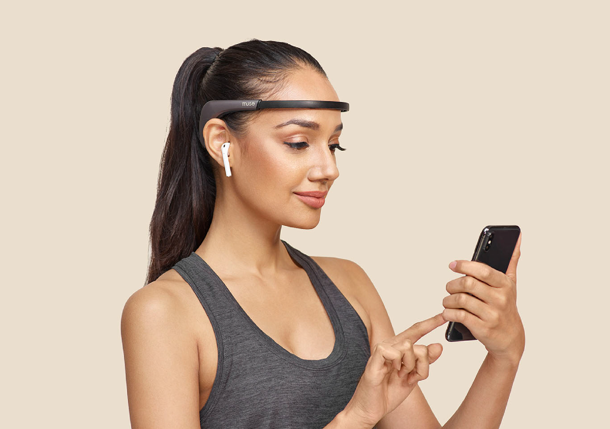

Miami, FL. Mar 03, 2022.

<a target="_blank" href="https://www.cobuildlab.com/services/">   Technology</a> has become a very intimate part of our lives. Thanks to these advances, more than one can say that their daily lives have become more accessible, comfortable, and practical. 

But technology did not stop there. Technological advances have allowed us to have a greater focus on our <a target="_blank" href="https://www.cobuildlab.com/blog/How-Can-a-Mobile-or-Web-App-Help-Improve-the-Healthcare-Industry/">   physical and mental health</a>, always looking for new and better ways to take care of ourselves, be aware of our health and change our lifestyle to a healthier and more durable one. 

Today, we can find an infinite number of technological advances that we could only imagine or watch in science fiction movies not so many years ago. Now we have everything from smartwatches to <a target="_blank" href="https://www.cobuildlab.com/blog/ai-for-health-healthcare-support/">   AI-assisted</a> meditation sessions. 

In this article, we will talk about some devices and technological advances that bring us significant benefits in terms of <a target="_blank" href="https://www.cobuildlab.com/blog/healthcare-apps-present-and-future/">   wellness and lifestyle</a>, improving our days in one way or another.  

Sometimes it feels like physical and mental health has taken a back seat, but technology constantly reminds us that we have many ways to take care of ourselves without putting in a lot of effort. 

Here are 5 <a target="_blank" href="https://www.cobuildlab.com/blog/benefits-of-using-low-code-and-no-code-technology/">   technologies</a> that have been created to improve your health and lifestyle:

<b><title-4>1. Smart jewelry</title-4></b>

Accessories have reached another level with intelligent jewelry. Now, looking cool, stylish, or sassy is not enough. These devices work in the same way as smartwatches, albeit with sleeker designs. 

You can track your heart rate, blood pressure, and sleep activity with intelligent jewelry, but they don't stop there. These devices can be configured to generate notifications when feeling anxious or stressed. A suitable warning to take some of the pressure off work or know when you urgently need to relax. 

If you want to look good and be aware of your health, these devices are ideal and practical, as they work via Bluetooth with your smartphone.    

    

<b><title-4>2. Meditation tracking devices</title-4></b>

Are you looking to get started in the world of meditation? 2022 is a perfect year to do it! There are now platforms or apps that allow you to track meditation. 

These types of tools help you learn proper meditation techniques and schedule your sessions so that you can enjoy the experience to the fullest when you are alone. They also help you create the perfect environment to take full advantage of the benefits of this relaxing activity. 

One guided meditation tool is the <a target="_blank" href="https://choosemuse.com/es/muse-2/">   Muse 2</a>, whose system helps you track brain activity and posture, offering guided meditations with the right music to create the ideal environment.    

<youtube-video id="https://www.youtube.com/watch?v=_RMo0LQjLV8"></youtube-video>    

<b><title-4>3. AI-powered air purifiers</title-4></b>

There's nothing like coming home or to the office and smelling a pleasant aroma. That is even proven as a method to lower stress levels. 

With an AI-powered air purifier device, odors are no longer a problem. Your home or office will stay fresh and fragrant.

There are already many devices that allow you to maintain a pleasant aroma, they can be programmed and controlled by other devices, but Brise goes to another level.    

<youtube-video id="https://www.youtube.com/watch?v=eNg2Mril8v4"></youtube-video>    

This air purification device can customize indoor conditions according to the user's preferences, room size, and air quality levels.

It has built-in sensors that can detect sudden changes in air quality and even the presence of toxins. In this way, the device can activate the corresponding modes or functions to combat any foul odors.    

<b><title-4>4. Personal Training Applications</title-4></b>

Being fit is good for the body and soul. Physical wellness has everything to do with mental health. Exercise is proven to help incredibly against ailments like anxiety and depression, even making them go away if you suffer from them. Still, not everyone is a friend of the gym or wants someone telling them what to do at all times. 

Apps like <a target="_blank" href="https://fiit.tv/">   Fiit</a> and <a target="_blank" href="https://www.future.co/">   Future</a> were made for you if you're into fitness. These apps become your virtual personal trainer, tailoring routines according to the goals you set and the data you provide. 

These apps range from weight training to yoga so that no one is left behind and chooses the physical activity that best suits or appeals to them. The important thing is never to neglect our physical health.    

<b><title-4>5. Mindfulness Trackers</title-4></b>

Naturally, if we train our bodies with technology, we can also improve our mental health.

With technological advances, we can track how we react to certain situations. This type of technology is called a mental wellness app. They help us redirect our thoughts and overcome daily challenges that motivate us to improve and eliminate bad feelings such as anxiety or worry. 

<a target="_blank" href="https://hminnovations.org/meditation-app">   Healthy Mind</a> is a program that you can take to say goodbye to negative thoughts and embrace a better lifestyle full of creative works and connections with yourself. The mission of this app is to keep your emotions under control and give you the tools to face life with the best attitude. 

These <a target="_blank" href="https://www.cobuildlab.com/blog/low-code-development-this-2022/">   technologies</a> are now part of our daily lives; even if we don't use them, we can see them everywhere. 

We all want to feel better, look better, be healthier and happier, and these kinds of stuff make them possible. They reduce the effort, increase results for those who are open to trying them and making them part of their lives. It lives.

At Cobuild Lab, as technology developers, we love to join any project that reflects a healthy lifestyle and, in general terms, more excellent value for people. If you want to bring wellness to the world, let's team up to <a target="_blank" href="https://www.cobuildlab.com/services/app-development">   build a great idea</a>. 

<b><title-3>Cobuild Lab Team</title-3></b>
