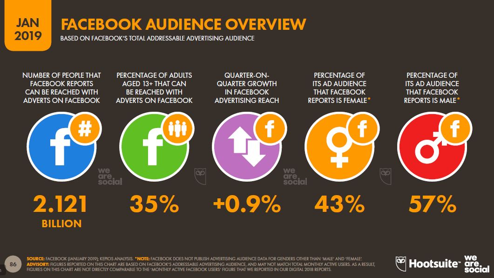
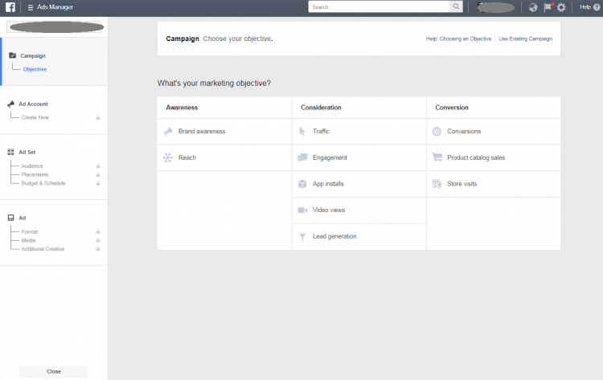
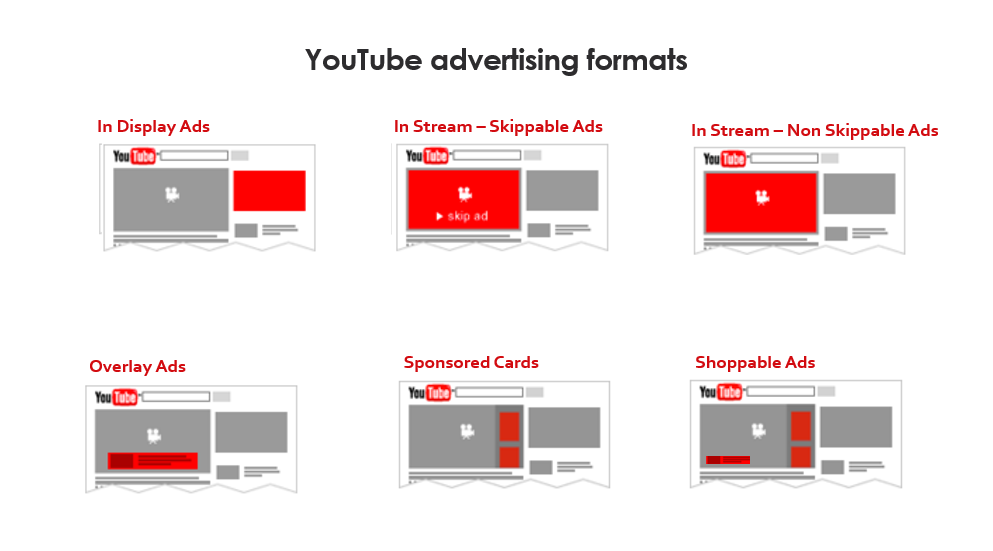
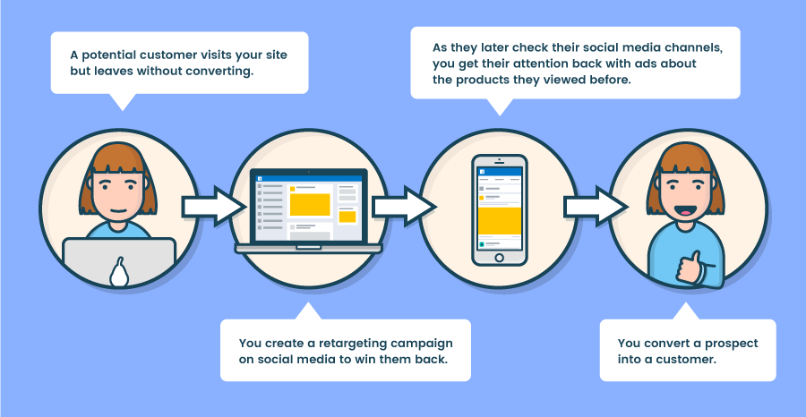

Who doesn't use social networks today? Already there you know that the chances of reaching the audience you want are tripled. 

There are several platforms that allow you to carry out ads campaigns, such as those offered by Google, like [Google Ads](https://cobuildlab.com/blog/tips-to-create-effective-campaigns-in-google-search-engine/), [Google Ad Manager](https://cobuildlab.com/blog/google-ad-manager-the-platform-to-track-your-ad-campaign/) or [Google Marketing Platform](https://cobuildlab.com/blog/google-marketing-platform-another-way-of-google-advertisement/), but each social media platform had to take advantage of the huge market that exists, and that's why they created their own ads platforms, which opened up other social media platforms, such as the case of [Facebooks Ads](https://www.facebook.com/business/ads), with which ads can also be published on Instagram and other social media platforms.

<title-2>Exactly what are the Social Ads</title-2>

Social Ads are a diminutive for advertising on social networking platforms. 

If you have a social media marketing campaign, you must surely have two sections within: I) the content you publish to receive visits and organic positioning ([SEO](https://cobuildlab.com/blog/seo-tips-that-will-increase-your-position-in-search-engines/)), and II) the ads. 

When it comes to [Social Ads](https://www.adobe.com/express/create/advertisement), we would be in the presence of the paid content that you want to publish on social media ads platforms. 

A good thing about this kind of advertisement is that you would have broad objectives for a low investment cost, and also almost perfectly segmented ads, taking into account the information and profile that the same social media platform has built by the users search patterns, followers, preferences, ages, etc.. 

This information that makes the algorithm suggest things we will love, will also help you to segment your ad very well, and appear more accurately to those who are your target audience.

Now that you know what Social Ads are, it is also important for you to know that there are several options for making this type of advertisement. Stay a little longer and we'll explain them all to you. 

<youtube-video id="yBvdRMy2j_g"></youtube-video>

<title-2>These are the main Social Ads platforms</title-2>

<title-3>These are the main Social Ads platforms</title-3>

This is perhaps one of the most important, as it is multiplatform, not only works to make ads campaigns on Facebook, also is one of the first to be launched on the market.

The good thing about [Facebook](https://www.facebook.com/business/ads) Ads is also that it is ideal if you want to reach your potential in the same social network, which is not too much to say that it is the one that has more subscribers in the world. To be a little more exact, [more than 2 billion people by 2019.](https://www.juancmejia.com/marketing-digital/estadisticas-de-redes-sociales-usuarios-de-facebook-instagram-linkedin-twitter-whatsapp-y-otros-infografia/)

What does this mean? that you could capitalize as a brand in the social network with the highest demand in the whole world. 

Facebook Ads offers you three types of targets for your ad campaigns, such as awareness, consideration, and conversion.

Depending on the intentions or goals you want to achieve with your campaigns, select any of these options, and your investment, the type of ad, the segmentation, the elements you must integrate, and the overall behavior of the campaign will be different to achieve the goal you set.

* In order for you to know a little bit about this, **Awareness** is used to let your target know that your brand is one of its alternatives. Usually, this type of campaigns is done with new brands, which are just starting in a market, and customers should know them, who they are and what they can do specifically.

* **Consideration** is equivalent to positioning. Once your target knows you, and the recognition phase is done, it is generally applied to the consideration option in Facebook Ads, because with this one, what is searched is to consolidate the image in the market and to be scaling little by little with the campaigns that you are carrying out. 

* **Conversion** campaigns are usually carried out when you are already positioned in the market, but you need to achieve that last step so that those who recognize you and look for you also buy from you. 

What changes with each type of advertisement is mainly the way the investment is made, the extensions that are added and the requirements that you must complete, to complete the ad, such as forms, pictures, videos or links, etc. 

It is also important to add that, in Facebook Ads, you can advertise images, video, carousel, leads ads, you can advertise on Facebook Messenger, images or products collections, and so on. It is a versatile tool.

<title-3>A little of the history</title-3>

It all started in 2004 when [Mark Zuckerberg](https://en.wikipedia.org/wiki/Mark_Zuckerberg) at Harvard was launching this platform. Although in the film The Social Network we observed that he opposed the marketing of The Facebook, it turns out that this did happen at some point, with the so-called "flyers", which were banners paid for students or merchants in the area to appear on the platform. Between 10 and 40 dollars cost this type of banners with which many parties and events were announced, even from the same campus of the university. 

From there, more income came with advertisers such as Victoria Secret and Apple, and from there it evolved to what we know today. 

Previously, the company earned a lot for this type of advertisement, and the brands that offered, achieved conversions, but in a generic way. 

When the Power Editor platform is created and later becomes Facebook Ads, is when it becomes much more accessible this type of campaigns for many to earn money sharing quality material.

In this same way, the types of campaigns were perfected and made much more specific and of course, this increased the effectiveness and efficiency of all those who were advertisers. 

Today that growth continues. There have been improvements such as the possibility of publishing content in 360 degrees, specific ads for mobile, and many others that have made this social ads platform one of the most used today and with great promises for this year. 

If you want to know the process to [plan and create an ads campaign](https://cobuildlab.com/blog/Planning-your-ads-campaign-on-10-steps/), we invite you to read the post we did previously on this subject. 

<title-3>Instagram Ads</title-3>

We all love Instagram. In fact, this social network is a little below the giant Facebook, and in fact, is not entirely detached from it, have a very interesting integration even in the area of ad campaigns. 

Instagram is a very visual platform, which generates a very high level of engagement. This makes it ideal for ads campaigns, as it has many ways in which users can interact. 

In Instagram, you can publish Ads with segmentation by age, region, and pay in your local currency. This segmentation is a little less detailed than Facebook Ads but still very effective. 

And it also has the advantage that you can have your campaigns image, video, sequences in the timeline as well as in the famous stories. 

Like Facebook Ads, you can make ads for reach or recognition, for consideration, and conversion. 

If you want to have a step by step to [create a Social Ads campaign on Instagram, here we share this post with you with three easy ways to do it.](https://www.socialmediaexaminer.com/3-ways-to-create-instagram-ads/)

<title-3>Youtube Ads</title-3>

This social media alternative for Ads is very used too. 

How many of us didn't get ads before watching a video? And sometimes we see them until the end, while others only jump them after a few seconds. 

Youtube is a safe place where you will make money with an ad. This depends on the type of brand you have, of course. In fact, it is thanks to this social platform that the idea of so-called [video marketing](https://cobuildlab.com/blog/video-marketing/) is partly conceived, with which you can connect very well with your audience.

The potential of ad campaigns on this platform is tremendous. 

This is also one of the most used social media networks in the world, where the universe of people you can reach is almost unimaginable. Some statistics place this social network in second place, just below Facebook. But if you are not very convinced, [we invite you to read this post to know a little about the reach of Youtube](https://www.brandwatch.com/blog/youtube-stats/) as a social platform to publish content or to make ads campaigns. 

In Youtube Ads, you can make display ads,   that are skippable or unskippable, overlay ads, sponsored cards, and even shoppable ads as you can see in the next image. 

**Source: [Influencer Marketing Hub](https://influencermarketinghub.com/how-much-do-youtube-ads-cost/)**

"YouTube ads have an average cost-per-view of $0.10 – $0.30, and the views that you generate will count towards your overall YouTube viewer count.
The average cost of reaching 100,000 viewers is around $20.000."

To have a more complete idea about [the process of creating this type of ads visit this page that we share with you in the link](https://influencermarketinghub.com/how-much-do-youtube-ads-cost/), so that your Youtube Ads campaigns are the best. 

<title-3>And practically all social media have their own ads platforms</title-3>

These are just a few, but the truth is that Twitter, LinkedIn, Pinterest, Snapchat, and lots of social media platforms that exist today have a tool to create and manage ads campaigns. In this way, you can earn money or simply get to know yourself, or position yourself more in the market, thanks to the ads in any network you have a presence.

<title-2>We couldn't finish this post without giving you some tips for social ads</title-2>

1. Explore all the social ads options you can use, but focus on where the majority of your audience is concentrated or at least the profile of those who use it is similar to your target audience. Forget your personal preferences. 
2. Create your ads by thinking about how people use the social media platform where you are advertising and even try to predict some of the needs or search patterns in which your ad may appear. 
3. This is possible with a good study of personality and consumer behavior.  
Be consistent with the content of your campaigns. Don't contradict yourself, or show little confidence.
4. If you can, link your ad to your profile on the social media platform you are advertising, or instead to your website, but always seek to establish communication. 
5. Choose an ad format that is consistent with the type of content you are publishing in the ad. And it also takes into account the qualities of the social platform you're working on. 
For example, if you want to be very concise and you are using Instagram and your ad is a video, remember that the network is restricted by the time of audiovisuals.

<title-3>Think in the next…</title-3>

**Source: [Lyfe Marketing](https://www.lyfemarketing.com/blog/paid-social-ads/)**

Remember: **social ads connect you more directly with those who are already gathered in a social media platform**. Some of the work is done before you do the campaign.

That's all for now. We hope that you have already convinced yourself to use social ads in your favor. If not, at least you learned something very interesting that you don't know when you will be able to take advantage of. We invite you to subscribe to our newsletter so that we can continue discussing topics like this. Have a nice day.
