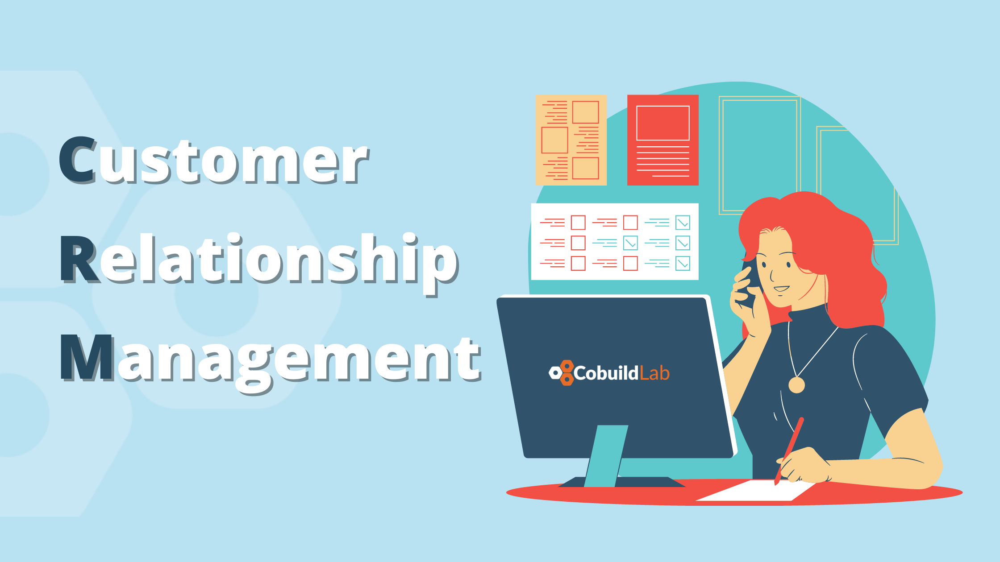
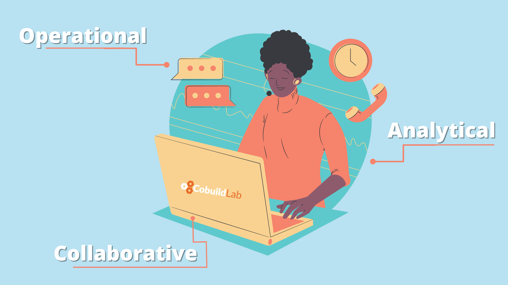
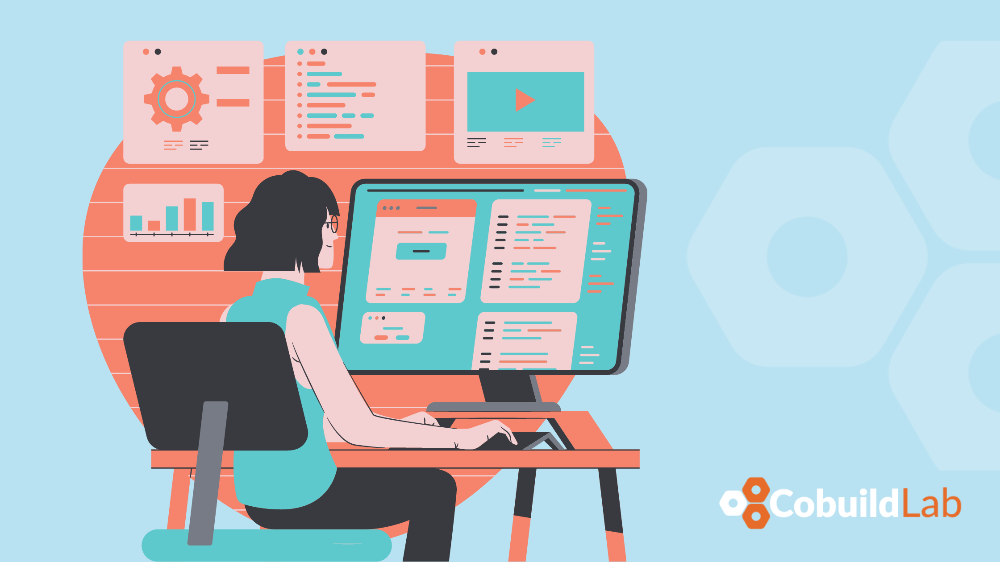

If we visualize a company as a clock, we would understand that it is extremely important that each gear works perfectly for it to work. The management of customers and users is a key gear to make the mechanics of the business work, and if it is essential for yours, then you already know that having a quality CRM is a must to facilitate data management.   

The concept of CRM is more than just an abbreviation for customer relationship management. It is a term that can be applied to methodologies or specific software to help organize relationships. In this post, we will tell you what you need to know about CRM software and how custom software can step up your game when it comes to CRM.    

<title-3 align="centered"> WHAT IS CRM? </title-3>    
    

A CRM is a customer relationship management solution, usually aimed at managing three main areas: sales management, marketing, and after-sales or customer service. The use of a CRM is part of a customer-oriented strategy in which all actions have the ultimate goal of improving the attention and relationships with customers and prospects. The CRM tool and the customer orientation provide demonstrable results, both for having structured commercial management that boosts sales productivity and for offering a deep knowledge of the customer that enables more effective marketing campaigns.    

<title-4 align="centered"> CRM SOFTWARE  </title-4>    

CRM software allows you to easily share and maximize the information about a given customer, and thus understand their needs and anticipate them. By definition, the CRM collects all the information of commercial management maintaining a detailed history.    

The history is so detailed that all conversations that anyone in your company has with a customer, whether they be emails, calls, or meetings, are automatically saved in that customer's file. This file is accessible to everyone in the company and, in addition, internal notes and/or activities with a date to do can be placed on these conversations, assigned to somebody on your team, thus achieving a great improvement in productivity.    

<title-4 align="centered"> Types of CRM software  </title-4>    
     

There are different types of CRM: Operational CRM, Analytical CRM, and Collaborative CRM.    

🔵 **Operational CRM:** Through sales, marketing, and service automation, and Operational CRM streamlines many of the company's processes. It is focused on customer service and primarily seeks to generate leads, convert them into contacts, make a registry of all the necessary information and details about the customer to finally provide a personalized service during the life cycle of that customer. All these processes are called "Front Office" since the company has direct contact with the customer.     

Its main functions consist of:    

🔹 Organizing in databases all the information coming from the customers.    

🔹 Analyzing the customer's behavior in order to offer them a better service.    

🔹 Designing segmented commercial actions.    

🔹 Assessing and measuring marketing campaigns and their effectiveness.    

🔵 **Analytical CRM:** It refers to the different applications and tools that provide customer information, so the analytical CRM is linked to a data or information repository called Data Warehouse. It is used to help in making decisions regarding products and services, and to evaluate results.    

Its main functions consist of:    

🔹 Manage marketing, sales, and customer service functions.    

🔹 Interacting with our customers and establish trust and loyalty.    

🔹 Obtaining all possible data from customers, so we know their needs and offer them a suitable product or service.    

🔵 **Collaborative CRM:** Its function is to centralize and organize all the information and data provided by the customer through different channels. The objective of collecting this information is to improve customer service quality. When all customer needs are addressed and anticipated, we can build up customer loyalty and possibly gain new clients.    

Its main functions consist of:    

🔹 Improving the relationship with the company's customers.    

🔹 Creating multi-channel communication between all departments of the company, as well as interact with customers.    

<title-3 align="centered"> ADVANTAGES AND DISADVANTAGES OF CRM  </title-3>    
     

<title-5 align="left"> Advantages of CRM software </title-5>    

✔️ **Improves customer services:** it makes it possible to develop a more personal and close relationship with customers and to offer them a personalized service, that fulfills their expectations, promoting affective ties between the customer and the company.     

✔️ **It promotes more effective marketing strategies:** through the management and collection of data on customers, it is easier to discover their tastes, needs, expectations, and opinions. This information will help you design personalized strategies, adapted to your customers, which will be far more effective and profitable.     

✔️ **Increases sales volume and revenue:** The design of marketing campaigns tailored to customers translates into higher sales and, as a rule, more revenue.     

✔️ **Promotes more efficient communication within the company:** This solution promotes the creation of more effective communication channels between departments, which allows a better understanding of what is happening in each section involved and the detection and analysis of possible incidents that may arise.     

✔️ **Increases customer loyalty:**  just by meeting customer needs and expectations, we could be able to gain their retention and loyalty.      

<title-5 align="left"> Disadvantages of CRM software </title-5>    

❌ **The price:** Some CRM plans are very expensive, even investing in a custom CRM software requires a significant investment but there are many free ones that even though they may not totally fit the needs of your company, we suggest you try them to know exactly which are the features that work best for you to build your own once you have the budget for it.    

❌ **Training:** With a variety of options available, it is common for some CRMs to be more complex than others so they require some training in order to get the most out of them. The problem is that getting familiar with these programs requires a considerable amount of time and not everyone is willing to make that commitment.    

❌ **Use:** If you are not going to use it then don't waste your time and money, just don't buy it.  A CRM must be useful and for that, being redundant, it has to be used; if you spend some time on it you can get a lot of benefits from it.    

❌ **Change:** Not everyone likes change, especially when it comes to their workflow, so by introducing a CRM to your company's processes, not everyone will be able to swiftly adapt to the new changes.    

<title-5 align="left"> In Conclusion… </title-5>

Companies that use CRM solutions generate more sales opportunities, streamlining management, with updated budgets in real-time and optimized sales processes. Similarly, companies that use CRM can make better segmentation, and have the information for a higher level of customer service and after-sales.    

In general terms and seeing the results that can be obtained, a CRM is always a good option as long as you review all the possibilities and goals you want to achieve using them.    

If you find this post helpful please share it, and if you have any questions write them down in the comments section down below. Don’t forget to subscribe to our newsletter to get more content like this. Thank you so much for reading, stay safe!    

<title-5 align="left"> CompetitiveAdvantage Cobuild Lab </title-5>

We transform Small and Medium size businesses by automating manual processes and tasks into optimized and streamlined workflows with Web and Mobile custom software. Everything from using email autoresponders to automated workflow can help you redefine your relationship with the customer and open up new revenue streams for you. It's time for you to use technology and automation to make your business more efficient.    

<youtube-video id="5fbYxQNgJ7s&"></youtube-video>     

Got an idea for a web or mobile app? Let’s build it! Check out our <a target="_blank" href="https://cobuildlab.com/price-calculator/">  price calculator</a> to have an estimate of the cost of your project or email us at contact@cobuildlab.com and get a FREE online consultation. 

