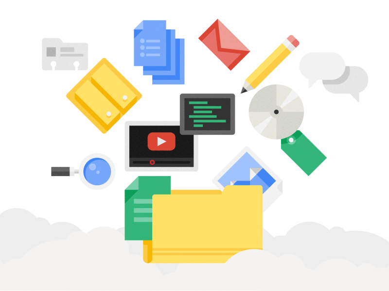
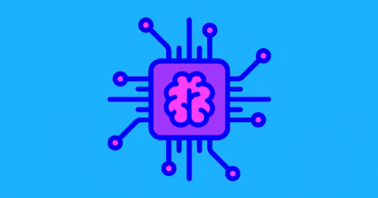
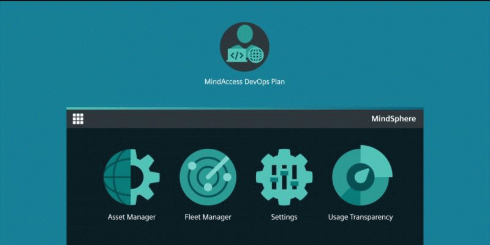

We've heard about the **digital transformation** for a long time, and how important it is in 2020, and we couldn't stay silent about this process that is revolutionizing small businesses and large companies.

Digital transformation is a process of using new technology to improve a business or industry.

Among the most important areas covered by the digital transformation this 2020 we have:  

 

<title-3>[Large data and analysis (Big data)](https://www.atscale.com/blog/digital-transformation-its-still-the-driver-of-big-data-analytics-for-the-data-driven-enterprise/)</title-3>

 

|   | It refers to the study and storage of a large amount of data from one industry or market and the entire ecosystem that makes it up, mainly of customers, suppliers, and competitors. This information is useful to take strategic actions within the company.
|
|---|---|

 

<title-3>[Mobile technology](https://mercury.one/online-business/mobile-driving-digital-transformation/)</title-3>

 

|   | Everything that involves [mobile software development](https://cobuildlab.com/blog/mobile-apps-web-apps-or-cross-platform-what%E2%80%99s-the-best-for-my-small-business/) to consume internally or externally to provide services and increase the quality of services.
|
|---|---|

 

<title-3>[Private and public clouds](https://www.i-scoop.eu/cloud-computing/)</title-3>

 

|   | The digital transformation is also linked to the storage of information, web services, IT infrastructure in cloud servers (public, private, and mixed).
|
|---|---|

 

<title-3>[Artificial Intelligence](https://towardsdatascience.com/3-ways-ai-aids-digital-transformation-4a5965708c45)</title-3>

 

|   | [Artificial intelligence](https://cobuildlab.com/blog/artificial-intelligence-for-enterprise-software/) is another area of technology which if we apply it in our small businesses, we will be on the road to digital transformation.
|
|---|---|

 

<title-3>[The Internet of Things](https://magazine.wharton.upenn.edu/digital/internet-of-things-the-key-to-digital-transformation/)</title-3>

 

|   | When we mix software and hardware development and link the operation of the device to the Internet, not only will we be developing a project of the [Internet of things](https://magazine.wharton.upenn.edu/digital/internet-of-things-the-key-to-digital-transformation/) (IoT), but we will also be directing our small business towards the complete digital transformation.
|
|---|---|

 

<title-2>What is digital transformation?</title-2>

 

We can say that digital transformation brings together a series of technologies to reinvent the processes of different industries, cultures, and customer experiences, in order to increase the production of companies, improving the product’s characteristics and making consumers happier using software and technology.  

Today, digital transformation is very important for businesses since it is the only way that companies can keep up to date, improving their performance. That is why if you want to position your company in the market and be one of the most competitive, you should bet on this type of process without a doubt. 

[It is also important to know that global spending on technologies and services is expected to reach $2.3 trillion by 2023.](https://www.idc.com/getdoc.jsp?containerId=prUS45612419)

 

<title-3>Preparing for Digital transformation</title-3>

 

* One of the main characteristics is to have a very good approach to what your customer needs, only then you can improve your products, be more at the forefront of the market, and meet the needs of consumers. 
* Another important feature is that the processes within your company should be well defined and standardized, this to improve the performance within your company and make it more productive. 
* There must be a good relationship between the data and the processes, so that everything works correctly, without any setback, so that all the information is in order

 

<title-2>Phases of Digital Transformation</title-2>

 

**Phase 1:** 

To carry out a digital transformation process, you must first take into account the cost savings and investment necessary to carry out all the digitalization and try as much as possible to optimize the work within the company. 

 

**Phase 2:** 

Prioritize the list of processes or areas where you can apply this transformation. Go from the highest ROI to the lowest.

Evaluate 2 or 3 potential solutions to integrate into your business. Hint: consider Artificial Intelligence is a very powerful tool impacting all the industries.  

 

**Phase 3:** 

Build a network and reliable business ecosystem to provide complete solutions that ensure success in the marketplace and at scale. 

 

<title-3>1. Identify the challenges for your business</title-3>

<youtube-video id="bUQz9ZWjsvc"></youtube-video>

