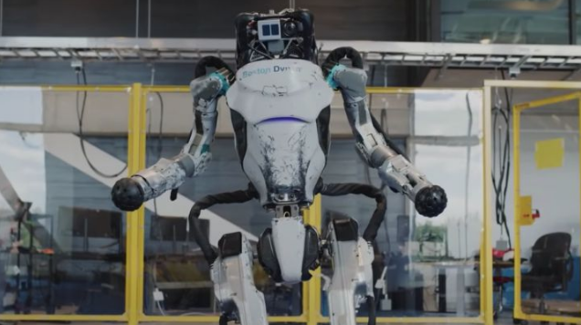
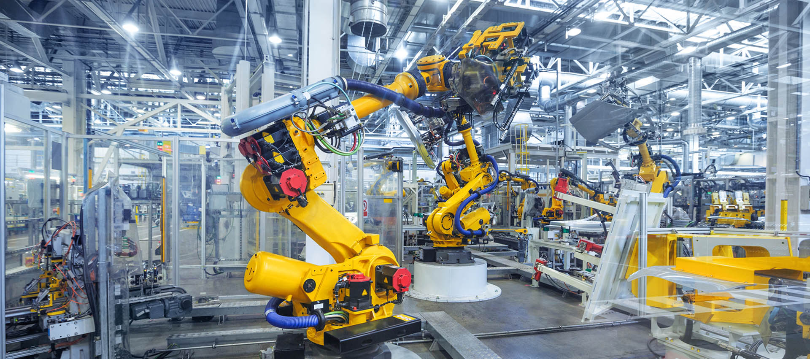
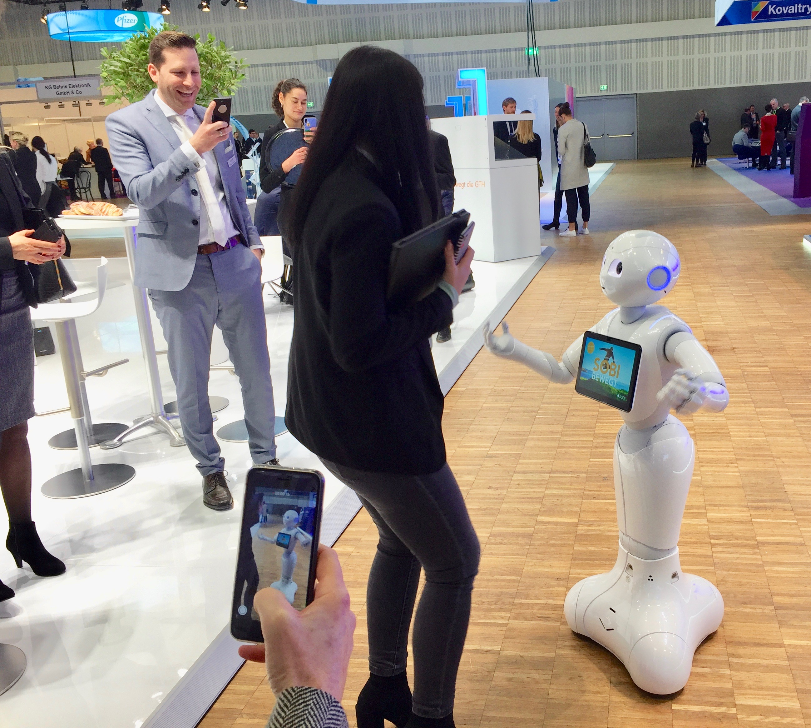
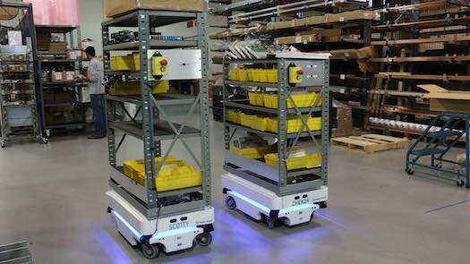

**Robots** increase productivity and contribute to the growth of many industries, but they need skilled engineers to build and maintain them. Today, investment in <a target="_blank" href="https://www.cobuildlab.com/blog/top-benefits-of-robotic-process-automation-in-logistics/"> robots for the industrial and commercial sectors </a> has been growing and the demand for robots is increasing at an unprecedented rate. As time goes by, it is normal to see and hear that more and more activities are being automated in a company and also in many of our daily activities. If you want to invest in these technologies for your company but you are still not very clear about what it is and how it can help your company grow, just keep on reading and we’ll show you. 

 

<title-2>What is Robotic Engineering?</title-2>

 

Robotic engineering is an engineering field focused on building <a target="_blank" href="https://www.cobuildlab.com/blog/reduce-your-headcount-with-the-help-of-machine-learning/">  machines </a> that replicate human actions, which has paved the way to what we know today as automation. Automation can help various industries to grow, such as mining, manufacturing, automotive, services, and others. Often, the goal is to program machines to perform repetitive, dangerous, or unhealthy jobs. On the other hand, it is of utmost importance that the robotics engineer is in charge of research to find the most cost-effective and safe process to manufacture their robotic systems.

 

 

Source: <a target="_blank" href="https://as.com/meristation/2021/08/19/betech/1629406335_263157.html">  AS </a>

 

<title-2>How can you use robots in your company?</title-2>

 

<title-3>* Industrial mass production:</title-3>

 

Manufacturing robots handle tasks such as welding, sorting, assembly, and pick-and-place operations with greater speed and efficiency than human workers could achieve. All of this is extremely positive as it alleviates your employee’s workload and prevents work-related accidents from becoming a legal problem for your company later on.  They can also work in areas or activities that are very extreme and even in places where humans cannot reach. 

 

 

<a target="_blank" href="https://www.google.com/url?q=https://medium.com/neuromation-blog/cutting-edge-ai-techniques-will-help-the-industrial-robots-of-today-enable-the-manufacturing-of-e0c72bc90abd&sa=D&source=editors&ust=1630345631579000&usg=AOvVaw2dP-ADuTZXF6j0MwKN-Zjv">  Medium </a>

 

<title-3>* Marketing:</title-3>

 

Today, robots can be used for <a target="_blank" href="https://www.cobuildlab.com/blog/Planning-a-Digital-Marketing-Strategy-key-to-success-for-your-New-Software-Application-or-Small-Business-in-the-US-during-COVID-time/">  marketing </a> so consumers can have a better experience.  With these technologies applied to marketing, companies can test products, ideas, devices, etc., creating a sense of innovation and progress. In the same way, these robots can be used in special events to capture the attention of the consumer even further.

 

 

<a target="_blank" href="https://arabesque.ch/en/successful-marketing-with-robots/">  Arabesque </a>

 

<title-3>* Inventory:</title-3>

 

When it comes to <a target="_blank" href="https://www.cobuildlab.com/blog/Warehouse-and-Inventory-Management/"> inventory </a>, robots are not far behind, since in recent years there has been a significant increase in the use of robots for storage and inventory in companies that handle an extremely varied and big flow of goods, since usually the warehouses tend to be very large and the work is facilitated by robots.  

 

 

<a target="_blank" href="https://www.ebnonline.com/answering-4-common-questions-about-autonomous-mobile-robots/"> ebnonline </a>

Inventory robots are essentially driverless vehicles that can navigate a warehouse and pick specific pieces of merchandise, bringing them to employees who enter product requests into an automated system. Inventory robots save time and also reduce the likelihood of human error that can cause inconsistencies in inventory tracking.

 

<title-3>* Communication:</title-3>

 

Automated call robots make pre-recorded calls, including appointment reminders and customer satisfaction surveys. Likewise, an automated call center uses a programmable interface to greet callers and direct them to the appropriate information or department.

On the other hand, every company needs some form of telecommunications infrastructure to communicate with its suppliers and customers. Robots can simplify a company's call center and manage incoming phone or Internet traffic to keep communication channels open and running smoothly.

 

<title-3>* Entertainment:</title-3>

 

In recent years companies have adopted robots as entertainment for their users so that consumers can live an unforgettable experience like never before. This type of robot is primarily used in the children and game related market, as they are usually the ones who feel more attracted to robots.  Another branch of entertainment that has benefited from robots is the world of cinema as they are often used on scenes too dangerous for human actors.    

It is a fact that the use of **robots** has become a great importance to grow a company quickly. Thanks to this technology it is possible to automate most of the jobs that were once difficult for us. So as an entrepreneur, investing in these technologies gives you a plus to help your company grow by increasing efficiency and productivity in all activities and areas. You have been able to take a look at all the areas that have benefitted from the use of robotics and how you apply them in your company, so get ready, start now and take your company into the new digital age.  
