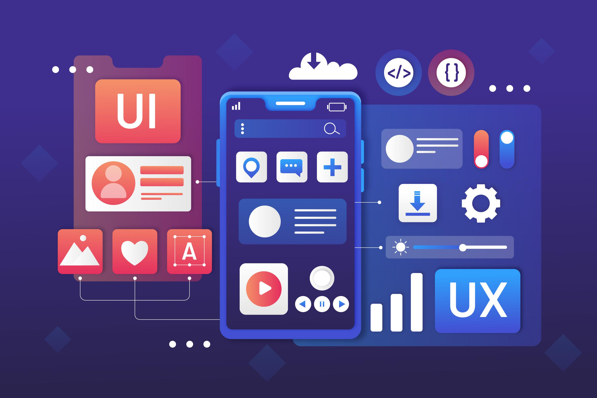

As we know it today, the concept of User Experience (UX) is linked to the digital environment, whether in the web format or in applications for mobile phones and other devices. Therefore, it is a term that is used on a daily basis in technology and online consumer companies.     

<title-3 align="centered">  What is UX design?   </title-3> 

Any brand that wants to have a digital presence must generate a positive user experience. We define UX (User Experience) design as the design strategy or methodology that seeks for the user, when consuming a product, to live an experience that helps them distinguish our product from the competition. For this, certain techniques based on UX design are applied. Among the responsibilities that a UX design team must undertake are:

* User research.

* Analysis of the client and its competition in the digital environment.

* Analysis of the current product and competition.

* Wireframing and product prototyping.

* Planning for product development.

* Analysis of the interaction.

* Development planning and usability testing.     

A web page, such as an online store, or a mobile application, such as a video game, have their own User Experience, something that companies try to take maximum care of from the first moment, long before launching their products to the market.

And that's because the User Experience speaks of sensations, feelings, and emotions. It's not about how a product (in this case, digital) works, but rather about what that product conveys. The User Experience generates various emotional responses in the consumer during the interaction with the product that goes far beyond usability.

Speaking of digital environments, topics, as varied as the aforementioned usability, the recruitment, loyalty, and satisfaction of users, the design and aesthetics of the product, and the cognitive and emotional response generated by it, are part of the User Experience.     

<title-3 align="centered">  Ok ... and why is it so important?  </title-3>

Until not too long ago, the only concern of brands when designing a website was aesthetics. But things have changed, and ease of use is now being valued more and more, even over design. 

Why? Because the complexity of the webs has increased. If a website only has a few pages, most users will know how to interact with it. But today, it is increasingly necessary to incorporate more features and content. Faced with this avalanche, it is easy for the user to get lost, not know what to do, or even leave the web early. Therefore, it is essential that the user experience works correctly.

Since we access the pages and applications from a lot of different devices, a very important job of the UX is to harmonize the experience across different desktop and laptop devices and make sure that the system works on all of them, be it different types of mobiles, tablets, laptops or computers with giant monitors. 

The challenge is not easy because we increasingly value accessibility. And by this, we not only mean to make the web available to people with visual problems (for example), but also to those who have a slow internet connection or an old mobile device. The more accessible your content is, the more users you can reach.     

     

<title-3 align="centered">  What are the advantages of designing a great UX?  </title-3>

When starting a new digital project, be it a desktop or mobile version, we don't usually pay much attention to the importance of UX  design. One of the main reasons that can explain it is that we tend to focus more on developing the product/service. In this way, we tend to isolate web design from the general development process, as if it were just an aesthetic task that beautifies our website. Big mistake! Next, we'll tell you the advantages offered by integrating UX / UI strategies in web projects so that you can grow as a business, increase your sales and enhance your brand:     

☑️ **Reduce costs in the development of your product**
Good usability will make it easier for the user to reach the goal. Reporting in a simple way and with a correct integration of the design will mean significant savings for the company, since incidents and queries to the customer service, among others, will be minimized.

☑️ **Optimize times**
If we have a good design, we can clearly define the development phases of our web product. This will reduce the time we must invest in the entire design process of our website.

☑️ **Increase in sales**
With an adequate UX strategy, the purchase process is improved. It is especially advisable to apply this design in e-commerce stores, where it is key to take care of this process, which should be short and simple. Only the necessary data should be requested from the user and informed about the steps to take to finalize their purchase.

☑️ **Retain and retain the user**
Your potential user will stay longer if the website has good navigability and finds what they are looking for quickly and easily.

☑️ **Increase user satisfaction**
If you increase the satisfaction of your users, your online reputation will also increase. If customers have a good experience, they will help raise awareness of the brand. Also, a happy user will spend more.     

Remember, users no longer settle for less. To attract customers, it is no longer enough to create a unique and quality product, you also have to make the user experience unforgettable. They are a demanding and well-informed target, so you will have to be up to the task.

