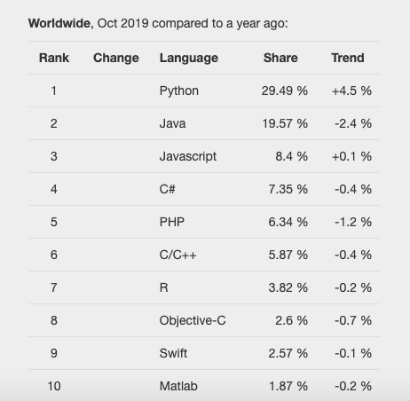
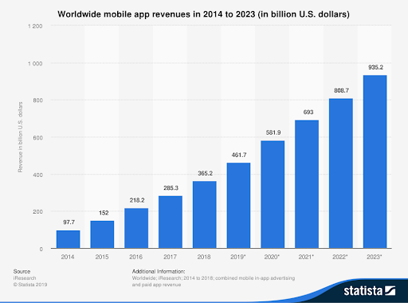

We are amidst the 4th Industrial Revolution, and technology is evolving faster than ever. Companies and individuals that don't keep up with some of the major tech trends run the risk of being left behind. Understanding the key trends will allow people and businesses to prepare and grasp opportunities. As a business and technology futurist,  look ahead and try to identify the most important trends. In this article, know the most imminent trends everyone should get ready for in 2020. 

This current year has already ushered in a tidal wave of tech innovations, from the rise of social robots and personal assistants to Amazon Prime’s one-day delivery gamble and the proliferation of voice search. Chatbots have been heavily deployed this year too, and are generally well-received by customers who would otherwise have to call or submit forms. But we finish 2019, so it's time to ask: What significant-tech changes are going to affect the way we live and work in 2020? 

<title-2>Software Trends to 2020</title-2>

We all know that startups have gained massive popularity over the past few years. They even got to the point of becoming mass-commercialized, all thanks to their presence in different industries and fields. From technology to medicine, startup trends are continually changing, which makes it difficult to predict.

For startup founders, keeping up with the latest trends can be crucial for success. At a time when technology development can disrupt entire niches and industries overnight, being unprepared can bring an early conclusion to any business venture.

<title-3>Software trend #1 More dependence on AI technology</title-3>

It’s been a long time since the onset of Artificial technology in software development services. But the ways of its adoption are revolving and enhancing every year drastically. Most businesses are adopting this technology in their software to offer a little extra to their customers.

In a recent survey, 84% of respondents said that they think the implementation of AI can provide them with a competitive edge over competitors. This technology, along with its related technologies like machine learning and deep learning, has numerous applications in every industry.

Custom software developers are not leaving any stone unturned to introduce new ways of AI adoption in business. It is expected that 2020 will witness some fantastic ways of AI implementation in web app development.
 
Chatbots have become a new trend included in every app or website. Chatbots, AI technology has replaced human customer service executives. AI is all about reducing human involvement and more dependence on machines.  2020 will be a year of more chatbots, accurate customer behavior analysis, and less human resource appointments. AI is making every task automatic with maximum accuracy, reliability, and speed.

<title-3>Software trend #2 5G network</title-3>

Soon a hundred times faster network than 4G will hit the ground to amaze us! It is the 5G network that is expected to enter the market by the end of the year 2020. Speculated to provide a wider range of connectivity,  5G is alluring a lot of software development companies. It has been presumed that 5G will provide better data security. Moreover, the virtual reality app development like 3D gaming will also improve along with augmented reality enabled apps. Not only business persons but laypersons are also eagerly waiting for this network.

<title-3>Software trend #3 Edge computing</title-3>

It is expected that the market of edge computing is not going to increase by two-three or four folds! Edge computing global market is predicted to rise by approximately 28 times by 2025.  

Do you have any idea behind this trend? What makes researchers believe that edge computing is going to show such drastic growth? This is because it is being used to upgrade cloud computing, which is itself a growing and embraced technology. 

How is edge computing better than cloud computing? Edge computing has an advantage for remote areas where connectivity to a centralized location is poor. Moreover, it can be used to process data that is time-sensitive, whereas cloud computing cannot be used for this purpose. 

<title-3>Software trend #4 Instant Apps</title-3>

It was in 2016 when introduced instant apps to the software development world. These apps have features of an app but run like a website. You do not have to download them, which means there is no need to provide them memory from your device. Instant apps can also be used for testing purposes. Mobile app developers launch these apps to test their mobile apps before their launch. They are smaller in size than usual apps and offer a better user experience.
Another advantage of these apps can provide better conversion rates. Hence looking at its strategic importance, it is expected that there will be a rise in the number of instant apps in 2020 and beyond. 

<title-3>Software trend #5 Programming trends</title-3>

Just like software development trends, its programming tools’ trends are also of great value. A number of new programming languages or frameworks are launched and some disappear almost every year. Along with dynamic software technologies, their development tools are also unsteady in their market presence.  Although in every other survey, Javascript and PHP are the most used programming languages for front-end and back-end programming languages. Many different tools are gaining constant popularity. One such language is python, which is most used for AI and ML development. It showcases a steady growth among other major programming languages.

**Source:** [condinginfinitive](https://codinginfinite.com/best-programming-languages-to-learn-2019/)

<title-2>Market of Development companies in 2020</title-2>

As per research by iResearch, revenue from paid mobile app downloads and in-app advertising alone would reach up to 581 billion dollars in 2020, and reach almost near the trillion-dollar mark by 2023.

So yes, the market and statistics point towards substantial benefits from app development provided that businesses invest it in today. But it's easier said than done. What sets apart good apps from the best ones is who builds them. As a business leader or a CEO, you surely wouldn’t want a shoddy application to help customers reach your services, or to help make your business processes easier. This is why it’s essential to find the best among the list of app development companies to get the job done and deliver a bug-free, robust, scalable app that serves all your needs.

The year 2019 is coming to a close as getting nearer to 2020. The end of 2019 will be the end of a decade in which app development increased, and in which software technology reached greater heights.  But as the years go by, the importance of apps is only going to increase even further people begin to use technologies such as IoT, chatbots, AI/ML software in their daily lives. App development includes more than just mobile apps. It also provides development for applications for other types of devices, such as PCs, tablets, wearables, etc. However, the growth of mobile apps alone gives an excellent scope for running profitable businesses in this space.

