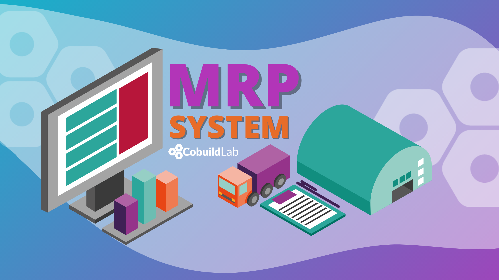

Let's just start with the basics…

<title-3 align="centered">  What is an MRP?  </title-3> 

A **Material Requirements Planning** is a system of production planning, scheduling, and inventory control used to manage manufacturing processes. The Master Production Plan is created from the MRP, which is usually the software.

<title-4 align="left"> What are the objectives of the MRP? </title-4>

An MRP system must meet these three objectives:

✔️ Ensuring that materials are available for production and products are available for delivery to customers.

✔️ Try to maintain the stock levels of material and finished product as efficiently as possible.

✔️ Plan manufacturing activities, delivery orders, and purchases. 

The ultimate goal of any company is to deliver its product to its customers in the shortest time possible. To achieve this, some kind of planning is necessary and MRP optimizes this objective.   

<title-3 align="centered">  Production planning with an MRP system  </title-3>

The basic functions of an **MRP system** include stock control, bill of material processing, and elementary scheduling. Therefore, MRP helps companies keep inventory levels at an optimal level and is used to plan manufacturing, purchasing, and delivery activities.

In addition, companies need to control the amount of material they buy, plan which products are to be produced and in what quantities, and ensure that they are able to meet current and future customer demand, and all this at the lowest cost possible.

Making a bad decision in any of these areas will cause the company to lose money in situations such as:

▪️ If insufficient quantities of a material (or the wrong material) are purchased, the company may be unable to meet delivery deadlines.

▪️ If excessive quantities of material are bought, the money stays in the warehouses. As long as this stock is kept in the warehouse, that money cannot be used.

▪️ Starting production of an order at the wrong time can cause delivery deadlines to be missed.    

<title-4 align="left">  MRP solves these problems and provides answers to questions like:  </title-4>

☑️ What materials are needed?

☑️ How many are necessary?

☑️ What products must be delivered?

☑️When are they needed?

☑️Material requirements planning can be applied both to items purchased from external vendors and to internally produced subsets, such as components of more complex items.   

    

<title-3 align="centered">  How does MRP help with supply management? </title-3>

When a company receives an order, it creates a production order. This is when material requirements planning (MRP) software plays an important role. This is because, when generating this order, you have to check the list of necessary materials and if they are available or not. In addition, each order can be seen as a project, especially when the manufacture of the order involves a certain duration. With the MRP, the product to be manufactured is selected and the amount of inventory that you have and the materials or products that need to be purchased appears. In the event that the product is made to measure, the system recognizes the plan and materials that the engineering department has indicated. By doing this, the MRP creates a list, sees how many inventory items exist, and is assigned to the project or production order.

By doing this, the company may not have enough inventory to meet the order or may run out of the minimum inventory set. Then, the MRP proposes a purchase order valuing when the materials are needed. If the inventory takes 2 days to arrive and is not needed for another 2 weeks, the system will propose to acquire it when the use date is closer to avoid having surplus material in the warehouse.

For example, a machine manufacturing company will need to know what materials it needs to make a type of machine and how much they cost, when it needs them, and how long it takes to produce. In this way, the company will be able to present an accurate budget and will be able to tell the customer when it will be available. However, this not only serves to give a good proposal to the client. With the MRP, the manufacturing company will not only know the cost of manufacturing said machine, but also calculate the inventory, plant control, be able to establish a demand prediction, among others.

    

<title-3 align="centered">  What happens if there is an incidence in the production?  </title-3>

Various kinds of incidents may occur during the production of a product. When a company handles the incident manually, it often happens that it ignores certain details and loses control of how much delay and losses it will entail. With an MRP, the incident is recorded and it calculates the time delay and cost increase that it will cause.

For example, if it were because one of the production machines has broken down, it is calculated how long it takes to repair and how long it delays this order and the rest of the orders that would require the use of that machine. On other occasions, the delay may be due to a modification requested by the client. If the MRP is connected to the ERP, it would be possible to count how much time and money such a change would entail and, if the client agrees, add that cost to the initial budget.

Depending on the sector, incidents sometimes lead to product recalls or delays in the delivery of an order. There are sectors that run a greater risk if a withdrawal is not made on time, such as in the pharmaceutical sector or the food sector (especially in meat companies). In these sectors, the traceability of the products and the materials with which they have been generated is very important. If there is an incident regarding the raw material, it is vital that any product containing it can be withdrawn from the market. Apart from these sectors, other sectors also note the importance of traceability. In the case of car manufacturing companies, for example, it may happen that the manufacturing of the airbags has not been done well in a series of production. By being able to trace the owners of the cars produced in such series, they can be informed of the error and asked to take them to the workshop to fix the problem and avoid possible large fines in the future.

Today, systems that allow managing production in isolation are no longer sufficient. To be productive, we need to automate, reconcile and centralize the management of our business, from a complete, secure, and accessible platform from anywhere.

Having an MRP system allows us to satisfy the demands of our clients, guaranteeing that we will receive adequate materials to maintain the inventory and to be able to do the adequate planning of the activities to be executed, the purchases, and the final production.

Looking for your own MRP system? Let’s build it! Check out our <a target="_blank" href="https://cobuildlab.com/price-calculator/">  price calculator</a> to have an estimate of the cost of your project or email us at contact@cobuildlab.com and get a FREE online consultation. 

