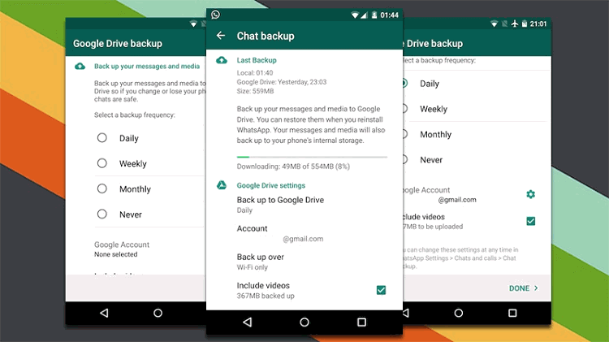
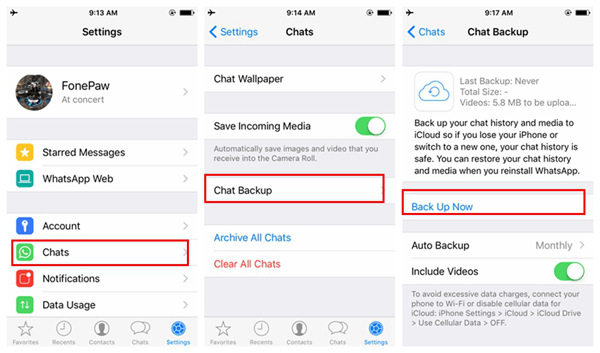

Have you made your WhatsApp backup? If not, It is time to do it. The reason is simple; WhatsApp database is going to turn it off.

At least those you didn’t save in Google Drive. So Don’t fear.

This [news](https://www.hindustantimes.com/tech/whatsapp-will-delete-all-unsaved-chats-on-google-drive-here-s-how-to-backup-your-data/story-CzI8mz91zsrjCd84Bc4WWM.html) was announced a few days ago and it’s going to happen from the next Monday. 

So, you have until Monday to backup your chats and everything you can from your conversations. This initiative comes from some years ago when WhatsApp's team add the option to make a backup for erasing information in the App without losing it. 

From now, things will be a little different. You need to do it and store the information in Google Drive.

If you don’t make this, you’ll lose information because WhatsApp it’s not gonna save it anymore.

<title-2>Why WhatsApp database will be erased?</title-2>

Strategic alliances are common nowadays, especially if they are between tech giants like Facebook and Google. 

In this case, that’s what happened. 

Google and WhatsApp, a product of Facebook Inc, make an agreement where users from the last will have the opportunity to save data using Google Drive without memory limits and the possibility of transfer it to other hardware easily.  

It means that to move data, for example, when you change your smartphone, it will be easier.

<title-3>What you have to do for protecting your information?</title-3>

First of all, making the backup on Google Drive.

**For Android:** 

Let’s tap on menu bottom, settings, chats, Backups. Choose Google Drive as memory source, how often do you want a backup, even you can program this action to be executed only when you are connected for wifi.

Source:[fonepaw](https://www.fonepaw.es/tutorial/copia-de-seguridad-whatsapp-iphone.html)

**For iOS** 

If you have an iPhone, we mean, iOS system, you only have to tap on settings, select the option “chats”, and click on “chat backup”. Immediately you will see some options, but you have to select “back up now” in case you want to save it in the cloud. But you have other options to keep in safe your database there. It is the next option called “auto backup” to make it local. 

In the last option, you can select how often you can do it. 

But remember,   will erase everything that’s not on the cloud. It is better to be sure.

Source: [fonepaw](https://www.fonepaw.es/tutorial/copia-de-seguridad-whatsapp-iphone.html)

Another option to keep safe your data from WhatsApp it is making a local copy in file format. 

The main goal is protecting your photos, chats, records, and all data in WhatsApp.

We recommend you to use the benefit of Google Drive, your database will be safer.

<title-2>Why Google drive?</title-2>

WhatsApp and Android, in general, selected Google Drive because it is safer, it’s more difficult to get unwanted access. 

At least it is safer in comparison with Dropbox or box, which are other options of storage. 

Actually, Edward Snowden, the famous hacker said: If you use Dropbox, your privacy is in danger.   

He said that some of this companies collaborate with agencies like PRISM, and your data is not private. 

Another good reason for selecting a Google Drive is the possibility of recover every information from the first day you used it.

For some of these reasons, WhatsApp bet for Google Drive as an ally to make customers’ backup.

<title-4>Simple reasons for saving your WhatsApp’s data</title-4>

1. You will have access to your information whenever you want or need it. 
2. You can restore it on another phone or desktop computer because it’s safe and available in the cloud. 
3. You can remember these important things you said or you read.
4. You can save sensitive data an be confident because they are stored in the best place.
5. If you made business or you have an important evidence, you can keep it forever if you want. 
6. You will not lose any space on your Google account, thanks to the agreement between Facebook and Google, but you will save memory in your phone because it is not necessary to have this information local.

If you haven’t done any of these options, it is time to do it. You have until Monday for protecting your **WhatsApp database**. From there, the information that is not on Google Drive will be lost. Let’s go!

