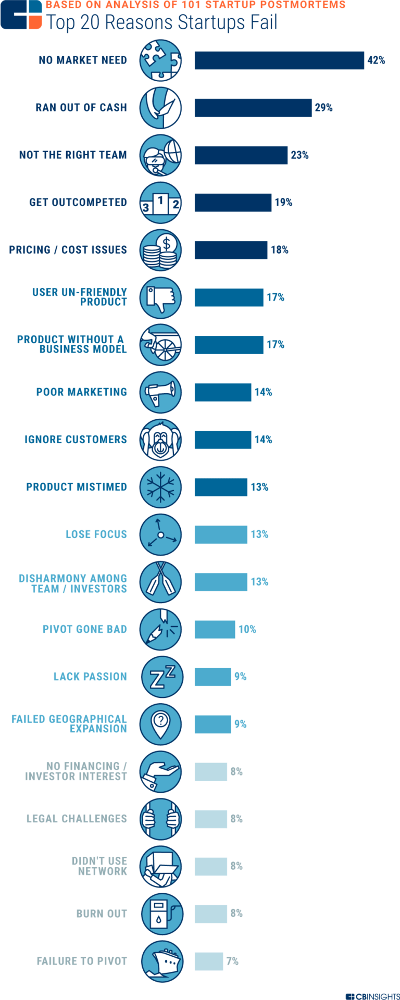

Sometimes there are startups on the market that offer very good solutions, but for some reason, they don't have the success they expected, and more often than you think, this doesn't have any relation with technical or economic aspects.  

These two reasons make startups often fail, but in this post, we want to dedicate ourselves to talk about others, which sometimes go unnoticed because they can be effortless. 

Learn them so you can avoid them from happening to you when you start a startup. 

</title-2>Here are the 7 reasons why a Software Startup can fail too early</title-2>

</title-3>1. Marketing Strategy Failures</title-3>

If one software is very good but does not have a good marketing or communications strategy, the destiny for it can be failure. 

It is not enough to have a good product. You have to commercialize it for the right channels, make [ads campaigns](https://cobuildlab.com/blog/Planning-your-ads-campaign-on-10-steps/), create social media accounts, have a website, sponsor events, networking, and make the necessary investment in the marketing area. 

It is not an expense, it is an investment, without this, your product will be more difficult to know, it will be more difficult to scale in the market, position, and loyalty to users. 

You are a brand and good communication is everything. 

It often happens that there are startups that do not consider this issue within the planning of their business and ignore the marketing actions. In essence, they get an excellent product with good functionality, but the massification is complicated and that's where they fail. 

According to the [ESGOA team, around 14% of startups fail because of this marketing problem](https://esgoa.es/blog/7-razones-de-fracaso-de-una-startup/) that should be considered from the very moment of conception of the idea and the development of the business model. 

</title-3>The solution</title-3>

When you are pivoting, configuring the idea of the business model, and validating it, include within the needs and necessary investments of a solid Marketing strategy and Plan, which you are going to execute when your prototype is already validated, and the time has come to accelerate the growth of your business idea (startup). 

That way it won't take you by surprise. If you want to save a little on this issue, you can bet on outsourcing or if you want a commitment in the time of an expert in the area, incorporate someone to your team or even make it a [co-founder](https://cobuildlab.com/blog/co-founders/). In many successful business projects such as Apple, one of the co-founders was a marketing expert or at least had contacts and negotiating talent. This subject is vital to the survival and development of your product. 

</title-3>2. Lack of leadership</title-3>

Leadership is one of the main ingredients that cannot be missing in the team behind a startup. 

You, as founder and creator, must encourage and inspire other members, create a sense of ownership by the project, so that the goals are met with greater efficiency and effectiveness, and at the same time, the working environment is full of energy. 

A well-guided team is a high-performance team, a strong team that will work committed to achieve the goals set. 

That leadership, charisma and the organization must start from you, and if possible transmit it to the members of your team because when your company grows, you can delegate to them the work of leaders of their areas. 

</title-3>The solution</title-3>

Leadership is a natural quality that can also be learned. Therefore, if you are a leader since childhood, you inspire others, you are good at organizing teams, structuring goals and fulfilling them, congratulations. But if you're not, don't worry, look for activities that develop that skill, that help you find the leader inside you, train yourself or just wait for our next post about some tips and activities that will help you develop leadership in your business. It is a promise!

</title-3>3. Not having the right team or having a one-person team</title-3>

If you are starting a business and you do not have an entire team yet, it is recommendable that you begin to look for it. We are not saying that you do not have enough qualities, knowledge, experience, or capacity to start it and do it well, what we are saying is that is a complex process that usually just one person cannot perform.

Create a business alone is too difficult because there are many different activities that needs to be done simultaneously. For example, when you are planning the business idea including the software, marketing, and other issues, the ideal is that experts in each area work on their specialty. If you are alone, you will be overloaded of work, and it is possible that you forget something or some details cannot be covert correctly. 

And this would take you to failure. So, try to complete a team who may not be the most talented in the market but yes the most committed with your project. Everyone is necessary. 

And here, we should mention the second situation that would make your startup fail. It is related to the selection of the wrong people for the team. Maybe, problematic people, people who are not motivated by your project, or who are not sufficiently prepared, or even a team that is not involved, or that does not have good management. 

</title-3>The solution</title-3>

First of all, be a good leader, motivate your workers and build a team that it doesn't have to be the most talented in the world, but at least the most complete. Try to find people with different abilities, that way, they will get to know each other better. 

Look for people, research, have interviews, calls, ask friends, check previous coworkers, go to staffing agencies, go to events, etc, etc, etc if it is more than one, better. One person teams are not ideal for starting a startup. 

Distribute responsibilities based on people's strengths, do not overload them with too much work, try as much as possible that everyone knows what their colleagues are working on, and even try to boost the collaborative work. 

There are [workflow tools](https://cobuildlab.com/blog/workflows-in-your-business/) and techniques that can help you with this. 

Every one of those little details makes your team the right one.

</title-3>4. Not knowing enough about the market and needs</title-3>

All products or services offered by startups exist to solve a problem for someone. They are solutions that must have their own value to provide that makes them different from other proposals in the area. 

Reaching this point requires a very deep knowledge of the competition, the desires, and needs of your target audience, and the market in general. 

If you do not have enough knowledge about these, results can be disastrous. 

Below you will see a study by CBInsides where you can see that this is the main reason why startups fail. Specifically, 42% of startups do it for the same reason.

Source: [CBInsights](https://www.cbinsights.com/research/startup-failure-reasons-top/)

Sometimes this can happen because you idealize a product that is far from meeting the needs and desires of the end user, who is the one who will really consume.

</title-3>Solution</title-3>

[Focus more on what customers want not just on building based on your criteria](https://cobuildlab.com/blog/customer-development-process/). And besides this, don't rush into the conception of the idea, the review, the conceptualization, the pivoting, the tests, and all the activities that must be done before, during and after starting a startup. This helps you to know better the market, and to be more effective and accurate with the solutions you offer. 

</title-3>5. Non-validation or insufficient validations</title-3>

Before starting any business, one of the most important things is to have the certainty or at least a good percentage of security, that the market you are going to attack is the correct one. If your software provides value, how is it different from the other options, if it solves a problem, if users are willing to use it and pay for it, if it has opportunities or hypotheses for future development, if it is competitive, if your idea is valid, if it is viable, and several data of this nature that are necessary to improve the project or to dismiss it completely and try on another product. 

All this is known as [business validations](https://cobuildlab.com/blog/validating-your-business-idea-part-2/). Whether it's the idea, the prototype, [the hypotheses](https://cobuildlab.com/blog/value-hypothesis-and-growth-hypothesis/), the business model, etc. [These validations](https://cobuildlab.com/blog/practices-for-validating-your-business-idea-for-your-software/) are made from the moment of the idea reaches your mind until the moment the software product is launched in its full version. 

They are so important, that they should continue to be made even after the product is launched to the market because you can always improve your proposal. 

The market changes, your customers and users also do, and you must be changing based on the information you get from validations. 

This means that the [user doesn't have the experience they expect](https://cobuildlab.com/blog/user-experience/), and of course, it complicates the success of your project.

</title-3>The solution</title-3>

The idea is validated, the hypotheses of your business too, technical validations are made to the software, economic validations to the business model, the market, and even after launching a minimum viable product, or a fuller version of the software, it is necessary to make a validation with the consumers, and if necessary make improvements to the product. 

That is the best recommendation we can make. Always validate what you are going to do or change your product to be sure that it will be well received, that it is viable, and that it is in line with the market and your goals. 

</title-3>6. Legal Implications</title-3>

This is very important. In general, when we are entrepreneurs we look for a team of experts in different areas, in economics, technology, marketing, developers, etc. But it can happen that the issue of legality does not pay as much attention as we should, and this is another reason why a startup can fail. 

Each country has different laws applied to startups and companies that are starting, and these laws are important if you want to start your business on the right foot. Breaking any of them or overlooking an obligation that you have as an entrepreneur, it can bring you serious personal problems, and affect the activities of your business. In the best of cases, it could generate a fine or a penalty that you could save by taking care of these details. 

</title-3>The solution</title-3>

Find a lawyer and ask for legal advice on the subject. If it is possible, incorporate it to your team, and that this one is in charge of watching over the legality of your company, of your actions and if it is possible to complement it with an accountant so that your taxes are also in order. 

Also study a little the laws of your country, so that you can also supervise everything, and although you have the experts, you can also defend yourself in the legal matter. It is a subject that every entrepreneur should know.

</title-3>7. No passion for what is being done</title-3>

Some people think that to start a startup you don't need to be passionate about the solution you're offering. For example, it might be a [blockchain solution](https://cobuildlab.com/blog/blockchain-revolution-in-business-world/), and that's not your favorite technology. We don't think so. 

If you're not the most knowledgeable or just not a fan of the technology you offer, you should be passionate about your business. As much as to work hard for it and try to fulfill everything necessary the best you can. That's the secret of success. 

</title-3>The solution</title-3>

Fall in love with your project. Find something that you really enjoy doing and start from there.

</title-2>Why it's valuable to bet on the creation of startups</title-2>

* Generate innovation and make our lives much easier

* Boost and improve the world economy

* Generate jobs

* Technology is developed

* It's just fun

These are some of the reasons why a **Software Startup can fail** in its beginning or developing. Reasons that are separated from the technical and economic part. Do your best effort to avoid them and develop your business as much as you can. The sky is no limit. For more information, visit our website or subscribe to our newsletter to get more information like this one. 

