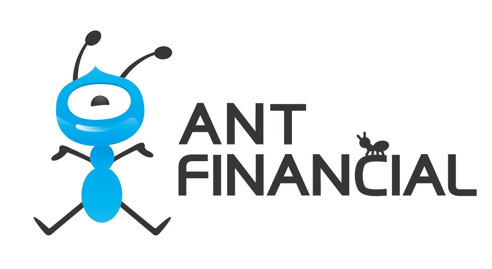
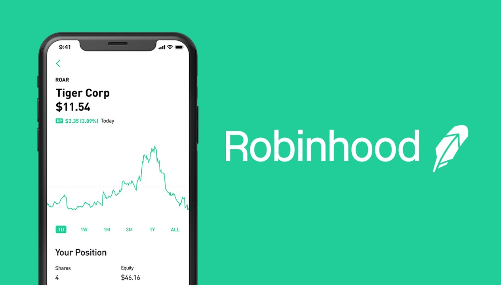
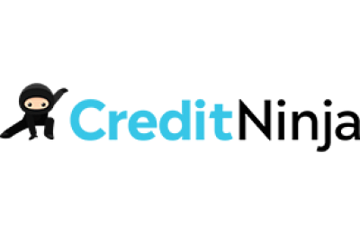

Nowadays  the finance world has taken an emerging and revolutionary turn with the arrival of the **fintech** wave, which have changed the bases of competition for financial services, as well as how these kinds of services are structured, supplied, and consumed.

**Fintech is the acronym to refer to financial technology which is used to describe new applications or software development that improve and automate the provision and use of financial services. It competes with the implementers of traditional economic methods. Primarily, Fintech is used to help companies, business owners, and consumers better manage their commercial operations, and processes through the use of specialized software, hardware, and algorithms for web and smartphones.**

Source: [Investopedia](https://www.investopedia.com/terms/f/fintech.asp)

But what is fintech, what are its benefits and risks, what products exist, what are the prospects? This guide will orientate you about the scopes and other implications that you should know. 

<title-2>What is FinTech and what its usefulness has been in recent years</title-2>

Fintech is impacting development of current technological innovations to optimize the financial services provided to the sectors of banking, commerce, investment, insurance and other industries related to the area of finance; applied directly by companies in the field or by companies that develop applications or software that offer products and services increasingly active and highly competitive. It can also be known as new applications, processes, products, or business models in the financial services industry, composed of one or more complementary financial services and provided as an end-to-end process through the Internet.
 
This innovative approach to financial technology can have a favorable impact on investment choices and the economic future of companies in the area as they diversify their assets and look for alternatives to traditional financial services.

Some of the most active areas of  innovation include or revolve around the following areas: 

<title-3>Digital cash</title-3> 

The global economy is fast moving from cash-based to digital transactions. At least [64% of smartphone users](https://www.paymentscardsandmobile.com/mobile-wallet-global-usage-statistic/) have used any mobile payment in the last year. Examples of mobile payment methods include Apple Pay, Google Wallet, and PayPal services.

<title-3>Cryptocurrency</title-3>

Are currencies that only exist digitally and can be secure. Unlike traditional currencies, they are not government regulated by a public network. As of November 2018, there were over 2,500 cryptocurrencies in the world.

Blockchain technology</title-3>

Blockchain technology has helped make financial transactions faster and more secure. About [61% of big digital industry names](https://cointelegraph.com/news/61-of-major-global-digital-firms-invest-in-blockchain-report-finds) have invested in blockchain technology, according to the Digital Enterprise Report by Okta. For Example, including Ethereum, a distributed ledger technology (DLT) that maintains records on a network of computers, but has no central ledger.

<title-3>Insurance industry</title-3>

Insurance industry innovations have impacted the insurance industry by improving efficiency, reducing costs, improving risk assessment, and delivering better customer experience, which seeks to use technology to simplify and streamline the insurance industry. According to a study by Accenture, insurers are paying more attention to insurtech with 86% believing that rapid innovation is a must if they are to retain a competitive edge in the market.  

<title-3>Open banking</title-3>

It refers to the sharing of financial data electronically and securely under customer-approved conditions. Lots of lending apps leverage a customer’s transactional information to make lending decisions. Through open banking technology, you can borrow money without hassle electronically. This concept leans on the blockchain and posits that third-parties should have access to bank data to build applications that create a connected network of financial institutions and third-party providers.
An example is the all-in-one money management tool Mint.

<title-3>Robo-advisers</title-3>

They are a class of automated financial adviser that provide financial advice or investment management online with moderate to minimal human intervention. They offer digital financial information based on mathematical rules or algorithms and thus can provide a low-cost alternative to an adviser.

<title-3>Virtual assistants</title-3>

They have made users mobile experience and access to services from financial institutions timely and secure. With this technological innovation, customers can access their credit score data, get alerts about fraud, and make voice or text-enabled payments. An example of this is Eno, Capital One’s AI assistant

* **Regtech**, which seeks to help financial service firms meet industry compliance rules, especially those are covering Anti-Money Laundering and Know Your Customer protocols which fight fraud.
* **Unbanked**: Services that seek to serve disadvantaged or low-income individuals who are ignored or underserved by traditional banks or mainstream financial services companies.
**Cybersecurity**, given the proliferation of cybercrime and the decentralized storage of data, cybersecurity and fintech are intertwined.
* **Budgeting Assistance Apps**: Last, by not least is another alternative finance example is budgeting apps. Created as a fintech solution for customers who struggle to track their finances and spending, these apps have steadily grown in popularity. They help customers keep their income, monthly expenditures, and payments in check. Examples include Acorns, Mint, and PocketGuard.

<title-2>What are the benefits of fintech?</title-2>

The following are several advantages to fintech:

* **Price**

Fintech products can come with lower prices that are better for consumers and businesses. These lower prices can be because of the use of algorithms to judge the risk of lending to someone better or directly through the lack of legacy systems.

* **Access to financial products**

A benefit of fintech globally is the increased access to banking and lending products. In Australia, small businesses may benefit from better access to finance through fintech products. Consumers may benefit from better insight into their spending and better interest rates through risk-based pricing. Simpler, automated investing also gives people options outside of savings accounts, and people living in regional areas will benefit by not having to visit a branch to conduct their banking.

* **Improve your finances**
 
Many fintech products aim to improve your financial position and strive to give you a better view of your finances. For example, neobanks and other banks offer [to spend analysis and insights](https://www.finder.com.au/compare-bank-apps-spend-tracking) as well as notifications to help you understand exactly where your money is going.

<title-2>Are there any risks to fintech?</title-2>

* **New companies**

Many companies entering the fintech space have less experience in financial services compared to banks. Makes it essential to check that the company is appropriately licensed and contactable before applying for any products. You would also benefit from reading financial documents, such as product disclosure statements as well as reviews, from ensuring you're well informed about what you're buying.

* **Less regulation** 

Some fintech products and companies tend to operate outside of the traditional financial landscape and therefore may be pending management or be working in a less regulated space. For example, small business finance providers do not require a credit license to offer business loans. There are still consumer laws to protect you, but it's best to check how a company is regulated and licensed if you have any concerns, or you can even contact ASIC directly.

According to [Statista](https://www.statista.com/statistics/893954/number-fintech-startups-by-region/), there are 5,779 fintech startups in the Americas, 3,583 in Europe, Africa, and the Middle East, and 2,849 in the Pacific Region and Asia as of February 2019.

<title-2>Examples of FinTech Startups</title-2>

Financial technology is an engine of the modern economy; it includes companies involved in payments, insurance, investments, credit and loans, and blocking chains, to name just a few of the developed areas.

FinTech's significant companies in the world can get multi-billion dollar valuations.

<title-3>Ant Financial</title-3>

China-based Ant Financial is a spin-off from the Alibaba Group ([BABA](https://www.investopedia.com/markets/quote?tvwidgetsymbol=baba)). Officially founded in 2014, it originated from Alipay, the world’s leading third-party payment platform founded in 2004. Today, Ant Financial runs Alipay, Ant Fortune, Ant Financial Cloud, and other financial services. Together, Ant Financial and its affiliates cover wealth management, credit reporting, private bank, payments, and cloud computing. Its business value was an estimate at a whopping $75 billion in 2016. Ant Financial tops the list of the most anticipated IPOs.

<title-3>Robinhood</title-3>

[Robinhood](https://robinhood.com/) is a mobile app and website that offers the opportunity to manage your stocks, ETFs and finances (even cryptocurrencies) with the Robinhood Financial and Robinhood Crypto.

This company was founded in 2013 for Vladimir Tenev and Baiju Bahtt in California. 

This company has 3 successful products for its clients. 

“Robinhood's original product was commission-free trades of stocks and exchange-traded funds”. [Wikipedia](https://en.wikipedia.org/wiki/Robinhood_(company)). At that moment, there were deposits crediting users instantly up to $1,000.

Second one, is a commission-free cryptocurrency trading of Bitcoin, Ethereum, and other cryptocurrencies. 

They also obtained a banking license, checking and savings accounts, with debit cards issued by Ohio-based Sutton Bank. Thay have a new Cash Management feature, with an annual interest rate of 1.8% from December 2019.

<title-3>Home Lending Pal</title-3>

[Home Lending Pal](https://www.homelendingpal.com/) is an automated mortgage lending platform that has the particularity of using Artificial Intelligence for predicting mortgage approval odds for research and lender comparison.

This app was founded here, in Miami, that is why we love it. 

This software uses data for knowing mortgage affordability and makes it personalized. These tools and advice are available from 2017. 

[Alexander Cohan](https://www.crunchbase.com/person/alex-cohan-063c), [Bryan Young](https://www.crunchbase.com/person/bryan-young-1546), [Jeff Thomas](https://www.crunchbase.com/person/jeff-thomas-117b), [Steven Better](https://www.crunchbase.com/person/steven-better), [Tim Roberson](https://www.crunchbase.com/person/tim-roberson) are co-founders of Home Lending Pal. 

<title-3>Mambu</title-3>

[Mambu](https://www.mambu.com/) is a SaaS-based platform that offers digital banking, loan, and deposit management solutions for financial institutions.  Mambu started with the ambition to bring banking technology into the digital-first world and to make it accessible for any market opportunity. Dreaming big but wisely, Mambu began with servicing microfinance institutions and fintech startups. Within two years,  Mambu was adopted by 100 microfinance organizations in 26 countries worldwide. 

<title-3>CreditNinja </title-3>

[CreditNinja](https://www.creditninja.com/) is a FinTech company founded in 2017 by veteran, serial entrepreneurs who were part of the core team behind Enova (NYSE: ENVA), a leading publicly traded consumer financial services company. CreditNinja's mission is to provide hard working Americans with financial solutions when unexpected expenses arise. Unlike traditional banks, CreditNinja works hard to ensure that people with less-than-perfect credit can have quick access to the money they need. Our innovative underwriting allows us to offer online loans without any need to post home or car as collateral. 

We invite you to follow it and take advantage of this local mortgage lending platform.

As you can see, the majority of FinTech startups there are in Asia and here, in the country. So, Do you want to be part of this **Fintech** business? Any idea can make the difference, especially here in Miami. 

