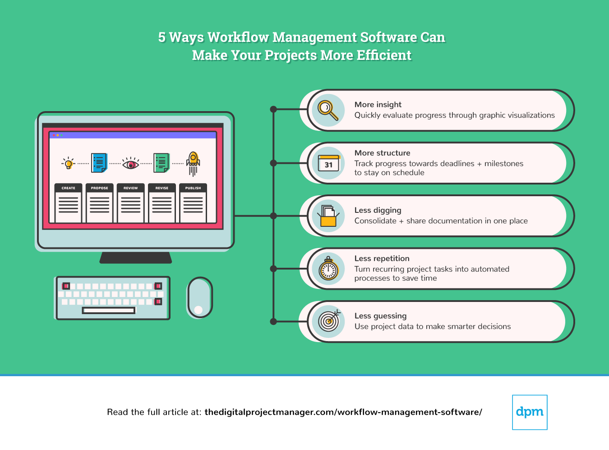
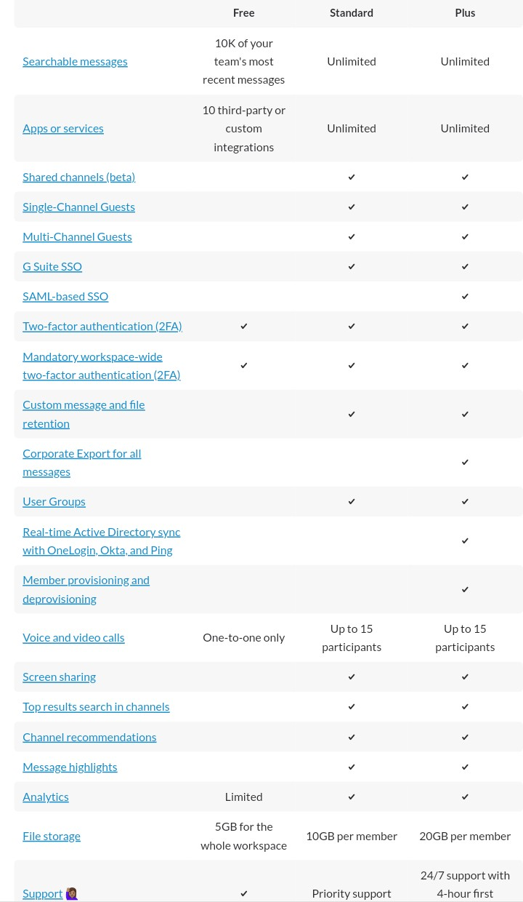
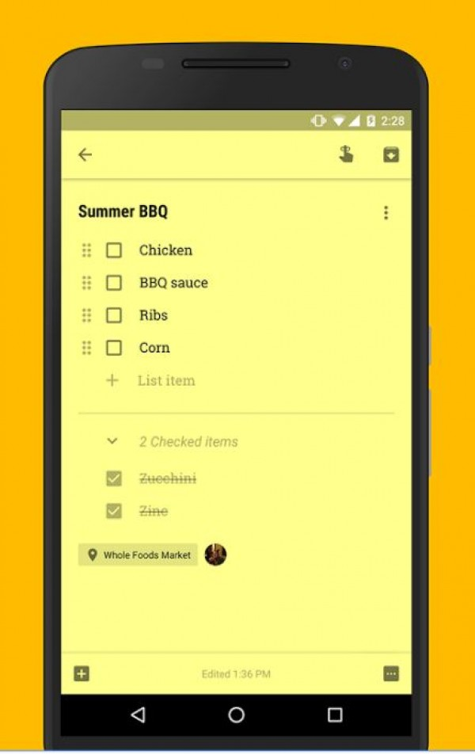
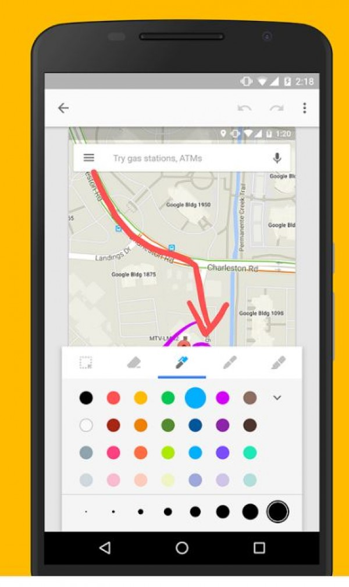
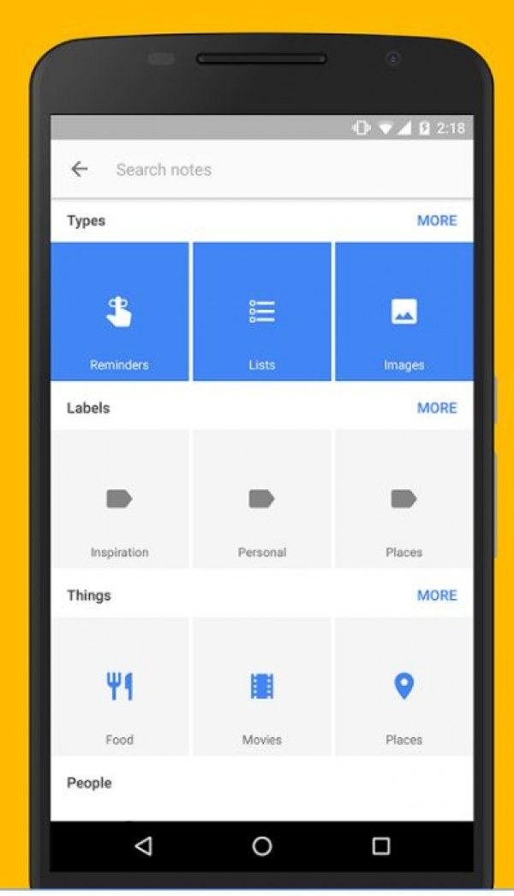
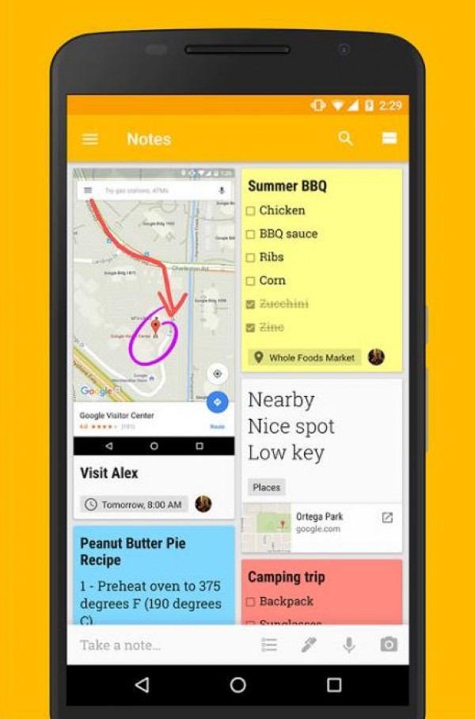

Be productive is what we all want. It is a way to be fast, effective, and efficient. Be productive is the secret of success and the formula to get better your processes, your business, and overcome yourself day by day. Be productive is possible by maintaining efficient **workflows in your business** and your personal life, and we want to give you some tools and tips to do it easily.

<title-2>Everything you have to know about an efficient workflow</title-2>

Workflow is a pattern of actions or steps that you repeat constantly to do work or finishing a process. 

This pattern is involved in daily activities, methods, information, people, resources, the ability to handle daily tasks, tools, etc. 

It is a tool that makes the processes and activities in your company works in a good or a bad way, depending on how you are implementing it. 

Some years ago workflows were controlled by a physical person and all teams used tools like blackboards, notes, messages, and lists to maintain the efficiency. 

But now, thanks to technology everyone forgot those tools and now we have digital workflows where we have management tools that allow setting business rules to dictate when one step can be taken as successfully completed and the next step can be triggered. In that form, the workflow is automated and that translates on more efficiency.

<title-2>How to improve an efficient workflow</title-2>

Source: [digital project manager](https://thedigitalprojectmanager.com/workflow-management-software/)

<title-3>1. Say goodbye to multitasking</title-3>

If you want a team focused and really productive, it is imperative to assign specific tasks. That doesn’t mean that a person is not able to do more than one task. For sure he or she can do it, but they will be more efficient if they have one first and then the other. They will end faster and better every task. 

If you begin one task and you finish it to begin the other, you will work better.

<title-3>2. Finish first more difficult tasks</title-3>

More complex and difficult tasks need more concentration. So, they take more time. Once you finish them, it will be easier to complete the others faster. 

<title-3>3. Improve communications</title-3>

Being efficient also is thanks to good and constant communication between the people working around the same area, project or tasks and you can do it using the right tools.

Tools like [Slack](https://slack.com/intl/es/), where you can have a grupal channel for communication or private channels you talk with each member of your team directly, immediately, fastly, and effectively.

<title-3>4. Schedules are your best friend</title-3>

You and your team need to know in every moment in what they are working and which tasks they need to do during the day, the week, even the month. In that way, they plan how to accomplish them. All of this is possible to do it and to keep it with schedules. 

There are really nice tools as Google Calendar, Trello, Evernote, etc, that can help you with this.

<title-3>5. Be as transparent you can</title-3>

You can make public all assignments you make using a workflow tool. In that way, everyone in your team would work as a network. 

Another good reason to do it is that all people in your team will know in what is working his or her partners. That is transparency.

<title-3>6. Define and respect roles</title-3>

If everyone knows which work they need to do, they will be able to finish faster and more effectively. The action of assign and choose a responsible for every task is call:  **role definition**.

<title-3>7. If there is a tool that gets easier the work and the organization, use it!</title-3>

This is maybe one of the most important things you could do to maintain an efficient workflow in your team, company, etc.  

We recommend you to read and search daily all tools that are being released and can help you to improve your workflow. They will make you more efficient, and the best, they will help you to win more money faster. 

We are going to describe some of them:

 

**Tools you can use for keeping a good workflow**

* **Trello**

It is a project management application that will do your work and your life easier. 

Trello has a variety of work and personal uses including real estate management, software project management, school bulletin boards, lesson planning, accounting, web design, gaming, and law office case management.

Source: [Wikipedia](https://en.wikipedia.org/wiki/Trello)

Trello is very visual. The whole team can see the every estate of task and even collaborate to accomplish it. That's one of the benefits of this tool. Tasks can be assigned to one person, but the other team members can participate later. It has the perfect balance between individual and team work. 

And all of that without mentioning the synchronization with all the devices that you have. Trello is the most common tool used for tasks management in the world. 

Trello has a free plan where you can have boards, list, checklists, power-ups for each board, you can synchronize with other accounts as Google Drive, and you have until 10 mb for add documents or archives. 

Also, It has a business plan where you have the same specifications, with 250 mb of capacity, premium power-ups, you can restrict the access to old members, you can make public and private boards, you have a better attention by email, and It is safer. This plan has a cost of $9,99 per month if you pay the anuality. 

The last plan you can have in trello it is the enterprise. You can have two factor authentication, more cybersecurity, and other benefits in comparison with the last. This plan you can have it for $20,83 monthly.

* **Slack**

Slack is a cloud-based set of proprietary team collaboration tools and services. [Wikipedia](https://en.wikipedia.org/wiki/Slack_(software)).

There you will have messaging services, where you can create groups, communities, teams of people, and you can make integrations with other software as Google Drive, Trello, Dropbox, Box, Heroku, IBM Bluemix, Crashlytics, GitHub, Runscope, Zendesk, etc. 

“Slack for teams is ideal for small- to medium- sized companies or teams who only need a single Slack workspace. You can use Slack with a limited number of features for free, but if you need more features and functionality, they offer two paid plans.” [Slack](https://get.slack.help/hc/en-us/articles/115003205446-Planes-productos-y-funciones-)

Source: [Slack](https://get.slack.help/hc/en-us/articles/115003205446-Planes-productos-y-funciones-)

* **Google Keep**

Everything you need to write you can save it in [Google Keep](https://keep.google.com/u/0/). Google Keep is a note-taking service developed by Google.

You can include texts, images, videos, audios, lists, and many elements to take your notes in your private life and in your work. 

Even users can set reminders, which are integrated with Google Now, with options for time or location.[Wikipedia](https://en.wikipedia.org/wiki/Google_Keep)

“Google Keep helps the users in sharing ideas with friends, family and colleagues since it allows collaboration in real time. Users can also record a voice memo and Google Keep will transcribe it so that it can be searched from time to time. It also allows users to set reminders for notes at a particular time or when they reach a particular place".[SoftwareAdvice](https://www.softwareadvice.com/project-management/google-keep-profile/)

In Google keep you also can organize data, create to-do lists, draw on images, and capture thoughts.

Source: [SoftwareAdvice](https://www.softwareadvice.com/project-management/google-keep-profile/)

* **KissFLOW**

“This is a cloud-based solution that helps users easily design, create, and customize business apps. It takes a lightweight approach to BPM and places the power of creating workflows back in the hands of users who understand the issues best”.

KiSSFLOW comes with about 50 pre-installed business applications such as employee onboarding, purchase orders, mileage reimbursement, vendor payment, and many more. Users can either install these apps and edit them to their preferences, or they can build their own from the ground up. The business application also includes a form to capture data, a workflow with a sequence of system and human task, reports, and notifications.

Source: [Financesonly](https://reviews.financesonline.com/p/kissflow/)

This tool has a free plan, an two paid. The first paided is the kissFLOW plan, which has a cost of $9 per month while the second one is the enterprise, but they don't show the price. If you want you know it you have to communicate with the vendor.

<youtube-video id="qyB7lfozSwM"></youtube-video>

* **Nintex**

This tool gives solutions for workflow automation. Linking cloud workflows, on-premise systems, and mobile users this software automates the processes used collaboration and content management platforms.

“It enables you to easily streamline processes, integrate content, and empower employees wherever they are located. The app sports a people-driven design and offers people-friendly participation to improve processes – both simple everyday ones to complex elaborate procedures. The best part is you can work with content no matter what or where it is, and route it to the right recipients.”[Financesonly](https://financesonline.com/top-15-workflow-management-software-solutions/)

The best part about this software is the flexible pricing scheme and how it helps regain control of all business processes on a price that corresponds to what the company genuinely can offer. It doesn't matter if It is a small, medium, or a large business, Nintex can help you understand and automate all operations. 

It has a free trial, and two paid plans which are a little more expensive that its competition. The standard plan which has a price of $625 monthly and the enterprise plan that costs $938 per month.

<youtube-video id="MXOotP1-onQ"></youtube-video>

* **Wrike**

There you can create a dashboard with the whole information you need for doing your work, a process, or a task. 

And not only yours, also, you could see what is doing other team’s members. 

Wrike simplifies project management with features such as dynamic request forms that help capture information and ensure that project teams have all the details before they start working. The interactive Gantt chart that shows dependencies and conflicts, with items that can be easily adjusted within the chart, dashboards, etc. 

This tool has many plans as the last. It has a free plan where only 5 users are included and the storage is 2GB maximum. Then, we have the professional plan which costs $ 9,80 monthly and you enjoy of 5GB of storage and 5, 10 or 15 users availables. 

A third plan is called business, and there you have from 5 users yo 200 users in your account, and the last plan is the enterprise where you can have unlimited users, more storage, more security and even premium tools as marketing tool specialized for creative teams.

* **Monday**

“Formerly known as Dapulse is one of the few tools that prides itself in ‘not being a project management tool’! They’ve done away with a lot of the trimmings of typical workflow tools and focused instead on a structure and views that help clarify the sequence of work that needs to be done. Monday’s approach is somewhat Kanban-style in that it uses boards, with rows and columns that you use to organize processes”.[The digital project manager](https://thedigitalprojectmanager.com/workflow-management-software/)

The Monday’s most distinctive advantage compared to similar systems is the advanced scheduling capability, which applies both to task and project management, and helps companies get rid of arcane paperwork. This capability makes sure there will be no manual errors, and  makes the brand even more trustworthy and reliable in the eyes of buyers. 

Monday has 5 plans. The first is free. Next is the basic plan, where you can have 5GB of storage, two factor authentication, and a filter for person. This plan costs $39 per month. 

In the third position you have the standard plan, where you can enjoy of 50GB of storage, full API, a timeline, and also you can create your own account template. And all of that for $39 by month. 

The PRO plan is the next. You can get it for $59 monthly. Herramientas you have Google authentication, private boards, unlimited storage, tags, and every we said in early plans. 

The last and more expensive plan is the enterprise for $118 monthly if you pay the anuality. You might have access to all benefits from other plans plus vip support, more cybersecurity, one-on-one training, etc.

<youtube-video id="ajBtOzTIhC8"></youtube-video>

These are its benefits

We said some of them before, but we decide to strengthen them with this video. Enjoy it!

<youtube-video id="Lm0fbskHRv8"></youtube-video> 

**How to convert everyday tasks in better, reproducibles and more efficient workflows

1. Make it clear and concise

Sometimes happens that we have something to do and we know it. It is only a task, but we have only descriptive information. That's not bad at all, but if we want to enhance this task in a workflow, we need to name it, and write specifications about it. In that way, everyone will know what has to be done clearly. 

2.  Look for a responsible

This mean that a simple task is an activity you need to do in your company or life, but if you want to convert the task in a workflow you need to determine the responsible, and if you are this person, you need to identify which people do you need to involve or search for achieve this task. This information goes together with the last point. 

3.  Assign a period of time 

This is so important. A workflow necessarily has a task or a group of task that need to be accomplish it in a specific period of time. You can manage a period or a due date. This is the quality that permit you to be more efficient with time.

4.  Put it in your tool

Once you have this information, you can introduce the task (name, specifications, responsables, time) on the app or tool you are using to manage your workflow. This app can be any of the ones that we showed in the last part. 

5. Share it

A common characteristic of a workflow in a team is the transparency. All people should know what the others team members are doing, so that even they can participate if they are capable to do it or it is required. 

It is vital for success keeping and improving **efficient workflows in your business.** We hope this information would be useful for you and it can help you achieve this goal. 

Try it and then we want to know how did it go.

