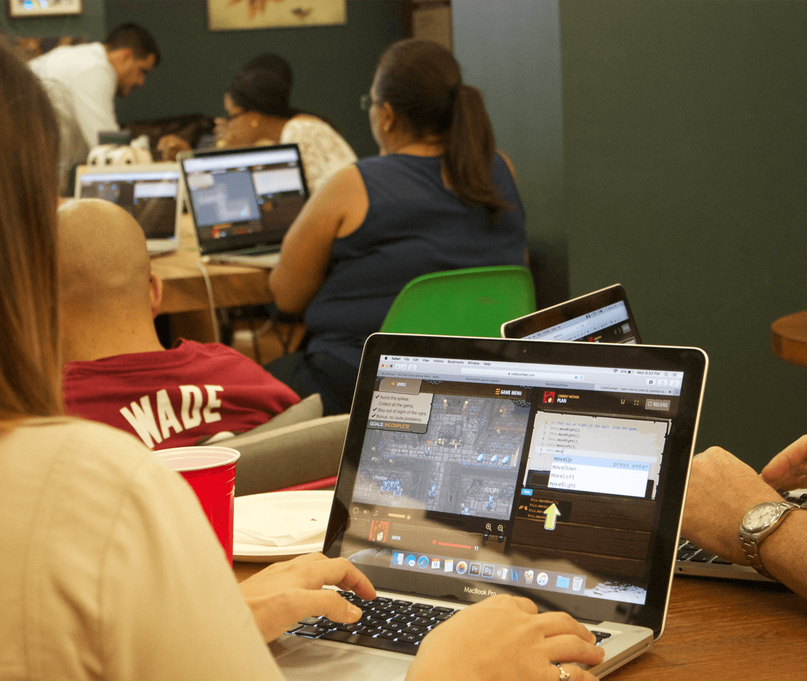

<title-2 align="centered">4Geeks Academy</title-2>
 
**Contact Person:** Marcelo Ricigliano

**Location:** Miami, US, Caracas and Maracaibo, Venezuela

**Industry:** Education

**Web Site:** www.4geeksacademy.co

<title-4>Beginning of 4Geeks</title-4>

The idea of an academy of programmers was an idea in Alejandro Sánchez’ mind since 2009. By then, the Co-Founder and former CEO of some of the most important Accelerators in Venezuela had already met with all the challenges that the application development market when trying to find the best talent

This company, already positioned at the forefront of software development, was constantly in the situation of finding new members for its projects, which by 2009 had been complicated by the shortage of trained personnel in the software developer market.

Given this situation, a series of initiatives around the company’s activities are beginning to be developed to begin to recognize and attract the surrounding talent in the software world:

* The Tech Meetup: Event to gather entrepreneurs and developers

* DevLab: Programming workshops in universities

* Workshops: Workshops in the company offices to train developers

* La Carta: The community newsletter

All these initiatives product of the experience of the company, but especially the tastes and needs of its members will constitute 4Geeks Developers Community.

**The Academy in Venezuela**

After many years of initiatives in 2014, it emerged in Venezuela: Academia Hack, an initiative of 4Geeks to solve a need that continued to grow very rapidly worldwide.

The result was amazing, in October of 2014 Hack opens with an incredible demand, being the first success of the dream of having an academy for developers.

**4Geeks Academy: Maturity and experience**

After a year of emotions and successes, Alejandro decided to take a much more ambitious step and set himself the task of launching this project in the city of Miami.

With the experience gathered for more than 8 years promoting projects, the support of the 4Geeks community and the perfect sidekick (Marcelo Ricigliano, Vice President of 4Geeks Academy), the idea of 4Geeks Academy, a part-time developer academy with a innovative study program for the city of Miami.

Having almost 2 years of success and more than 250 stories in its participants the idea of 4Geeks Academy suffered the fate of all the projects carried out with experience, intelligence, passion and perseverance, demonstrating that in 4Geeks we can build sustainable businesses.

Today, Alejandro works full time as **CEO of 4Geeks Academy**, and President of **4Geeks Developers Community**.

[Alejandro Sanchez LinkedIn Bio](https://www.linkedin.com/in/alesanchezr/)

[Marcelo Ricigliano Linkedin Bio](https://www.linkedin.com/in/marcelo-ricigliano-32440379/)

Review in the News Week:

[A CODING CAREER AND YOU – TOP CODING SCHOOLS 2017](http://www.newsweek.com/insights/coding-career-and-you-top-coding-schools-2017/4geeks-academy)

<carousel folder='customer-success-stories'>
./media/2-1280x1080.png
./media/3-1280x1080.png
./media/4-1280x1080.png
</carousel>

