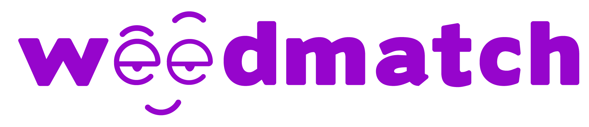

<title-2 align="centered">Weedmatch</title-2>

**Weedmatch** is the **first free cannabis social network** made by a group of Venezuelans led by its founder Oscar Lopez in Chile where
you can interact with other people and be aware of events and news about the culture of **cannabis**.
The part of the match is specially dedicated to cannabis relationships or encounters, which will eventually expand the networks of
consumers and brands.

## Founding History

**Oscar López** was born in Maracaibo, Venezuela. Graduated in Computer Engineering at the University Doctor Rafael Belloso Chacin.
He has six years of experience developing internet projects in a wide range of areas, from websites to digital marketing agencies and
managing a news conglomerate with 15 million Facebook fans all over Latin America. Prior to this, he worked for several years as a web
**software developer**.
At the moment he is dedicated to change the Latin American Cannabis reality creating the first **Cannabis social network** in **Chile**
and **Latin America**.

## Biography of weedmatch

Born as an idea on April 20, 2017, to attend a national cannabis march in Chile, surprised with the call and massiveness, Oscar Lopez decided to create something to unite all the community, and from there emerged the idea of a social network. As he delved deeper into
the idea and the Chilean cannabis culture he realized that the market and opportunity were much bigger than he expected and at the same time the worldwide cannabis culture begins to have high traction: it was a case of perfect timing.

## How everything started:

Oscar met Angel Lacret in the university, he knew that he was programming but they lost contact, sometime later they retaken contact by
Facebook and Oscar remembered that he had a development company and decided to contact him to develop the **Weedmatch** project through Cobuild. During several months we chat about the Cannabis industry and its trends, and how the lifestyle world was in debt of tools for this community. 

After a couple of meeting Oscar develop the concept of the brand with several of its partners and the shape of the Weedmatch app started arising. It was until beginnings of 2018 were we setup a team and start working in this project.

We made an application for **mobile Android** and **iPhone** that allows you to contact the people closest to you, interested in the cannabis culture. Allows you to match and create a chat to chat and know the interests of those people. 
The application was develop using **React Native** and **Django frameworks**.

The project lasted approximately four and a half months with a **back-end programmer**, a **front-end programmer**, a **typesetter**, and a **Qa**. Working as a team with the client and holding daily meetings, the first beta of the application was developed and then functionalities were added. Currently, the project is already live and all the Chilean community loving cannabis enjoys it.

<carousel folder='customer-success-stories'>
./media/.jpg
./media/.jpg
./media/.jpg
./media/.jpg
./media/.jpg
./media/.jpg
./media/.jpg
./media.jpg
./media/.jpg
</carousel>

**Contact Person:** Oscar Lopez

**Location:** Chile, Santiago

**Industry:** 
