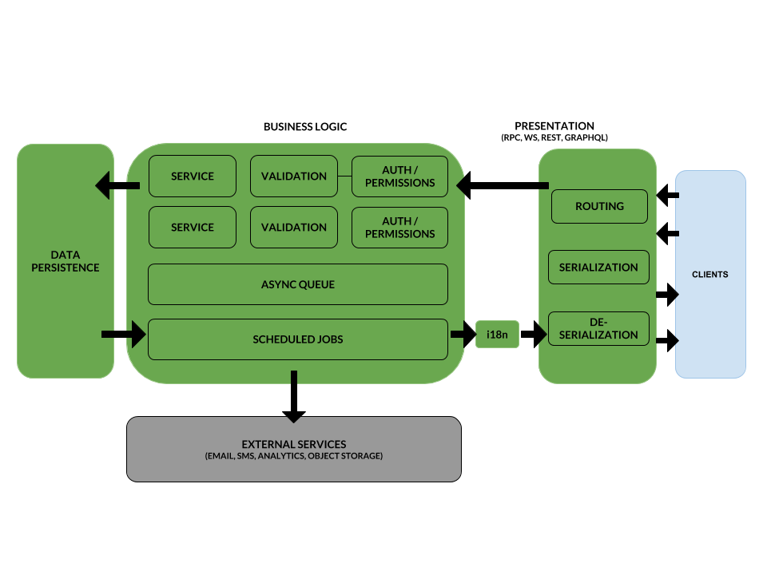

Blocks architecture is an architectural implementation proposal based on the Service Oriented Architecture design pattern for building APIs.

This architecture is also based on our experience developing software on the last few years, along with the [SOLID design principles](https://en.wikipedia.org/wiki/SOLID) and some other patterns explored and tested in current projects.  

In a nutshell, the implementation looks like this:

## Principles:
    
    1. Single Responsibility Principle: Every block must have one and just one task to do.
    2. Favor Composition over inheritance: The only relationship between objects that obey the "is a" description should be subject of inheritance, otherwise composition is preferred.
    3. Open / Close principle: Every block should maintain a clear interface de coupled with the technology that was used to implemented it.
    4. Scalability: Every decision made in the design is done thinking of how the services could be scaled.
    5. Testable: The services must be easy to test 
    6. Open to Microservice or Monolythic architecture

## Blocks:

### 1. Presentation Block 

Also known as Views or Handlers is the block in charge of translating the communication technology or protocol (REST, GRAPHQL, WS, RPC) into the programming language domain data types and vice versa.

Depending on the technology and the level of separation desired could be divided in:

#### 1.1 Routing Block: 

It is in charge of routing the requests to the service infrastructure into the correct resources. 

Routing is preferred to be declarative.

#### 1.2 Serialization and Deserialization Block:

In charge of translating the Business Domain Objects into plain data types in the programming language domain and possible to the underlying common data format: JSON, XML, etc
 
### 2. Business Logic Block:

#### 2.1 Authorization and Permissions Block:

As the name suggests is the layer where authorization is granted and the permissions to the requested resource are checked.

Common implementations on this layer include complete abstraction and independence compelling with a microservices architecture and caching.

The block responsibility for executing the logic in the application. Depending on the complexity of the system, it could have:

#### 2.2 Validation Block:

Responsible for checking the integrity of the data and the operation to be made. It can include checking information from other services.

#### 2.3 Services Block:

A set of functionality built in the most atomic possible way for reusability and taking always in consideration the validation and ability to enroll in a multi-service transaction. 

#### 2.4 Async Queue Block:

A block dedicated to all the async tasks that the system must perform: Emails sending, heavy computation, notifications, and communications with external entities. 

#### 2.5 Scheduled jobs Block:

A block for the tasks that need to be done recurrently without the user intervention: Notifications, invoicing, subscriptions, etc

### 3. Data Persistence Block:

This is the main block for storing information normally in databases. It has the responsibility of handling the connection to the data source.

### 4. Internationalization and Localization Block:

This is the block responsible os translating the response from the services if necessary in the locale settings.
    
    
    
## Conclusions:

  * This is my second Draft on how to build API architectures, we have tested with Python and Javascript, and i will show that implementation in other posts. 
  * We hope that if you are reading this you can get benefits of our experience, and suggest further improvements.
 
