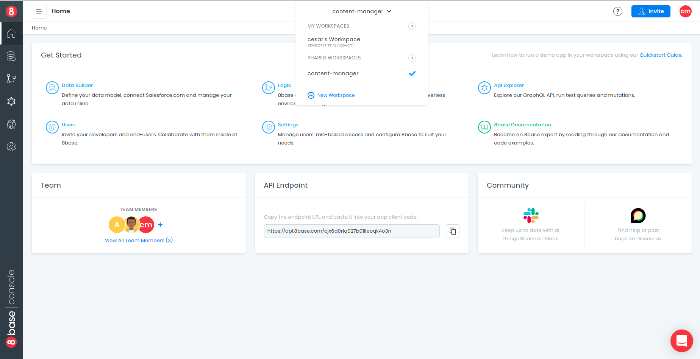
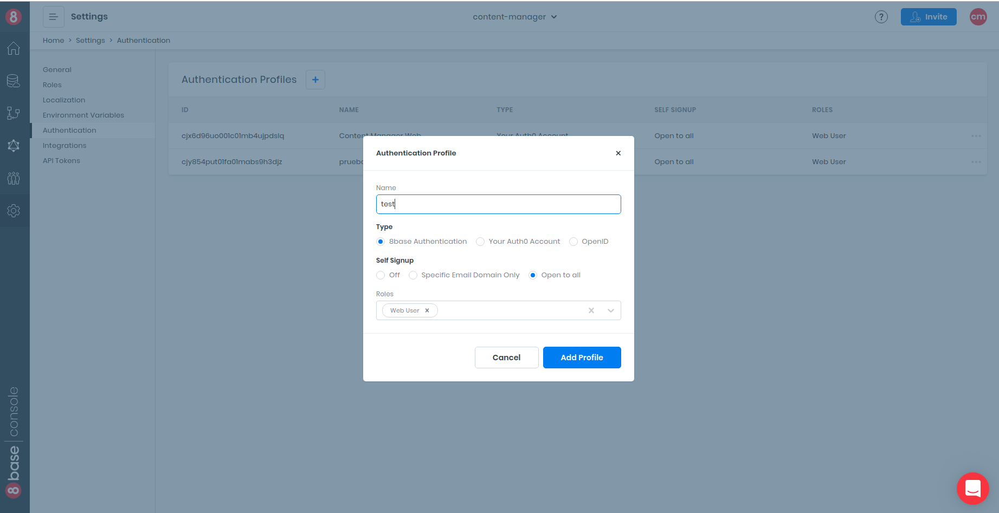
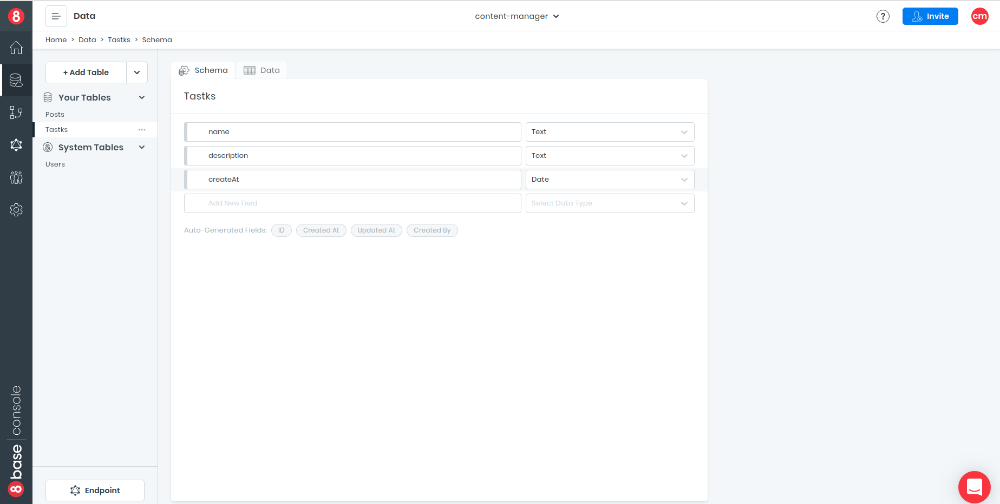
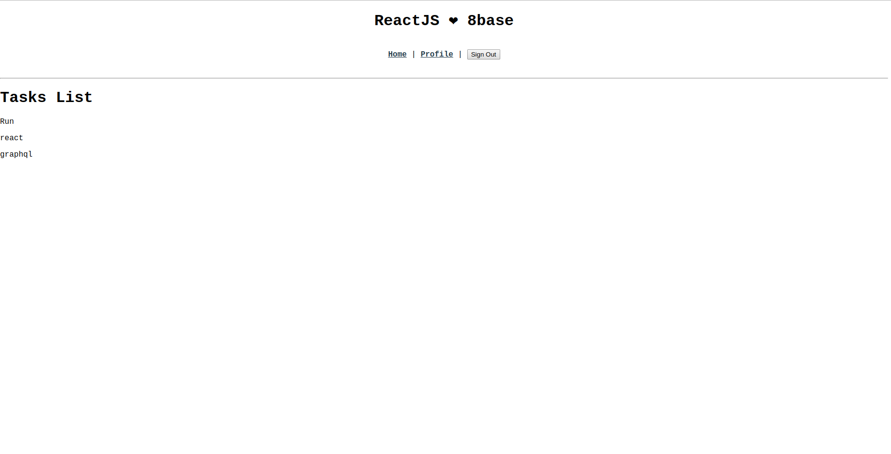

## 8base

**8base** is a Backend-as-a-Service. It lets front-end developers focus more on what they love and backend developers expedite their workflow. As our CEO likes to say, "it's totally awesome!"

When using 8base, you're project benefits from having:

1. A fully scalable serverless API
2. A managed MySQL Database that's hosted on AWS
3. Ready-to-use app services, like Authentication, Authorization, and File Storage
4. 8base's rock-star team and the Community
5. So, so, so much more!

<https://docs.8base.com/getting-started/getting-started>

## Connect to 8base

### 1. Create an account at 8base

create an account in 8base is easy just go to this [link](https://app.8base.com/) we send you a confirmation email

### 2. Setting up a Workspace

when you create an account 8base give you a free workspace for 30, but if you want to create a new workspace just click on the drop down menu "New workspace". Name it however you want, select the plan you want and you're done.



### 3. Create the Authentication provider

Under the hood, 8base utilizes Auth0 to manage your users' identities and ensure the best security standards. But in this tutorial we will use our own auth0 account

In this tutorial we will use the authentication that gives us 8base
To create the authentication profile, go to Settings > Authentication and press the + button. The form that appears can be completed using

the following fields described.
Once the authentication profile is created, ClientID and Domain are generated, which will allow us to connect the 8base back-end to any application.



### 4. Create table

8base provides you with a default table called users,but in this example we'll see how to create a

to create a table go to Data you click on +add table and we name it tasks.Next we will create the fields and we will fill them manually that will serve us to execute the Query



### 5. Cloning repository

The best way to start with 8base for the first time is to go to the 8base [documentation](https://docs.8base.com/getting-started/quick-start) and Clone the Demo Repository. They have on for React and one for Vue

    git clone https://github.com/8base/react-8base-starter-app.git

### 6. Then we go into the project folder and do an `npm install`

### 7. Setting up the client

    APP_WORKSPACE_ENDPOINT=<workspace_endpoint>
    APP_AUTH_PROFILE_ID=<auth_profile_id>
    APP_AUTH_CLIENT_ID=<auth_client_id>
    APP_AUTH_DOMAIN=<auth_domain>

Look for a 8base-starter-app/client/.env file that contains a template for the required environment variables. Fill in the template with all appropriate values. Each starter app will have a thorough READme.md with instructions on which files are responsible for which functionality. Please read them!

### 8. Installing Dependencies

Although the example application that we clone already has included apollo-client we will use the version of apollo but with hooks

    npm install apollo-boost @apollo/react-hooks graphql

### 9. Modifying the file

we are going to modify the index.js file located in the `src/routes/home/index.js` folder.
In the file copy the following code

```javascript
import React from 'react'
import { useQuery } from '@apollo/react-hooks'
import gql from 'graphql-tag'

const TASK_LIST_QUERY = gql`
  {
    tasksList {
      count
      items {
        name
        description
        createAt
      }
    }
  }
`

const Home = props => {
  const { data, loading, error } = useQuery(TASK_LIST_QUERY)

  if (data === undefined) return <p>Login to view content </p>
  if (loading === true) return <div className={'loading'}>Loading...</div>

  const {
    tasksList: { items },
  } = data
  return (
    <div>
      <h1>Tasks List</h1>
      {items.map((task, i) => (
        <p key={i}>{task.name}</p>
      ))}
    </div>
  )
}

export { Home }
```

### Let's explain what we did here

- We imported React
- we import useQuery from @apollo/react-hooks to make the query.
- We import graphical-tag gql that will help us write the query.
- We created a functional component called **Home**
  Inside that component we make a destructuring of objects to useQuery that receives as parameter the constant **TASK_LIST_QUERY**.
- We ask if data is not defined and return a paragraph explaining that you have to log in to see the content.
- We ask if the load goes out and we return a div indicating that it is loading.
- We make a double desestructuration to **data** and extract **item**
- Finally we return a div with all the names of the list.

### 10. Run the application with the `NPM STAR` command

### 11. Showing the data


Siéntase libre de darle los estilos que desee
