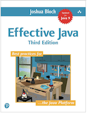
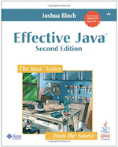
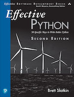

> This are a set of commonalities and practices learn from my experience with Java, Python and Javascript development over near 20 years of experience. Angel Lacret

This set of practices are heavily based on this books:

For Java:

|   | [Effective Java](https://www.amazon.com/gp/product/0134685997/ref=as_li_tl?ie=UTF8&tag=gurupia-20&camp=1789&creative=9325&linkCode=as2&creativeASIN=0134685997&linkId=4e66ae1154a5d6dab6b03394fcfee40b)|
|---|---|
|   | [Effective Java 2](https://www.amazon.com/gp/product/B078H61SCH/ref=as_li_tl?ie=UTF8&tag=gurupia-20&camp=1789&creative=9325&linkCode=as2&creativeASIN=B078H61SCH&linkId=b950edc2c1bec33e7e14acd66e569504)|

For Python:

|   | [Effective Python](https://www.amazon.com/gp/product/0134853989/ref=as_li_tl?ie=UTF8&tag=gurupia-20&camp=1789&creative=9325&linkCode=as2&creativeASIN=0134853989&linkId=2c2867868bcdab4bb2ee21b4cdd6b133)|
|---|---|

This document aims to reduce the friction between patterns, conventions and best practices to right `effective code`. (See below)

### **Effective code:**

- Easy to understand
- Well organized
- Self descriptive
- Well documented
- Easily Testable
- Easily Debuggable
- Named under a clear pattern
- Robust: enhancements don't create undesired side effects
- Portable: easy to reuse
- Predictable
- [SOLID](https://en.wikipedia.org/wiki/SOLID) compliant

### as the contrast of **Ineffective Code:**

- Difficult to understand and read
- Difficult to test
- Difficult to debug: Given a fail scenario is not clear to the eye where the error is being generated
- Does more than 1 thing

# 1. General Best Practices for Code Style

## 1.1 Don't use more than one sentence in a try/catch block

Is a common mistake for new developers to surround long function calls or views inside try-catch blocks as a failsafe or catch all exception handling. But in fact, this is one sign of ineffective code.

Multi sentence try catch blocks are **ineffective** because:

- Difficult to debug, as is not 100% clear which sentences are generating an exception.
- Promote a bad pattern of handling all exceptions in the same way
- Usually this broad catch blocks make use of a generic and catch all object or class that does not prepare your code for unknown / undesired scenarios, and promotes the handling of all the exceptions in the same way. 

Keep your code predictable, robust, solid and **effective** by:

- For readability and robustness keep your try/catch blocks limited to 1 sentence
- Use specific Exceptions subclasses and not broads classes or definitions to prevent unknown scenarios to behave like know scenarios
- For easier bug hunting, make sure to handle different Exceptional scenarios appropriately  

## 1.2 Promote the **Return Early** pattern

TODO:
