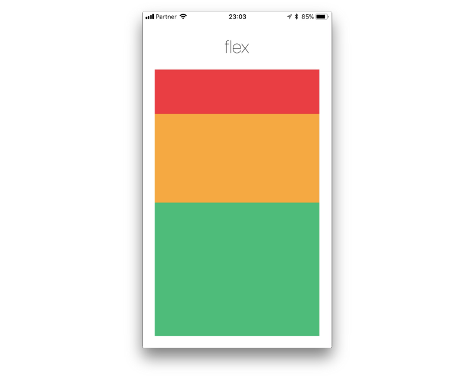

## React Native for mobile development

React Native is a JavaScript framework for writing real, natively rendering mobile applications for iOS and Android. 

It’s based on React, Facebook’s JavaScript library for building user interfaces, but instead of targeting the browser, it targets mobile platforms. In other words: web developers can now write mobile applications that look and feel truly “native,” all from the comfort of a JavaScript library that we already know and love. 

Plus, because most of the code you write can be shared between platforms, React Native makes it easy to simultaneously develop for both Android and iOS.

Similar to React for the Web, React Native applications are written using a mixture of JavaScript and XML-esque markup, known as JSX. Then, under the hood, the React Native “bridge” invokes the native rendering APIs in Objective-C (for iOS) or Java (for Android). Thus, your application will render using real mobile UI components, not webviews, and will look and feel like any other mobile application. React Native also exposes JavaScript interfaces for platform APIs, so your React Native apps can access platform features like the phone camera, or the user’s location.

[Source](https://www.oreilly.com/library/view/learning-react-native/9781491929049/ch01.html)

### Advantages:

- Develop on Javascript with React and JSX
- Develop for Android and IOS at the same time
- Native performance
- Open source community 

## Flexbox Layout on React Native

A Layout technique that helps deign flexible and responsive layouts structures.

- Was originated around 2008 in response to the existing problems of css rules to consistently layout elements
[Source](https://vimeo.com/98746172)
- Based on XUL from Firefox
- Built with responsiveness on mind 

## Main concepts:

### Parent, Parent Container or Container

This is how the container of elements is called. It may contain other containers.

### Children or Items

Elements within a container. Container can be elements too.

### Flex direction

The primary axis of orientation of the elements: Column or Row. For React Native the default values is: `column`

### React Native Flex Box:

#### Flex Direction:

This is also referred to as the main axis. The cross axis is the axis perpendicular to the main axis, or the axis which the wrapping lines are laid out in.

`row` Align children from left to right. If wrapping is enabled then the next line will start under the first item on the left of the container.

`column` (default value) Align children from top to bottom. If wrapping is enabled then the next line will start to the left first item on the top of the container.

`row-reverse` Align children from right to left. If wrapping is enabled then the next line will start under the first item on the right of the container.

`column-reverse` Align children from bottom to top. If wrapping is enabled then the next line will start to the left first item on the bottom of the container.

#### Justify Content:

justifyContent describes how to align children within the main axis of their container. For example, you can use this property to center a child horizontally within a container with flexDirection set to row or vertically within a container with flexDirection set to column.

flex-start(default value) Align children of a container to the start of the container's main axis.

flex-end Align children of a container to the end of the container's main axis.

center Align children of a container in the center of the container's main axis.

space-between Evenly space of children across the container's main axis, distributing remaining space between the children.

space-around Evenly space of children across the container's main axis, distributing remaining space around the children. Compared to space-between using space-around will result in space being distributed to the beginning of the first child and end of the last child.

space-evenly Evenly distributed within the alignment container along the main axis. The spacing between each pair of adjacent items, the main-start edge and the first item, and the main-end edge and the last item, are all exactly the same.

#### Align items:

alignItems describes how to align children along the cross axis of their container. Align items is very similar to justifyContent but instead of applying to the main axis, alignItems applies to the cross axis.

stretch (default value) Stretch children of a container to match the height of the container's cross axis.

flex-start Align children of a container to the start of the container's cross axis.

flex-end Align children of a container to the end of the container's cross axis.

center Align children of a container in the center of the container's cross axis.

baseline Align children of a container along a common baseline. Individual children can be set to be the reference baseline for their parents.

[Source](https://facebook.github.io/react-native/docs/flexbox)

## Examples

