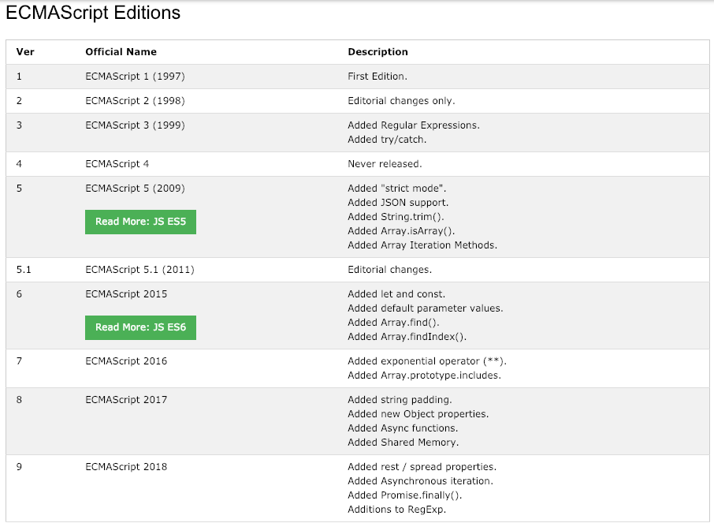
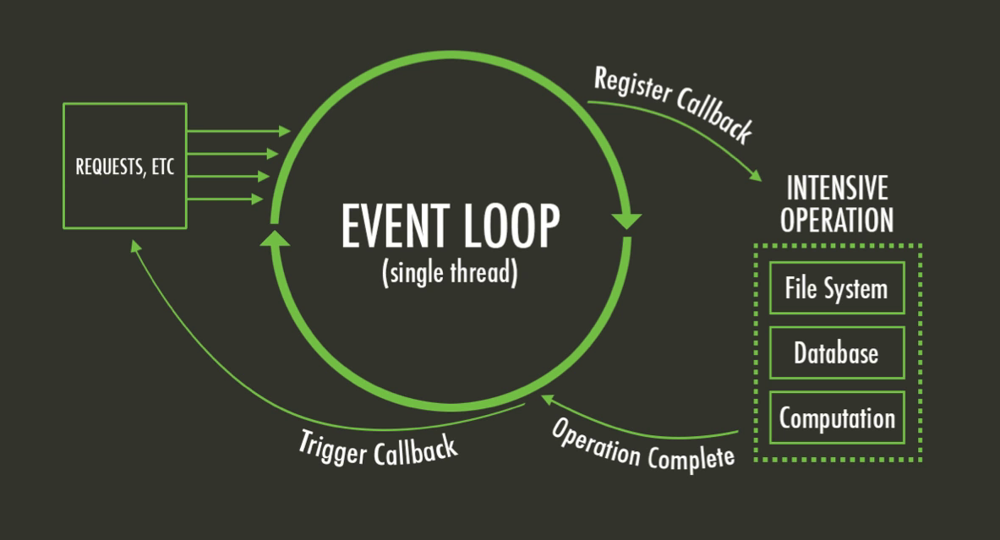
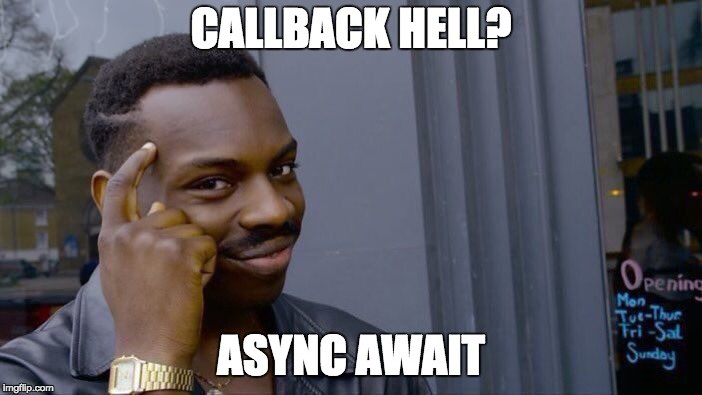

[Javascript](https://developer.mozilla.org/en-US/docs/Web/JavaScript):

>> JavaScript (JS) is a lightweight interpreted or JIT-compiled programming language with first-class functions. While it is most well-known as the scripting language for Web pages, many non-browser environments also use it, such as Node.js, Apache CouchDB and Adobe Acrobat. JavaScript is a prototype-based, multi-paradigm, dynamic language, supporting object-oriented, imperative, and declarative (e.g. functional programming) styles.


## Javascript specification history:
<br>


<br>

[Source] (https://www.w3schools.com/js/js_versions.asp)


Also, Javascript does not currently support concurrency, it is a single threaded language or better described as a language with an [Event Loop Architecture] (https://developer.mozilla.org/en-US/docs/Web/JavaScript/EventLoop)

In Simpler terms, the Javascript runtime executes a single thread that runs one task at the time. However, this architecture is very efficient, as Time consuming operations like I/O (reading a file, reading from the network, querying a database, etc) are executed by the OS using worker threads.


In Javascript a function never really 'blocks', it always continues it's execution until the end **register callbacks** or other functions to be executed when certain conditions are achieved. For example, when someones click an element or when the network response a request.

<br>


<br>


So, how can we interact with the Single Thread Model?


## Solution 1: Callbacks Funtions

Callbacks or asynchronous callbacks was the first tool to be able to interact with the single thread architecture.

Basically, you provide a function, that is gonna be called by the **Main Thread** once certain condition is achieved. Let's see an example:

Example 1: Calling a query using a mongoose function
<br>

```javascript
const Tank = mongoose.model('Tank', yourSchema);

var small = new Tank({ size: 'small' });

small.save(function (err) { // CALLBACK
  if (err) return handleError(err);
  // saved!
});

// or

function onCreate(err, small){ // CALLBACK
    if (err) return handleError(err);
    // saved!
};

Tank.create({ size: 'small' }, onCreate);
```
<br>

Even though it is a solution, large codebases and bad practices will make this difficult to read, as the functions that you place as callback can be declared anywhere, and it forces to chain callbacks upon conditions of other responses to callbacks. So calling functions in different places makes you jumping around figuring out where to go when you are trying to fix a bug.

Also, having 3 or more callbacks depending on each other will create a chain usually referred to as **Callback Hell**.


## Solution 2: Promises

>The Promise object represents the eventual completion (or failure) of an asynchronous operation, and its resulting value.

[Source] (https://developer.mozilla.org/en-US/docs/Web/JavaScript/Reference/Global_Objects/Promise)


>A Promise is a proxy for a value not necessarily known when the promise is created. It allows you to associate handlers with an asynchronous action's eventual success value or failure reason. This lets asynchronous methods return values like synchronous methods: instead of immediately returning the final value, the asynchronous method returns a promise to supply the value at some point in the future.


So Promises arise as a more pragmatic solution to the problem of communicating asynchronously with the Javascript Single Thread. 

They are broadly used, and look like this:

Example 2: Promises
<br>

```javascript
const Tank = mongoose.model('Tank', yourSchema);

var small = new Tank({ size: 'small' });

const promise1 = small.save();
promise1.then(function (result) { // CALLBACK For Promises
  
}, function (error) { // CALLBACK For Errors in the Promise
  
})

// or
function onCreate(, small){ // CALLBACK
    // saved!
};

function onError(err, small){ // CALLBACK
    return handleError(err);
};

const promise2 = Tank.create({ size: 'small' }, onCreate);
promise2.then(onCreate).catch(onError)

// You can also chain promises, as the return of a THEN, is a Promise
promise2.then(onCreate)
.then(someFunction)
.then(someOtherFunction).catch(onError)
```
<br>

This did improve readability in the code, but somehow it wasn't enough:

<br>


<br>

**So, introducing Async / Await**


## Solution 3: Async / Await

Facing a couple of downsides using Callbacks or Promises, Async / Await construct araises. With the main goal of readability and a 'linear way' of executing your code this new feature of the language has overcome the previous solutions.


Example 3: Async / Await

```javascript 
async function createTank (){
    const Tank = mongoose.model('Tank', yourSchema);

    var small = new Tank({ size: 'small' });
    const result = await small.save();

    // Do something here with the resul, no waiting or jump

    // Handling Errors
    try{
        const result2 = Tank.create({ size: 'small' });
    }catch(e){
        // Handle the Error
    }
}

createTank();
```

Benefits of Async / Await over Callbacks or Promises:

1. Less Code: Same logic, less code
2. Consistent Error handling: Good old Try/Catch construct
3. Bye Bye Callback/Promise Hell
4. Readability: When using conditionals, for loops, etc, etc
5. Debugging

