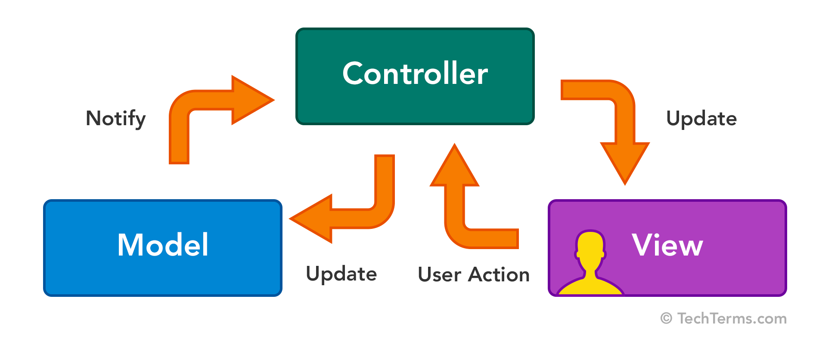
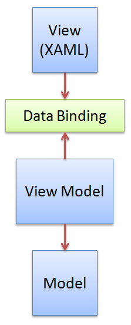

For many years Software Developers have face different challenges building User Interfaces: Rendering, Event handling, external systems communications, loose coupling of elements, separations of concerns, components communication, state management, routers, navigations, etc, etc, etc, resulting in many many solutions from different specialties, desktop, mobile, web, etc. Some of them have been effective, some other not so much, and over the years several attempts have been made to communicate these solutions to other developers using a design or architectural patterns.

>> An architectural pattern is a general, reusable solution to a commonly occurring problem in software architecture within a given context.[1] Architectural patterns are similar to software design patterns but have a broader scope. The architectural patterns address various issues in software engineering, such as computer hardware performance limitations, high availability and minimization of a business risk. Some architectural patterns have been implemented within software frameworks.

>>Even though an architectural pattern conveys an image of a system, it is not an architecture. An architectural pattern is a concept that solves and delineates some essential cohesive elements of a software architecture. Countless different architectures may implement the same pattern and share the related characteristics. Patterns are often defined as "strictly described and commonly available".[2][3]

[Wikipedia](https://en.wikipedia.org/wiki/Architectural_pattern)

**So, a Software Architecture Pattern defines a set of Components and Rules around the building of a Software Solution.**

This Rules usually are, but are not delimited to:

- Component's names
- Component's responsibilities
- Component's communication
- System communications or interfaces

Let's review some of the most common patterns used nowadays:

## MVC: Model View Controller (Long live the King)

Delimits the components of the User Interface in three big groups: Models to modeling the Data Objects or Elements of the application, the Views to present the data to the User and the Controllers to handle user interactions.

It has been around since the 70s and it has set the bases for all the further presented patterns. 

## MVVM: Model View View-Model

Here, the Model remains the domain or Data Objects, the View-Model is now in charge of rendering the data, and understanding the user interaction to communicate actions to the model. At last the View is completed separated from the logic of presentation but maintains the responsibility of handling the graphics elements normally in its own domain language like HTML, XML, XAML.

https://www.wintellect.com/model-view-viewmodel-mvvm-explained/

## Others MV*:

### [Model View Adapter](https://en.wikipedia.org/wiki/Model%E2%80%93view%E2%80%93adapter)
### [Model View Presenter](https://en.wikipedia.org/wiki/Model%E2%80%93view%E2%80%93presenter)

Introducing a new iteration on the MVC architectural pattern: Flux

## Flux

<youtube-video id="nYkdrAPrdcw"></youtube-video>

[Flux](https://facebook.github.io/flux/docs/in-depth-overview.html) is the proposed improvement from Facebook of the traditional MVC pattern and the restrictions that appear when you start scaling and create large codebases.

>> Flux applications have three major parts: the dispatcher, the stores, and the views (React components). These should not be confused with Model-View-Controller. Controllers do exist in a Flux application, but they are controller-views — views often found at the top of the hierarchy that retrieve data from the stores and pass this data down to their children. Additionally, action creators — dispatcher helper methods — are used to support a semantic API that describes all changes that are possible in the application. It can be useful to think of them as a fourth part of the Flux update cycle.

[Flux Overview](https://facebook.github.io/flux/)

### Single Way Communication Architectural Pattern Rules and Elements

After reviewing the evolution of Architectures for User Interfaces we compliant with the Flux pattern and extend it such as: 

- Store: holds the state of the application and are the only source of truth
- View: or Controlled View handle the logic to present or render the state.
- Action: Is consider any event that triggers execution of logic
- Dispatcher: Is a hub of events, is in charge of receive all actions and to send them to the appropriate stores to change the state of the system
- Views can trigger actions upon User Interaction
- An Action can be trigger by the View or any other component of the system
- Views register themselves with stores to get notified when a state change occurs