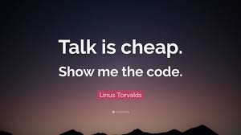

## Software Testing
Comprehends all the processes and tasks executed with the purpose of finding defects, deficiencies and errors in a software system, a part of it or as a whole.

## Test types:


### Functional Testing:

This are test that confirms that functional requirements were met. 

It’s like a quality assurance which generally shows what the software can perform.

Functional testing probe a part of the functionality of the whole software. Also, it is “a type of black-box testing that bases its test cases on the specifications of the software component under test. Functions are tested by feeding them input and examining the output, and internal program structure is rarely considered.”


### Usability  Testing:

In this test, we need to probe the ease use of the app. This is part of non-functional testing.

It is used on user-centered interaction design: users test it, evaluate it and then they give you information about how real users are going to use the software.


### Stress Testing:

When the software it’s gonna be publicly available, it is common to do a stress testing on its components simulating many many users. This test is made to know the software performance with enough demand.

### Integration Testing:

This are the tests that are performed to prove that independent pieces of software can work together on a real environment with the intended goals.

### Unit Testing:

Unit Testing is the first level of software testing where the smallest testable parts of a software are tested. This is used to validate that each unit of the software performs as designed. [GeeksForGeeks](https://www.geeksforgeeks.org/unit-testing-python-unittest/)


[Source](https://cobuildlab.com/blog/software-testing-in-software-development/)


## Importance of testing

The main purposes of testing are 2:

1) Identify bugs and errors prematurely 
2) Make your code more robust, preventing tampering when you add new features or make changes 

But also:

- “Nothing is done until is tested.”
This is relative to the concept of ‘Done’. On daily basis we as programmers at all levels of experience always find out ourselves struggling with this term, until we end up not only wasting ours but also an important portion of the project’s time.
 
– The earlier bird catches the worm
Testing all the functions a block of code at once would save you lot of time at the end of the day. Knowing the test patterns and choosing the optimal one for the purpose of your test would save you of being rejected from the imminent and scary Quality Assurance testing process. The best part of it? This will make you notice possible bugs that might show up in the future, right now in the present.
 
– Quality is an investment in the future”
Following all the good practices and having a perfect compilation at first without any syntax error isn’t really a proof of a well working application. This isn’t only going to improve the quality of your code making it more integral but also it will help you to built more compact and success Applications.
 
– There’s nothing more reliable than a tested code.
In the future this will help to build faster your applications by reusing it. Improve the modularity, make your code more reliable and trusted, it’ll make you notice future bugs and also it’ll make you see the passionated task of coding from a better point of view.
 

[Source](https://cobuildlab.com/development-blog/2018-01-23-the-importance-of-testing-your-code-its-done/)

## Usually workflow to create tests

1) Select a Testing framework for your Language and Tooling
2) Identify the parts (functions or classes) that you want to test
3) Start with the edge cases first: null values, negative numbers, empty strings, too long values, etc
4) Move to business logic constraints
5) Automate the process

## Qualities of good tests

1) Consistent: under the same conditions they return the same result 
2) Real data: Use data directly from the business domain
3) Atomic: Each test has it's own environment and conditions and it doesn't depend on any other test
4) Use long and descriptive names for test functions, classes and files
5) Automated

## Pytest

`pytest` along with `unittest` are the most popular frameworks to building tests with python.

`pytest` is particularly simple, and has some other great features:

- Support for the built-in assert statement instead of using special self.assert*() methods
- Support for filtering for test cases
- Ability to rerun from the last failing test
- An ecosystem of hundreds of plugins to extend the functionality

[Source](https://realpython.com/python-testing/#choosing-a-test-runner)



## My first PyTest tests:

1) Create a Project Folder
```bash
mkdir pytests
cd pytests
```

2) Install PipEnv
```bash
pip install pipenv
```

```

3) Install PyTest
```python3
pipenv install pytest
```

4) Write your first test

>>> test_sample.py
```python
def sum(a,b):
    return a + b


def test_sum():
    assert sum(3,1) == 4
    assert sum(3,3) == 5
```

5) Run the test

```bash
pipenv run pytest
```

## Other Examples

### Exceptions

```python
import pytest


def divide(a,b):
    if b === 0: 
        raise DivisionError(1)


def test_mytest():
    with pytest.raises(DivisionError):
        divide(1,0)

```
